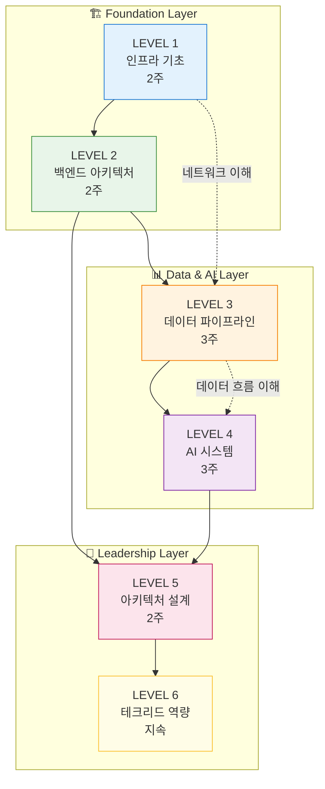
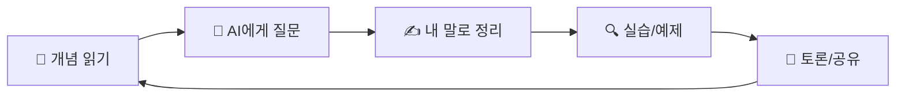

<div align="center">

# 🚀 AI 시대 모바일 개발자 → 테크리드 로드맵

[](https://opensource.org/licenses/MIT)
[](http://makeapullrequest.com)


<br/>

**모바일 개발자에서 AI / 데이터 / 인프라까지 이해하는 풀스택 테크리드로 성장하기 위한 체계적인 학습 로드맵**

<br/>


</div>

---

## 📚 목차

- [🎯 대상 독자](#-대상-독자)
- [🗺️ 학습 로드맵](#️-학습-로드맵)
- [📖 전체 커리큘럼](#-전체-커리큘럼)
- [📅 추천 일정](#-추천-일정)
- [💡 효과적인 학습 방법](#-효과적인-학습-방법)
- [🏆 최종 목표 상태](#-최종-목표-상태)
- [🤝 기여 가이드](#-기여-가이드)
- [📄 라이선스](#-라이선스)

---

## 🎯 대상 독자

### 이 로드맵이 적합한 분

| 대상 | 설명 |
|------|------|
| 📱 **모바일 개발자** | iOS/Android/Flutter 개발 경험이 있고, 백엔드와 인프라 영역으로 확장하고 싶은 분 |
| 🔄 **풀스택 지향** | 프론트엔드만 알던 것에서 벗어나 전체 시스템을 이해하고 싶은 분 |
| 👨‍💼 **예비 테크리드** | 기술 의사결정과 팀 리딩 역량을 키우고 싶은 시니어 개발자 |
| 🤖 **AI 시스템 관심자** | LLM, RAG, MLOps 등 AI 시스템 구축에 관심이 있는 분 |

### 사전 지식 요구사항

- ✅ 프로그래밍 기초 (최소 1개 언어 능숙)
- ✅ 기본적인 API 호출 경험
- ✅ Git 기본 사용법
- ⭐ (권장) 모바일 앱 개발 경험 1년 이상

---

## 🗺️ 학습 로드맵

아래 다이어그램은 전체 학습 경로와 각 레벨 간의 연관성을 보여줍니다.



---

## 📖 전체 커리큘럼

### 📊 레벨별 개요

| 레벨 | 주제 | 기간 | 난이도 | 핵심 키워드 | 링크 |
|:----:|------|:----:|:------:|-------------|:----:|
| **LEVEL 1** | 인프라 기초 | 2주 | ⭐ | HTTP, Docker, Linux, Nginx | [📁](./level-1-infrastructure/README.md) |
| **LEVEL 2** | 백엔드 아키텍처 | 2주 | ⭐⭐ | REST, JWT, DB, Redis, Kafka | [📁](./level-2-backend/README.md) |
| **LEVEL 3** | 데이터 파이프라인 | 3주 | ⭐⭐⭐ | ETL, Spark, Data Warehouse | [📁](./level-3-data-pipeline/README.md) |
| **LEVEL 4** | AI 시스템 | 3주 | ⭐⭐⭐ | LLM, RAG, Vector DB, MLOps | [📁](./level-4-ai-system/README.md) |
| **LEVEL 5** | 아키텍처 설계 | 2주 | ⭐⭐⭐⭐ | Clean Architecture, MSA, CQRS | [📁](./level-5-architecture/README.md) |
| **LEVEL 6** | 테크리드 역량 | 지속 | ⭐⭐⭐⭐⭐ | 의사결정, 팀 설계, 기술 부채 | [📁](./level-6-tech-lead/README.md) |

---

### 🔧 LEVEL 1: 인프라 기초 `⭐`

> **목표**: 네트워크와 서버 인프라의 기본 개념을 이해합니다.

| # | 주제 | 핵심 내용 | 링크 |
|:-:|------|----------|:----:|
| 01 | HTTP / HTTPS | 웹 프로토콜, TLS 암호화 | [📄](./level-1-infrastructure/01-http-https.md) |
| 02 | TCP / UDP | 전송 계층 프로토콜 | [📄](./level-1-infrastructure/02-tcp-udp.md) |
| 03 | DNS | 도메인 네임 시스템 | [📄](./level-1-infrastructure/03-dns.md) |
| 04 | Linux 기본 | 서버 운영체제 기초 | [📄](./level-1-infrastructure/04-linux-basics.md) |
| 05 | Nginx | 웹서버, 리버스 프록시 | [📄](./level-1-infrastructure/05-nginx.md) |
| 06 | Docker | 컨테이너 기술 | [📄](./level-1-infrastructure/06-docker.md) |

---

### ⚙️ LEVEL 2: 백엔드 아키텍처 `⭐⭐`

> **목표**: 백엔드 시스템의 핵심 구성요소를 이해합니다.

| # | 주제 | 핵심 내용 | 링크 |
|:-:|------|----------|:----:|
| 01 | REST API 설계 | RESTful 원칙, API 설계 패턴 | [📄](./level-2-backend/01-rest-api.md) |
| 02 | JWT / OAuth | 인증, 인가 메커니즘 | [📄](./level-2-backend/02-jwt-oauth.md) |
| 03 | Database 구조 | RDB, NoSQL, 인덱싱 | [📄](./level-2-backend/03-database.md) |
| 04 | Redis | 인메모리 캐시, 세션 관리 | [📄](./level-2-backend/04-redis.md) |
| 05 | Kafka / SQS | 메시지 큐, 비동기 처리 | [📄](./level-2-backend/05-kafka-sqs.md) |

---

### 📊 LEVEL 3: 데이터 파이프라인 `⭐⭐⭐`

> **목표**: 대용량 데이터 수집, 처리, 저장 파이프라인을 이해합니다.

| # | 주제 | 핵심 내용 | 링크 |
|:-:|------|----------|:----:|
| 01 | 로그 수집 구조 | ELK Stack, Fluentd | [📄](./level-3-data-pipeline/01-log-collection.md) |
| 02 | ETL | 데이터 변환 파이프라인 | [📄](./level-3-data-pipeline/02-etl.md) |
| 03 | S3 | 오브젝트 스토리지 | [📄](./level-3-data-pipeline/03-s3.md) |
| 04 | Spark | 분산 데이터 처리 | [📄](./level-3-data-pipeline/04-spark.md) |
| 05 | Trino | 분산 쿼리 엔진 | [📄](./level-3-data-pipeline/05-trino.md) |
| 06 | Data Warehouse | DW 설계, 스키마 | [📄](./level-3-data-pipeline/06-data-warehouse.md) |

---

### 🤖 LEVEL 4: AI 시스템 `⭐⭐⭐`

> **목표**: AI/ML 시스템의 구조와 운영 방법을 이해합니다.

| # | 주제 | 핵심 내용 | 링크 |
|:-:|------|----------|:----:|
| 01 | LLM 구조 | Transformer, GPT 아키텍처 | [📄](./level-4-ai-system/01-llm.md) |
| 02 | RAG | 검색 증강 생성 | [📄](./level-4-ai-system/02-rag.md) |
| 03 | Vector DB | 임베딩, 유사도 검색 | [📄](./level-4-ai-system/03-vector-db.md) |
| 04 | Fine-tuning | 모델 미세조정 | [📄](./level-4-ai-system/04-fine-tuning.md) |
| 05 | MLOps | ML 파이프라인 운영 | [📄](./level-4-ai-system/05-mlops.md) |

---

### 🏛️ LEVEL 5: 아키텍처 설계 `⭐⭐⭐⭐`

> **목표**: 대규모 시스템 설계와 아키텍처 패턴을 이해합니다.

| # | 주제 | 핵심 내용 | 링크 |
|:-:|------|----------|:----:|
| 01 | Clean Architecture | 의존성 규칙, 레이어 분리 | [📄](./level-5-architecture/01-clean-architecture.md) |
| 02 | Microservice | MSA 패턴, 서비스 분리 | [📄](./level-5-architecture/02-microservice.md) |
| 03 | Event Driven | 이벤트 소싱, 비동기 패턴 | [📄](./level-5-architecture/03-event-driven.md) |
| 04 | CQRS | 명령/조회 분리 패턴 | [📄](./level-5-architecture/04-cqrs.md) |
| 05 | 장애 대응 전략 | 서킷브레이커, 폴백 | [📄](./level-5-architecture/05-failure-response.md) |

---

### 👔 LEVEL 6: 테크리드 역량 `⭐⭐⭐⭐⭐`

> **목표**: 기술 리더십과 조직 관리 역량을 개발합니다.

| # | 주제 | 핵심 내용 | 링크 |
|:-:|------|----------|:----:|
| 01 | 기술 의사결정 프레임워크 | ADR, 트레이드오프 분석 | [📄](./level-6-tech-lead/01-decision-framework.md) |
| 02 | 팀 구조 설계 | 스쿼드, 길드 모델 | [📄](./level-6-tech-lead/02-team-structure.md) |
| 03 | 코드리뷰 문화 | 리뷰 가이드라인, 문화 구축 | [📄](./level-6-tech-lead/03-code-review.md) |
| 04 | 기술 부채 관리 | 부채 식별, 우선순위화 | [📄](./level-6-tech-lead/04-tech-debt.md) |

---

## 📅 추천 일정

```
Week 1-2   ████████░░░░░░░░░░░░░░░░  인프라 기초
Week 3-4   ░░░░░░░░████████░░░░░░░░  백엔드 아키텍처
Week 5-7   ░░░░░░░░░░░░░░░░████████  데이터 파이프라인
Week 8-10  ████████████░░░░░░░░░░░░  AI 시스템
Week 11-12 ░░░░░░░░░░░░████████░░░░  아키텍처 설계
이후       지속적 학습 → 테크리드 역량 🎯
```

| 주차 | 레벨 | 학습 내용 | 체크 |
|:----:|:----:|----------|:----:|
| 1~2 | LEVEL 1 | 인프라 기초 (HTTP, Docker, Linux) | ⬜ |
| 3~4 | LEVEL 2 | 백엔드 아키텍처 (REST, DB, Message Queue) | ⬜ |
| 5~7 | LEVEL 3 | 데이터 파이프라인 (ETL, Spark, DW) | ⬜ |
| 8~10 | LEVEL 4 | AI 시스템 (LLM, RAG, MLOps) | ⬜ |
| 11~12 | LEVEL 5 | 아키텍처 설계 (MSA, Event Driven, CQRS) | ⬜ |
| 이후 | LEVEL 6 | 테크리드 역량 (지속적 학습) | 🔄 |

---

## 💡 효과적인 학습 방법

### 🤖 AI 활용 학습 팁

AI(Claude, ChatGPT 등)를 활용하면 학습 효율을 극대화할 수 있습니다.

#### 1️⃣ 개념 이해 - 쉬운 설명 요청

```
프롬프트 예시:
"Docker를 초등학생도 이해할 수 있게 설명해줘.
실생활 비유를 들어서 설명하고, 왜 개발자들이 사용하는지도 알려줘."
```

#### 2️⃣ 실무 연결 - 예시 요청

```
프롬프트 예시:
"우리 회사에서 모바일 앱을 만들고 있어.
Kafka를 어떤 상황에서 사용하면 좋을지 실무 예시 3가지를 들어줘."
```

#### 3️⃣ 시각화 - 아키텍처 다이어그램 요청

```
프롬프트 예시:
"RAG 시스템의 아키텍처를 Mermaid 다이어그램으로 그려줘.
각 컴포넌트의 역할도 함께 설명해줘."
```

#### 4️⃣ 검증 - 내 이해도 확인

```
프롬프트 예시:
"내가 이해한 게 맞는지 확인해줘.
CQRS는 읽기와 쓰기를 분리하는 패턴인데,
읽기가 많은 서비스에서 성능을 높이기 위해 사용한다. 맞아?"
```

#### 5️⃣ 심화 - 면접 질문 요청

```
프롬프트 예시:
"테크리드 면접에서 나올 수 있는 Microservice 관련 질문 5개와
모범 답변을 알려줘. 심화 질문도 포함해줘."
```

### 📚 효과적인 학습 순서



1. **개념 읽기** - 문서를 통해 기본 개념 파악
2. **AI에게 질문** - 이해 안 되는 부분 바로 해결
3. **내 말로 정리** - 문서의 "내 생각" 섹션에 작성
4. **실습/예제** - 간단한 예제로 직접 확인
5. **토론/공유** - 스터디 그룹에서 공유하며 정리

---

## 🏆 최종 목표 상태

이 로드맵을 완주하면 달성할 수 있는 역량입니다.

| 영역 | 목표 역량 |
|------|----------|
| 🤖 **AI 시스템** | LLM 기반 서비스를 직접 설계하고 구축할 수 있다 |
| 📊 **데이터** | 데이터팀과 파이프라인, DW 설계에 대해 기술적으로 토론할 수 있다 |
| 🏛️ **아키텍처** | 대규모 시스템의 아키텍처를 설계하고 트레이드오프를 설명할 수 있다 |
| 👔 **리더십** | 팀의 기술 방향성을 설정하고 의사결정을 주도할 수 있다 |
| 💰 **비즈니스** | 기술적 근거를 바탕으로 투자 판단에 기여할 수 있다 |

```
        🎯 CTO급 시야 확보
              │
    ┌─────────┼─────────┐
    │         │         │
 AI 전문성  데이터 이해  비즈니스 연결
    │         │         │
    └─────────┼─────────┘
              │
        📱 모바일 개발자
```

---

## 🤝 기여 가이드

<div align="center">

### 💖 PR을 환영합니다!

이 로드맵은 함께 만들어가는 문서입니다.

</div>

#### 기여할 수 있는 방법

| 유형 | 설명 |
|------|------|
| 📝 **내용 추가** | 누락된 개념이나 예시 추가 |
| 🐛 **오류 수정** | 잘못된 정보나 오타 수정 |
| 🔗 **링크 추가** | 유용한 참고 자료 링크 |
| 💡 **아이디어** | 새로운 주제나 개선 제안 |
| 🌐 **번역** | 영문 버전 기여 |

#### 기여 절차

1. 이 저장소를 **Fork** 합니다
2. 새 브랜치를 생성합니다: `git checkout -b feature/개선내용`
3. 변경사항을 커밋합니다: `git commit -m 'Add: 새로운 내용'`
4. 브랜치에 푸시합니다: `git push origin feature/개선내용`
5. **Pull Request**를 생성합니다

#### 커밋 메시지 규칙

```
Add: 새로운 내용 추가
Fix: 오류 수정
Update: 기존 내용 개선
Docs: 문서 수정
```

---

## 📄 라이선스

이 프로젝트는 [MIT 라이선스](LICENSE)를 따릅니다.

학습 목적으로 자유롭게 활용하세요. 단, 출처를 밝혀주시면 감사하겠습니다.

---

<div align="center">

### 🙋‍♂️ 저자

**Nathan**

[](https://github.com/nathankim0)

---

### ⭐ 이 로드맵이 도움이 되셨나요?

**Star**를 눌러주시면 더 많은 분들이 이 로드맵을 발견할 수 있습니다!

[](https://github.com/nathankim0/to-tech-lead)

---

<sub>Made with ❤️ for aspiring Tech Leads</sub>

</div>
