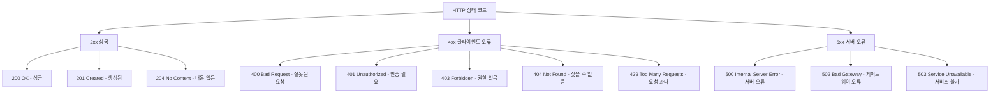

# REST API 설계

## 1. 한 줄 요약

REST API는 클라이언트와 서버가 HTTP 프로토콜을 통해 **리소스 중심**으로 통신하는 아키텍처 스타일이다.

---

## 2. 쉽게 설명

### 모바일 개발자 관점에서의 비유

REST API를 **레스토랑**에 비유해봅시다.

| 레스토랑 | REST API |
|:---|:---|
| 메뉴판 | API 문서 (Swagger, OpenAPI) |
| 주문서 | HTTP Request |
| 음식 | HTTP Response (JSON 데이터) |
| 테이블 번호 | 엔드포인트 URL |
| 주문 방법 (포장/매장) | HTTP Method (GET/POST/PUT/DELETE) |

모바일 앱에서 서버에 데이터를 요청하는 것은 레스토랑에서 주문하는 것과 같습니다.
- **GET**: "1번 테이블의 주문 내역 보여주세요" → 데이터 조회
- **POST**: "새로운 주문 넣어주세요" → 데이터 생성
- **PUT**: "주문 변경해주세요" → 데이터 수정
- **DELETE**: "주문 취소해주세요" → 데이터 삭제

### 왜 알아야 할까?

모바일 앱은 결국 서버의 API를 호출해서 데이터를 가져옵니다. API 설계를 이해하면:
- 백엔드 개발자와 **효과적인 커뮤니케이션**이 가능합니다
- API 응답 구조를 보고 **데이터 모델을 예측**할 수 있습니다
- 문제 발생 시 **클라이언트/서버 이슈를 구분**할 수 있습니다

---

## 3. 구조 다이어그램

### HTTP 요청/응답 흐름

```
┌─────────────┐                              ┌─────────────┐
│  Mobile App │                              │   Server    │
│  (Client)   │                              │  (Backend)  │
└──────┬──────┘                              └──────┬──────┘
       │                                            │
       │  HTTP Request                              │
       │  ─────────────────────────────────────────>│
       │  GET /api/v1/users/123                     │
       │  Headers: Authorization: Bearer xxx        │
       │                                            │
       │                                            │
       │  HTTP Response                             │
       │  <─────────────────────────────────────────│
       │  Status: 200 OK                            │
       │  Body: { "id": 123, "name": "홍길동" }      │
       │                                            │
```

### RESTful 엔드포인트 설계

```
리소스 기반 URL 설계
─────────────────────────────────────────────────────────────

    ┌─────────────────────────────────────────────────────┐
    │                    /api/v1/users                    │
    │                         │                           │
    │    ┌────────────────────┼────────────────────┐      │
    │    │                    │                    │      │
    │    ▼                    ▼                    ▼      │
    │  GET /users        POST /users         GET /users/123
    │  (목록 조회)        (생성)              (단일 조회)   │
    │                                                     │
    │    ┌────────────────────┬────────────────────┐      │
    │    │                    │                    │      │
    │    ▼                    ▼                    ▼      │
    │  PUT /users/123   PATCH /users/123   DELETE /users/123
    │  (전체 수정)       (부분 수정)         (삭제)         │
    │                                                     │
    │  중첩 리소스:                                        │
    │  GET /users/123/orders      (123번 유저의 주문 목록)  │
    │  POST /users/123/orders     (123번 유저의 주문 생성)  │
    └─────────────────────────────────────────────────────┘
```

### HTTP 상태 코드 분류



---

## 4. 실무 적용 예시

### 예시 1: 이커머스 앱 API 설계

```
상품 관련 API
─────────────────────────────────────────────────

GET    /api/v1/products                 # 상품 목록
GET    /api/v1/products?category=shoes  # 카테고리 필터링
GET    /api/v1/products?sort=price_asc  # 가격순 정렬
GET    /api/v1/products/123             # 상품 상세

POST   /api/v1/cart/items               # 장바구니 추가
DELETE /api/v1/cart/items/456           # 장바구니 삭제

POST   /api/v1/orders                   # 주문 생성
GET    /api/v1/orders/789               # 주문 상세
GET    /api/v1/users/me/orders          # 내 주문 목록
```

### 예시 2: API 응답 표준화

```json
// 성공 응답
{
  "success": true,
  "data": {
    "id": 123,
    "name": "상품명",
    "price": 29900
  },
  "meta": {
    "timestamp": "2024-01-15T10:30:00Z"
  }
}

// 에러 응답
{
  "success": false,
  "error": {
    "code": "PRODUCT_NOT_FOUND",
    "message": "상품을 찾을 수 없습니다",
    "details": {
      "productId": 999
    }
  }
}

// 페이지네이션 응답
{
  "success": true,
  "data": [...],
  "pagination": {
    "page": 1,
    "limit": 20,
    "totalCount": 150,
    "totalPages": 8,
    "hasNext": true,
    "hasPrev": false
  }
}
```

### 예시 3: API 버전 관리

```
방법 1: URL Path Versioning (가장 흔함)
─────────────────────────────────────────
GET /api/v1/users
GET /api/v2/users

방법 2: Header Versioning
─────────────────────────────────────────
GET /api/users
Header: API-Version: 2

방법 3: Query Parameter
─────────────────────────────────────────
GET /api/users?version=2
```

### 예시 4: 모바일에서의 API 호출 (Swift 예시)

```swift
// URLSession을 이용한 REST API 호출
func fetchUser(id: Int) async throws -> User {
    let url = URL(string: "https://api.example.com/v1/users/\(id)")!
    var request = URLRequest(url: url)
    request.httpMethod = "GET"
    request.setValue("Bearer \(accessToken)", forHTTPHeaderField: "Authorization")
    request.setValue("application/json", forHTTPHeaderField: "Content-Type")

    let (data, response) = try await URLSession.shared.data(for: request)

    guard let httpResponse = response as? HTTPURLResponse else {
        throw APIError.invalidResponse
    }

    switch httpResponse.statusCode {
    case 200:
        return try JSONDecoder().decode(User.self, from: data)
    case 401:
        throw APIError.unauthorized
    case 404:
        throw APIError.notFound
    default:
        throw APIError.serverError(statusCode: httpResponse.statusCode)
    }
}
```

---

## 5. 장단점

### 장점

| 장점 | 설명 |
|:---|:---|
| **직관적** | URL만 봐도 어떤 리소스인지 파악 가능 |
| **확장성** | 새로운 리소스 추가가 쉬움 |
| **캐싱** | HTTP 캐시를 자연스럽게 활용 가능 |
| **표준화** | HTTP 표준을 따르므로 도구 지원이 풍부 |
| **독립성** | 클라이언트-서버 분리로 독립적 개발 가능 |

### 단점

| 단점 | 설명 |
|:---|:---|
| **Over-fetching** | 필요 이상의 데이터를 받을 수 있음 |
| **Under-fetching** | 하나의 화면에 여러 API 호출 필요할 수 있음 |
| **실시간 한계** | WebSocket 대비 실시간 통신에 부적합 |
| **버전 관리** | 하위 호환성 유지가 어려울 수 있음 |

### REST vs GraphQL 비교

```
REST                              GraphQL
─────────────────────────────────────────────────────────
여러 엔드포인트                    단일 엔드포인트
고정된 응답 구조                   클라이언트가 원하는 필드 선택
Over/Under fetching 발생 가능      정확히 필요한 데이터만 요청
캐싱 용이 (HTTP)                  캐싱 복잡
학습 곡선 낮음                     학습 곡선 높음
```

---

## 6. 내 생각

> 이 섹션은 학습 후 본인의 생각을 정리하는 공간입니다.

```
Q1. 현재 담당 서비스의 API에서 개선하고 싶은 점은?


Q2. REST의 한계를 느꼈던 경험이 있다면?


Q3. API 설계 시 가장 중요하게 생각하는 원칙은?


```

---

## 7. 추가 질문

더 깊이 학습하기 위한 질문들입니다. AI에게 물어보거나 스스로 조사해보세요.

### 설계 관련
- [ ] HATEOAS란 무엇이고, 왜 실무에서는 잘 사용하지 않을까?

> **답변**: HATEOAS(Hypermedia As The Engine Of Application State)는 REST의 성숙도 모델에서 가장 높은 레벨(Level 3)로, API 응답에 다음에 수행할 수 있는 액션의 링크를 포함하는 방식입니다. 예를 들어 주문 조회 API 응답에 `"links": [{"rel": "cancel", "href": "/orders/123/cancel", "method": "POST"}]`처럼 취소 가능한 링크를 함께 제공합니다. 이론적으로는 클라이언트가 API 문서 없이도 상태 전이를 따라갈 수 있어 훌륭하지만, 실무에서 잘 사용하지 않는 이유가 있습니다. 첫째, 모바일 앱은 컴파일 타임에 이미 어떤 API를 호출할지 알고 있어서 동적 링크 탐색이 불필요합니다. 둘째, 응답 크기가 커져 네트워크 비용이 증가합니다. 셋째, 클라이언트 개발자 입장에서 링크 파싱보다 문서화된 엔드포인트를 직접 호출하는 게 더 직관적입니다. 대신 API Gateway나 BFF(Backend For Frontend) 패턴이 실무에서 더 선호됩니다.

- [ ] 리소스 간 관계가 복잡할 때 URL을 어떻게 설계해야 할까?

> **답변**: 리소스 간 관계가 복잡해지면 URL이 `/users/123/orders/456/items/789/reviews`처럼 깊어질 수 있는데, 이는 피해야 합니다. 일반적으로 **중첩은 2단계까지만** 권장합니다. 해결 방법으로는 첫째, 독립적인 리소스로 분리하여 `/reviews/789`처럼 직접 접근할 수 있게 합니다. 둘째, 쿼리 파라미터를 활용하여 `/reviews?order_id=456&user_id=123`으로 필터링합니다. 셋째, 모바일 앱에서는 BFF 패턴을 적용하여 화면 단위로 필요한 데이터를 한 번에 조합해서 제공하는 API를 만듭니다. 예를 들어 `/app/home` API가 사용자 정보, 최근 주문, 추천 상품을 한 번에 반환하면 앱은 여러 API를 호출할 필요가 없습니다. 실무에서는 "이 URL이 직관적으로 이해되는가?"를 기준으로 판단하세요.

- [ ] API Rate Limiting은 어떻게 구현하고, 클라이언트는 어떻게 대응해야 할까?

> **답변**: Rate Limiting은 특정 시간 내 API 호출 횟수를 제한하여 서버를 보호하는 기술입니다. 서버에서는 Redis를 활용한 Token Bucket이나 Sliding Window 알고리즘으로 구현합니다. 응답 헤더에 `X-RateLimit-Limit: 100`, `X-RateLimit-Remaining: 45`, `X-RateLimit-Reset: 1516239022`를 포함하여 클라이언트에게 상태를 알려줍니다. 제한 초과 시 `429 Too Many Requests`를 반환하고 `Retry-After` 헤더로 재시도 시점을 안내합니다. **모바일 앱에서의 대응 전략**으로는: (1) 429 응답 시 Retry-After 값만큼 대기 후 재시도, (2) Exponential Backoff 적용 (1초→2초→4초→8초 간격 재시도), (3) 불필요한 API 호출 최소화 (로컬 캐시 활용), (4) 사용자에게 "잠시 후 다시 시도해주세요" 안내가 있습니다. Kotlin 예시:

```kotlin
// Retrofit Interceptor로 Rate Limit 처리
class RateLimitInterceptor : Interceptor {
    override fun intercept(chain: Interceptor.Chain): Response {
        val response = chain.proceed(chain.request())

        if (response.code == 429) {
            val retryAfter = response.header("Retry-After")?.toLongOrNull() ?: 60
            Thread.sleep(retryAfter * 1000)
            return chain.proceed(chain.request())
        }

        return response
    }
}
```

### 실무 관련
- [ ] API 문서화 도구 (Swagger, Postman)를 어떻게 활용할까?

> **답변**: API 문서화는 백엔드-모바일 협업의 핵심입니다. **Swagger(OpenAPI)**는 코드에서 자동으로 문서를 생성하고, 브라우저에서 바로 API를 테스트할 수 있어 백엔드 개발 단계에서 유용합니다. Spring Boot의 경우 `springdoc-openapi`, Express는 `swagger-jsdoc`을 사용합니다. **Postman**은 API 컬렉션을 팀과 공유하고, 환경 변수(dev/staging/prod)를 분리하여 테스트할 때 유용합니다. 모바일 개발자 입장에서는 Postman Collection을 받아 먼저 API 동작을 확인한 후 앱에 구현하면 효율적입니다. 최근에는 **Stoplight, Redoc** 같은 도구로 더 예쁜 문서를 만들거나, **Mock Server** 기능으로 백엔드 개발 전에 프론트 개발을 시작할 수도 있습니다. 핵심 팁: API 스펙 변경 시 Swagger 문서와 Postman 컬렉션을 동시에 업데이트하는 CI/CD 파이프라인을 구축하세요.

- [ ] Breaking Change 없이 API를 수정하는 방법은?

> **답변**: Breaking Change는 기존 클라이언트를 망가뜨리는 변경으로, 특히 모바일 앱은 업데이트 강제가 어려워 매우 신중해야 합니다. **하위 호환성 유지 전략**: (1) **필드 추가는 OK**: 응답에 새 필드 추가는 안전합니다. 모바일에서 DTO에 없는 필드는 무시하면 됩니다. (2) **필드 삭제는 금지**: 대신 deprecated 표시 후 충분한 유예 기간(최소 3개월)을 둡니다. (3) **필드 타입 변경 금지**: `price: 1000` → `price: "1000"` 변경은 앱을 크래시시킵니다. (4) **Nullable 처리**: 새 필드는 nullable로 시작하여 구버전 앱 호환성을 유지합니다. (5) **API 버전 관리**: 큰 변경이 필요하면 `/v2/users`로 새 버전을 만들고 v1은 유지합니다. 실무 팁으로 모바일 앱의 최소 지원 버전을 정하고, 해당 버전이 사용하는 API는 절대 변경하지 않는 정책을 수립하세요. Swift/Kotlin에서는 `Codable`/`Gson`의 `@SerialName`과 기본값 설정으로 방어적으로 파싱하는 것이 좋습니다.

- [ ] 대용량 파일 업로드 API는 어떻게 설계할까?

> **답변**: 대용량 파일(이미지, 동영상) 업로드는 모바일 앱에서 흔히 마주치는 요구사항입니다. **권장 패턴인 Presigned URL 방식**은: (1) 앱이 서버에 업로드 URL 요청 → (2) 서버가 S3 Presigned URL 발급 → (3) 앱이 S3에 직접 업로드 → (4) 완료 후 서버에 알림. 이 방식은 서버 부하를 줄이고, 대용량 파일도 안정적으로 처리합니다. **Multipart Upload**는 큰 파일을 여러 조각으로 나눠 업로드하여 실패 시 해당 조각만 재시도합니다. **Chunked Upload**는 5MB씩 끊어서 업로드하고 진행률 표시가 가능합니다. **모바일 고려사항**: 백그라운드 업로드 지원(iOS `URLSession.background`, Android `WorkManager`), 네트워크 변경 시 이어서 업로드, 업로드 중 앱 종료 대응이 필요합니다.

```swift
// iOS Presigned URL 업로드 예시
func uploadImage(_ imageData: Data) async throws -> String {
    // 1. Presigned URL 요청
    let presignedResponse = try await api.request(.post("/upload/presign", body: ["contentType": "image/jpeg"]))
    let presignedUrl = presignedResponse.uploadUrl

    // 2. S3에 직접 업로드
    var request = URLRequest(url: URL(string: presignedUrl)!)
    request.httpMethod = "PUT"
    request.setValue("image/jpeg", forHTTPHeaderField: "Content-Type")

    let (_, response) = try await URLSession.shared.upload(for: request, from: imageData)

    guard (response as? HTTPURLResponse)?.statusCode == 200 else {
        throw UploadError.failed
    }

    return presignedResponse.fileKey
}
```

### 심화
- [ ] REST와 gRPC는 어떻게 다르고, 각각 언제 사용할까?

> **답변**: REST는 HTTP/JSON 기반으로 사람이 읽기 쉽고 브라우저 호환성이 좋습니다. gRPC는 HTTP/2와 Protocol Buffers(바이너리 포맷)를 사용하여 더 빠르고 타입 안전합니다. **성능 차이**는 상당합니다. gRPC는 직렬화/역직렬화가 JSON보다 10배 빠르고, HTTP/2 멀티플렉싱으로 여러 요청을 동시 처리합니다. **사용 시나리오**: REST는 공개 API, 웹 브라우저 통신, 단순한 CRUD 작업에 적합합니다. gRPC는 마이크로서비스 간 내부 통신, 실시간 양방향 스트리밍(채팅, 게임), 대용량 데이터 전송에 적합합니다. **모바일에서의 gRPC**: iOS/Android 모두 gRPC 라이브러리를 지원하지만, 디버깅이 어렵고 프록시 설정이 복잡합니다. 따라서 모바일 ↔ 서버는 REST, 서버 ↔ 서버는 gRPC를 사용하는 하이브리드 구조가 일반적입니다. 최근에는 gRPC-Web이나 Connect-RPC를 통해 브라우저/모바일에서도 gRPC를 더 쉽게 사용할 수 있게 되었습니다.

- [ ] API Gateway의 역할은 무엇일까?

> **답변**: API Gateway는 클라이언트와 백엔드 서비스 사이의 **단일 진입점**으로, 모바일 앱 개발자가 알아야 할 중요한 인프라 컴포넌트입니다. **주요 역할**: (1) **라우팅**: `/users/*`는 User Service, `/orders/*`는 Order Service로 전달 (2) **인증/인가**: JWT 검증을 Gateway에서 처리하여 각 서비스 부담 감소 (3) **Rate Limiting**: 서비스별 호출 제한 (4) **로깅/모니터링**: 모든 API 호출 추적 (5) **응답 캐싱**: 자주 조회되는 데이터 캐싱 (6) **프로토콜 변환**: 외부는 REST, 내부는 gRPC 가능. **모바일 앱에 미치는 영향**: API 엔드포인트가 `api.example.com`으로 통일되어 관리가 쉽습니다. Gateway 장애 시 모든 API가 불통되므로 고가용성 구성이 필수입니다. AWS API Gateway, Kong, Netflix Zuul, Nginx 등이 대표적입니다. BFF 패턴과 결합하면 모바일 전용 API를 효율적으로 제공할 수 있습니다.

- [ ] 멱등성(Idempotency)이란 무엇이고, 왜 중요할까?

> **답변**: 멱등성은 **같은 요청을 여러 번 보내도 결과가 동일**한 특성입니다. `GET /users/123`을 10번 호출해도 결과는 같지만, `POST /orders`를 10번 호출하면 주문이 10개 생깁니다. **HTTP 메서드별 멱등성**: GET, PUT, DELETE는 멱등하고, POST, PATCH는 멱등하지 않습니다. **모바일에서 중요한 이유**: 네트워크 불안정으로 요청이 중복 전송될 수 있습니다. 결제 API가 멱등하지 않으면 사용자가 버튼을 두 번 눌러 이중 결제가 발생합니다. **해결 방법인 Idempotency Key**: 클라이언트가 고유한 키를 생성하여 요청에 포함하면, 서버가 같은 키의 요청은 한 번만 처리합니다.

```kotlin
// Android에서 Idempotency Key 사용 예시
suspend fun createOrder(items: List<CartItem>): Order {
    val idempotencyKey = UUID.randomUUID().toString()

    return api.createOrder(
        body = OrderRequest(items),
        headers = mapOf("Idempotency-Key" to idempotencyKey)
    )
}

// 결제 버튼 중복 클릭 방지와 함께 사용
binding.payButton.setOnClickListener {
    binding.payButton.isEnabled = false  // UI에서 중복 방지
    viewModel.createOrder()  // API는 Idempotency Key로 추가 방지
}
```

서버에서는 Idempotency Key를 Redis에 저장하고, 같은 키로 재요청이 오면 저장된 결과를 반환합니다. 이 패턴은 Stripe, PayPal 등 주요 결제 API에서 사용됩니다.

---

## 8. 실무에서 자주 겪는 문제와 해결책

### 문제 1: N+1 API 호출 문제

모바일 앱에서 목록 화면을 구현할 때 발생하는 대표적인 문제입니다.

```
문제 상황
─────────────────────────────────────────────
화면: 주문 목록 (주문자 이름, 상품명 표시 필요)

❌ 잘못된 접근 (N+1 호출)
GET /orders                  → 주문 10개 반환
GET /users/1                 → 주문자 정보
GET /users/2                 → 주문자 정보
...
GET /products/101            → 상품 정보
GET /products/102            → 상품 정보
...
→ 총 20+ API 호출, 앱이 매우 느려짐

✅ 올바른 접근
GET /orders?include=user,products   → 한 번에 모든 데이터
또는
GET /app/orders                     → BFF 패턴으로 화면 맞춤 데이터
```

### 문제 2: 네트워크 오류 처리

```swift
// iOS - 네트워크 오류별 사용자 메시지
enum APIError: Error {
    case networkUnavailable     // 인터넷 연결 없음
    case timeout                // 요청 시간 초과
    case serverError(Int)       // 5xx 서버 오류
    case clientError(Int)       // 4xx 클라이언트 오류
    case decodingError          // JSON 파싱 실패

    var userMessage: String {
        switch self {
        case .networkUnavailable:
            return "인터넷 연결을 확인해주세요"
        case .timeout:
            return "서버 응답이 지연되고 있습니다. 잠시 후 다시 시도해주세요"
        case .serverError:
            return "서버에 문제가 발생했습니다. 잠시 후 다시 시도해주세요"
        case .clientError(let code):
            return code == 401 ? "다시 로그인해주세요" : "요청을 처리할 수 없습니다"
        case .decodingError:
            return "데이터를 불러오는데 실패했습니다"
        }
    }
}
```

### 문제 3: 오프라인 지원

```kotlin
// Android - 오프라인 우선 아키텍처
class OrderRepository(
    private val api: OrderApi,
    private val db: OrderDao,
    private val networkMonitor: NetworkMonitor
) {
    fun getOrders(): Flow<Resource<List<Order>>> = flow {
        // 1. 먼저 로컬 캐시 데이터 반환 (빠른 UI 표시)
        val cachedOrders = db.getAllOrders()
        emit(Resource.Success(cachedOrders))

        // 2. 네트워크 가능하면 서버에서 최신 데이터 가져오기
        if (networkMonitor.isOnline()) {
            try {
                val freshOrders = api.getOrders()
                db.insertAll(freshOrders)  // 로컬 DB 업데이트
                emit(Resource.Success(freshOrders))
            } catch (e: Exception) {
                emit(Resource.Error("서버 연결 실패", cachedOrders))
            }
        }
    }
}
```

---

## 9. 모바일-백엔드 협업 체크리스트

API 설계 시 모바일 개발자와 백엔드 개발자가 함께 검토해야 할 항목들입니다.

```
□ 응답 필드명이 일관성 있는가? (camelCase vs snake_case)
□ 날짜/시간 형식이 통일되어 있는가? (ISO 8601 권장)
□ 페이지네이션 방식이 합의되었는가? (offset/limit vs cursor)
□ 에러 응답 형식이 표준화되어 있는가?
□ null과 빈 값의 구분이 명확한가?
□ 인증 토큰 만료 시 처리 방식이 합의되었는가?
□ 이미지 URL은 전체 경로인가, 상대 경로인가?
□ 금액 필드의 단위가 명확한가? (원, 달러, 소수점)
□ API 버전 관리 전략이 있는가?
□ 테스트 환경(dev/staging)이 분리되어 있는가?
```

---

## 참고 자료

- [RESTful API 설계 가이드](https://restfulapi.net/)
- [HTTP 상태 코드 레퍼런스](https://developer.mozilla.org/ko/docs/Web/HTTP/Status)
- [Microsoft REST API Guidelines](https://github.com/microsoft/api-guidelines)
- [Google API Design Guide](https://cloud.google.com/apis/design)
- [Zalando RESTful API Guidelines](https://opensource.zalando.com/restful-api-guidelines/)
