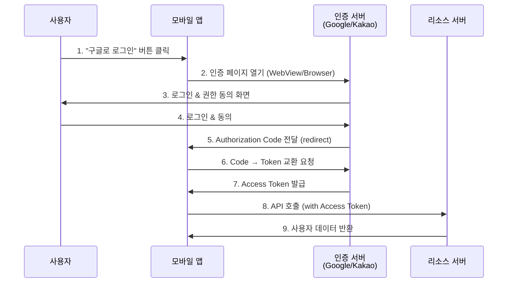

# JWT / OAuth

## 1. 한 줄 요약

JWT는 **토큰 기반 인증**을 위한 표준 포맷이고, OAuth는 **제3자 인증 위임**을 위한 프로토콜이다.

---

## 2. 쉽게 설명

### 모바일 개발자 관점에서의 비유

#### JWT = 놀이공원 자유이용권

| 놀이공원 | JWT |
|:---|:---|
| 자유이용권 | Access Token |
| 입장 시 본인 확인 | 로그인 (인증) |
| 놀이기구 탑승 | API 호출 |
| 이용권에 적힌 유효기간 | Token Expiration |
| 이용권에 적힌 이름, 등급 | Payload (Claims) |
| 위조 방지 홀로그램 | Signature |

자유이용권을 한 번 발급받으면, 놀이기구마다 신분증을 보여줄 필요 없이 이용권만 보여주면 됩니다. JWT도 마찬가지로, 한 번 로그인하면 토큰만으로 인증된 사용자임을 증명합니다.

#### OAuth = 발렛파킹 키

| 발렛파킹 | OAuth |
|:---|:---|
| 차 주인 | 사용자 (Resource Owner) |
| 발렛 기사 | 앱 (Client) |
| 발렛 전용 키 | Access Token |
| 주차만 가능, 트렁크 열기 불가 | Scope (권한 범위) |
| 호텔 (키 발급) | 인증 서버 (Google, Kakao) |

발렛 기사에게 마스터키 대신 주차만 가능한 전용 키를 주듯이, OAuth는 앱에게 전체 권한이 아닌 **필요한 권한만** 위임합니다.

### 왜 알아야 할까?

모바일 앱에서 로그인은 필수 기능입니다.
- 세션 기반 vs 토큰 기반 인증의 차이를 이해해야 합니다
- 토큰 저장 위치(Keychain, SharedPreferences)와 보안을 고려해야 합니다
- 소셜 로그인 연동 시 OAuth 플로우를 이해해야 합니다

---

## 3. 구조 다이어그램

### JWT 구조

```
JWT (JSON Web Token) 구조
══════════════════════════════════════════════════════════════

┌─────────────────────────────────────────────────────────────┐
│                                                             │
│  eyJhbGciOiJIUzI1NiIsInR5cCI6IkpXVCJ9.                      │
│  ─────────────────────────────────────                      │
│  │                                                          │
│  └─── Header (헤더) - Base64 인코딩                          │
│       {                                                     │
│         "alg": "HS256",    // 서명 알고리즘                  │
│         "typ": "JWT"       // 토큰 타입                      │
│       }                                                     │
│                                                             │
│  eyJzdWIiOiIxMjM0NTY3ODkwIiwibmFtZSI6IkhvbmdHaWxEb25nIn0.   │
│  ───────────────────────────────────────────────────────    │
│  │                                                          │
│  └─── Payload (페이로드) - Base64 인코딩                     │
│       {                                                     │
│         "sub": "1234567890",   // 사용자 ID                  │
│         "name": "HongGilDong", // 사용자 이름                 │
│         "iat": 1516239022,     // 발급 시간                  │
│         "exp": 1516242622      // 만료 시간                  │
│       }                                                     │
│                                                             │
│  SflKxwRJSMeKKF2QT4fwpMeJf36POk6yJV_adQssw5c                │
│  ─────────────────────────────────────────────              │
│  │                                                          │
│  └─── Signature (서명)                                       │
│       HMACSHA256(                                           │
│         base64UrlEncode(header) + "." +                     │
│         base64UrlEncode(payload),                           │
│         secret                                              │
│       )                                                     │
│                                                             │
└─────────────────────────────────────────────────────────────┘
```

### Access Token & Refresh Token 플로우

```
┌────────────┐                    ┌────────────┐                    ┌────────────┐
│   Mobile   │                    │   Server   │                    │  Database  │
│    App     │                    │            │                    │            │
└─────┬──────┘                    └─────┬──────┘                    └─────┬──────┘
      │                                 │                                 │
      │  1. 로그인 요청                  │                                 │
      │  (email, password)              │                                 │
      │ ───────────────────────────────>│                                 │
      │                                 │  2. 사용자 확인                  │
      │                                 │ ───────────────────────────────>│
      │                                 │ <───────────────────────────────│
      │                                 │                                 │
      │  3. 토큰 발급                    │                                 │
      │  {                              │                                 │
      │    accessToken (15분),          │                                 │
      │    refreshToken (7일)           │                                 │
      │  }                              │                                 │
      │ <───────────────────────────────│                                 │
      │                                 │                                 │
      │  ═══════════════════════════════════════════════════════════════  │
      │                         15분 후...                                │
      │  ═══════════════════════════════════════════════════════════════  │
      │                                 │                                 │
      │  4. API 호출 (만료된 accessToken)│                                 │
      │ ───────────────────────────────>│                                 │
      │                                 │                                 │
      │  5. 401 Unauthorized            │                                 │
      │ <───────────────────────────────│                                 │
      │                                 │                                 │
      │  6. 토큰 갱신 요청 (refreshToken)│                                 │
      │ ───────────────────────────────>│                                 │
      │                                 │                                 │
      │  7. 새로운 accessToken 발급     │                                 │
      │ <───────────────────────────────│                                 │
      │                                 │                                 │
      │  8. API 재호출 (새 accessToken) │                                 │
      │ ───────────────────────────────>│                                 │
      │                                 │                                 │
```

### OAuth 2.0 Authorization Code Flow



---

## 4. 실무 적용 예시

### 예시 1: 모바일 앱의 토큰 관리 (Swift)

```swift
// TokenManager.swift
class TokenManager {
    private let keychain = KeychainSwift()

    private let accessTokenKey = "accessToken"
    private let refreshTokenKey = "refreshToken"
    private let expirationKey = "tokenExpiration"

    var accessToken: String? {
        get { keychain.get(accessTokenKey) }
        set {
            if let token = newValue {
                keychain.set(token, forKey: accessTokenKey)
            } else {
                keychain.delete(accessTokenKey)
            }
        }
    }

    var isTokenExpired: Bool {
        guard let expiration = keychain.get(expirationKey),
              let timestamp = Double(expiration) else {
            return true
        }
        return Date().timeIntervalSince1970 > timestamp
    }

    func clearTokens() {
        keychain.delete(accessTokenKey)
        keychain.delete(refreshTokenKey)
        keychain.delete(expirationKey)
    }
}
```

### 예시 2: 토큰 갱신 인터셉터

```swift
// AuthInterceptor.swift
class AuthInterceptor: RequestInterceptor {
    private let tokenManager = TokenManager()
    private var isRefreshing = false
    private var requestsToRetry: [(RetryResult) -> Void] = []

    func adapt(_ urlRequest: URLRequest,
               for session: Session,
               completion: @escaping (Result<URLRequest, Error>) -> Void) {
        var request = urlRequest

        if let token = tokenManager.accessToken {
            request.setValue("Bearer \(token)", forHTTPHeaderField: "Authorization")
        }

        completion(.success(request))
    }

    func retry(_ request: Request,
               for session: Session,
               dueTo error: Error,
               completion: @escaping (RetryResult) -> Void) {

        guard let response = request.task?.response as? HTTPURLResponse,
              response.statusCode == 401 else {
            completion(.doNotRetry)
            return
        }

        // 이미 갱신 중이면 대기열에 추가
        if isRefreshing {
            requestsToRetry.append(completion)
            return
        }

        isRefreshing = true

        // 토큰 갱신 API 호출
        refreshToken { [weak self] success in
            guard let self = self else { return }

            self.isRefreshing = false

            if success {
                // 대기 중인 모든 요청 재시도
                self.requestsToRetry.forEach { $0(.retry) }
                self.requestsToRetry.removeAll()
                completion(.retry)
            } else {
                // 갱신 실패 - 로그아웃 처리
                self.requestsToRetry.forEach { $0(.doNotRetry) }
                self.requestsToRetry.removeAll()
                completion(.doNotRetry)
                NotificationCenter.default.post(name: .forceLogout, object: nil)
            }
        }
    }
}
```

### 예시 3: 소셜 로그인 (카카오)

```swift
// KakaoLoginManager.swift
import KakaoSDKAuth
import KakaoSDKUser

class KakaoLoginManager {

    func login() async throws -> AuthResult {
        // 1. 카카오톡 앱으로 로그인 (설치되어 있을 경우)
        if UserApi.isKakaoTalkLoginAvailable() {
            return try await loginWithKakaoTalk()
        } else {
            // 2. 카카오 계정으로 로그인 (웹뷰)
            return try await loginWithKakaoAccount()
        }
    }

    private func loginWithKakaoTalk() async throws -> AuthResult {
        return try await withCheckedThrowingContinuation { continuation in
            UserApi.shared.loginWithKakaoTalk { oauthToken, error in
                if let error = error {
                    continuation.resume(throwing: error)
                    return
                }

                guard let token = oauthToken else {
                    continuation.resume(throwing: AuthError.noToken)
                    return
                }

                // 3. 카카오 토큰을 서버에 전달하여 자체 JWT 발급
                Task {
                    do {
                        let authResult = try await self.exchangeToken(kakaoToken: token.accessToken)
                        continuation.resume(returning: authResult)
                    } catch {
                        continuation.resume(throwing: error)
                    }
                }
            }
        }
    }

    // 카카오 토큰 → 서버 JWT 교환
    private func exchangeToken(kakaoToken: String) async throws -> AuthResult {
        let response = try await APIClient.shared.request(
            .post("/auth/kakao"),
            body: ["kakaoAccessToken": kakaoToken]
        )
        return try JSONDecoder().decode(AuthResult.self, from: response.data)
    }
}
```

### 예시 4: 서버 측 JWT 검증

```javascript
// middleware/auth.js (Node.js Express)
const jwt = require('jsonwebtoken');

const ACCESS_TOKEN_SECRET = process.env.ACCESS_TOKEN_SECRET;
const REFRESH_TOKEN_SECRET = process.env.REFRESH_TOKEN_SECRET;

const ACCESS_TOKEN_EXPIRY = '15m';
const REFRESH_TOKEN_EXPIRY = '7d';

// JWT 생성
function generateTokens(userId, role) {
    const accessToken = jwt.sign(
        { userId, role },
        ACCESS_TOKEN_SECRET,
        { expiresIn: ACCESS_TOKEN_EXPIRY }
    );

    const refreshToken = jwt.sign(
        { userId },
        REFRESH_TOKEN_SECRET,
        { expiresIn: REFRESH_TOKEN_EXPIRY }
    );

    return { accessToken, refreshToken };
}

// 인증 미들웨어
function authenticateToken(req, res, next) {
    const authHeader = req.headers['authorization'];
    const token = authHeader && authHeader.split(' ')[1]; // Bearer TOKEN

    if (!token) {
        return res.status(401).json({
            error: 'UNAUTHORIZED',
            message: '인증 토큰이 필요합니다'
        });
    }

    jwt.verify(token, ACCESS_TOKEN_SECRET, (err, decoded) => {
        if (err) {
            if (err.name === 'TokenExpiredError') {
                return res.status(401).json({
                    error: 'TOKEN_EXPIRED',
                    message: '토큰이 만료되었습니다'
                });
            }
            return res.status(403).json({
                error: 'INVALID_TOKEN',
                message: '유효하지 않은 토큰입니다'
            });
        }

        req.user = decoded;
        next();
    });
}
```

---

## 5. 장단점

### JWT 장단점

| 장점 | 단점 |
|:---|:---|
| **Stateless**: 서버에 세션 저장 불필요 | **취소 어려움**: 발급된 토큰 즉시 무효화 불가 |
| **확장성**: 서버 수평 확장에 유리 | **크기**: 세션 ID 대비 토큰 크기가 큼 |
| **자체 포함**: 토큰 자체에 정보 포함 | **보안 위험**: 탈취 시 만료까지 악용 가능 |
| **크로스 도메인**: 여러 도메인에서 사용 가능 | **갱신 복잡**: Refresh Token 로직 필요 |

### OAuth 장단점

| 장점 | 단점 |
|:---|:---|
| **보안**: 비밀번호 직접 공유 불필요 | **복잡성**: 구현이 상대적으로 복잡 |
| **권한 제어**: Scope로 세밀한 권한 관리 | **의존성**: 외부 인증 서버에 의존 |
| **사용자 경험**: 소셜 로그인으로 가입 간소화 | **장애 전파**: 인증 서버 장애 시 로그인 불가 |

### 토큰 저장 위치 비교

```
플랫폼별 안전한 토큰 저장 위치
─────────────────────────────────────────────────────────────

iOS
├── ✅ Keychain (권장)
│   └── 하드웨어 수준 암호화, 앱 삭제 후에도 유지 가능
├── ⚠️ UserDefaults
│   └── 평문 저장, 탈옥 시 접근 가능
└── ❌ 파일 시스템
    └── 암호화 없이 저장 위험

Android
├── ✅ EncryptedSharedPreferences (권장)
│   └── Android Keystore 기반 암호화
├── ✅ Android Keystore
│   └── 하드웨어 기반 키 저장
├── ⚠️ SharedPreferences
│   └── 평문 저장, 루팅 시 접근 가능
└── ❌ 외부 저장소
    └── 다른 앱에서 접근 가능

Web
├── ✅ HttpOnly Cookie (권장)
│   └── JavaScript 접근 불가, XSS 방지
├── ⚠️ LocalStorage
│   └── XSS 공격에 취약
└── ❌ SessionStorage
    └── 탭 종료 시 삭제, XSS에 취약
```

---

## 6. 내 생각

> 이 섹션은 학습 후 본인의 생각을 정리하는 공간입니다.

```
Q1. 현재 앱에서 토큰은 어디에 저장하고 있는가? 보안상 적절한가?


Q2. 토큰 갱신 중 동시 API 호출 시 어떻게 처리하고 있는가?


Q3. 소셜 로그인 도입 시 고려해야 할 점은?


```

---

## 7. 추가 질문

더 깊이 학습하기 위한 질문들입니다.

### 보안 관련
- [ ] JWT가 탈취되면 어떻게 대응할 수 있을까? (Token Blacklist)

> **답변**: JWT는 한 번 발급되면 만료 전까지 유효하므로 탈취 시 큰 문제가 됩니다. **대응 전략 1: Token Blacklist**는 로그아웃된 토큰의 `jti`(JWT ID)를 Redis에 저장하고, 매 요청마다 블랙리스트를 확인합니다. 단점은 모든 요청에 Redis 조회가 추가되어 Stateless의 장점이 사라집니다. **대응 전략 2: 짧은 만료 시간**은 Access Token을 5-15분으로 짧게 설정하여 탈취되어도 피해를 최소화합니다. Refresh Token은 더 안전하게 저장(Keychain/EncryptedSharedPreferences)합니다. **대응 전략 3: Token Binding**은 토큰에 디바이스 정보나 IP를 포함시켜 다른 환경에서 사용 시 거부합니다. **모바일 실무**: 탈취 의심 시 서버에서 해당 사용자의 모든 Refresh Token을 무효화하고, 앱에서 강제 로그아웃 처리합니다. Firebase나 AWS Cognito 같은 인증 서비스는 이러한 기능을 기본 제공합니다.

```swift
// iOS - 의심스러운 활동 감지 시 처리
func handleSecurityBreach() {
    // 1. 서버에 모든 세션 무효화 요청
    api.revokeAllSessions()

    // 2. 로컬 토큰 삭제
    tokenManager.clearTokens()

    // 3. 사용자에게 알림
    showAlert("보안상의 이유로 다시 로그인해주세요")

    // 4. 로그인 화면으로 이동
    navigateToLogin()
}
```

- [ ] Refresh Token Rotation이란 무엇이고, 왜 필요할까?

> **답변**: Refresh Token Rotation은 **토큰 갱신 시마다 새로운 Refresh Token을 발급**하고 기존 것은 무효화하는 보안 기법입니다. 일반적인 흐름: (1) Access Token 만료 → (2) Refresh Token으로 갱신 요청 → (3) 새 Access Token + **새 Refresh Token** 발급 → (4) 기존 Refresh Token 무효화. **필요한 이유**: Refresh Token이 탈취되어도, 정상 사용자가 먼저 갱신하면 공격자의 토큰은 무효가 됩니다. 또한 같은 Refresh Token이 두 번 사용되면 탈취를 탐지할 수 있습니다. **모바일 구현 시 주의점**: 토큰 갱신 응답을 받기 전에 앱이 종료되면 새 토큰을 저장하지 못해 로그아웃될 수 있습니다. 따라서 (1) 네트워크 요청 전 UI를 블로킹하거나, (2) Refresh Token에 grace period(같은 토큰 재사용 허용 시간)를 두는 것이 좋습니다.

- [ ] PKCE(Proof Key for Code Exchange)는 왜 필요한가?

> **답변**: PKCE(Proof Key for Code Exchange, 픽시라고 발음)는 **Authorization Code 탈취 공격을 방지**하는 OAuth 2.0 확장입니다. 모바일 앱은 웹과 달리 client_secret을 안전하게 저장할 수 없고, Custom URL Scheme으로 Authorization Code가 전달되는 과정에서 악성 앱이 가로챌 수 있습니다. **PKCE 동작 원리**: (1) 앱이 랜덤 `code_verifier` 생성 (2) `code_verifier`를 SHA256 해시한 `code_challenge`를 인증 요청에 포함 (3) 인증 서버가 Authorization Code와 함께 `code_challenge` 저장 (4) 토큰 교환 시 원본 `code_verifier` 전송 (5) 서버가 해시 검증 후 토큰 발급. 악성 앱이 Authorization Code를 가로채도 `code_verifier`가 없으면 토큰을 받을 수 없습니다. **Apple Sign In, Google Sign In**은 PKCE를 기본 적용하며, 직접 OAuth를 구현할 때도 반드시 사용해야 합니다.

```kotlin
// Android PKCE 구현 예시
class PKCEHelper {
    fun generateCodeVerifier(): String {
        val bytes = ByteArray(32)
        SecureRandom().nextBytes(bytes)
        return Base64.encodeToString(bytes, Base64.URL_SAFE or Base64.NO_PADDING or Base64.NO_WRAP)
    }

    fun generateCodeChallenge(verifier: String): String {
        val bytes = MessageDigest.getInstance("SHA-256").digest(verifier.toByteArray())
        return Base64.encodeToString(bytes, Base64.URL_SAFE or Base64.NO_PADDING or Base64.NO_WRAP)
    }
}

// 사용
val verifier = pkceHelper.generateCodeVerifier()  // 저장해둠
val challenge = pkceHelper.generateCodeChallenge(verifier)

// 인증 URL에 포함
val authUrl = "https://auth.example.com/authorize?" +
    "code_challenge=$challenge&code_challenge_method=S256&..."
```

### 실무 관련
- [ ] 여러 디바이스에서 로그인할 때 토큰 관리는 어떻게 할까?

> **답변**: 대부분의 서비스는 다중 디바이스 로그인을 허용합니다(넷플릭스, 카카오톡 등). **권장 구조**: 서버에서 각 디바이스별 세션/토큰을 개별 관리합니다. DB에 `user_sessions` 테이블을 두고 `(user_id, device_id, refresh_token, device_name, last_active_at)` 형태로 저장합니다. **디바이스 식별**: iOS는 `identifierForVendor`, Android는 `ANDROID_ID` 또는 앱 설치 시 생성한 UUID를 사용합니다. **동시 접속 제한이 필요한 경우**: 새 디바이스 로그인 시 기존 세션 개수를 확인하고, 제한 초과 시 가장 오래된 세션을 만료시키거나 사용자에게 선택권을 줍니다. **모바일 UX 고려**: "새 기기에서 로그인되었습니다" 푸시 알림을 보내 보안 인식을 높입니다.

- [ ] "다른 기기에서 로그아웃" 기능은 JWT로 어떻게 구현할까?

> **답변**: 순수 JWT만으로는 구현이 어렵습니다. JWT는 Stateless라서 특정 토큰만 무효화하기 어렵기 때문입니다. **실용적인 해결책**: (1) **Refresh Token을 서버에 저장**: 로그아웃 시 해당 디바이스의 Refresh Token을 DB에서 삭제합니다. Access Token이 만료되면 갱신 불가로 자연스럽게 로그아웃됩니다. (2) **Token Version 사용**: 사용자별 `token_version`을 DB에 저장하고 JWT에 포함합니다. 전체 로그아웃 시 버전을 올리면 이전 버전 토큰은 모두 무효가 됩니다. (3) **세션 ID 포함**: JWT에 `session_id`를 포함하고, 서버에 유효한 세션 목록을 관리합니다. 특정 세션 삭제로 해당 기기만 로그아웃할 수 있습니다. 모바일 앱에서는 "로그인된 기기 목록" 화면을 제공하고, 각 기기별로 "로그아웃" 버튼을 두는 것이 일반적입니다.

- [ ] 바이오메트릭 인증(Face ID, 지문)과 JWT를 어떻게 연동할까?

> **답변**: 바이오메트릭은 **로컬 인증**으로 서버에 생체 정보가 전송되지 않습니다. 연동 패턴은 두 가지입니다. **패턴 1: 토큰 접근 보호** - Refresh Token을 Keychain/Keystore에 저장할 때 바이오메트릭으로 보호합니다. 앱 실행 시 Face ID/지문 인증 후 토큰에 접근하여 자동 로그인합니다. 이 방식이 가장 일반적입니다. **패턴 2: 간편 로그인** - 첫 로그인은 ID/Password로 하고, 이후 바이오메트릭으로 저장된 자격증명에 접근합니다.

```swift
// iOS - Face ID/Touch ID로 보호된 Keychain 접근
func getProtectedToken() async throws -> String? {
    let context = LAContext()
    var error: NSError?

    guard context.canEvaluatePolicy(.deviceOwnerAuthenticationWithBiometrics, error: &error) else {
        throw AuthError.biometricNotAvailable
    }

    // 바이오메트릭 인증 요청
    let success = try await context.evaluatePolicy(
        .deviceOwnerAuthenticationWithBiometrics,
        localizedReason: "로그인을 위해 인증해주세요"
    )

    guard success else { throw AuthError.biometricFailed }

    // 인증 성공 후 Keychain에서 토큰 읽기
    return keychain.get("refreshToken")
}
```

### 심화
- [ ] OpenID Connect(OIDC)와 OAuth 2.0의 차이는?

> **답변**: OAuth 2.0은 **인가(Authorization)** 프로토콜로, "이 앱이 내 Google Drive에 접근해도 될까?"를 처리합니다. OIDC는 OAuth 2.0 위에 **인증(Authentication)** 레이어를 추가한 것으로, "이 사용자가 누구인가?"를 확인합니다. **핵심 차이**: OAuth 2.0의 Access Token만으로는 사용자가 누구인지 표준화된 방법으로 알 수 없습니다. OIDC는 `id_token`(JWT 형태)을 추가로 제공하여 사용자 정보(sub, email, name 등)를 표준화된 클레임으로 전달합니다. **모바일 앱에서**: "Google로 로그인"을 구현할 때 OIDC를 사용합니다. Google에서 받은 `id_token`을 서버로 보내면, 서버는 이 토큰을 검증하여 사용자를 식별하고 자체 JWT를 발급합니다. Apple Sign In도 OIDC 기반입니다.

- [ ] JWT의 대안으로 PASETO, Branca 같은 것들이 있는데 차이점은?

> **답변**: JWT의 보안 취약점을 해결하기 위해 등장한 토큰 포맷들입니다. **JWT의 문제점**: (1) `alg: none` 공격 - 서명 없이 조작 가능 (2) 알고리즘 혼동 공격 - RS256을 HS256으로 속여 공개키로 서명 (3) 너무 많은 암호화 옵션으로 인한 실수 가능성. **PASETO(Platform-Agnostic Security Tokens)**: "알고리즘 선택"을 제거하고 용도별로 고정된 암호화 방식 사용. `v4.public`(서명), `v4.local`(암호화) 두 가지만 존재. 구현 실수를 원천 차단합니다. **Branca**: Fernet의 개선 버전으로 XChaCha20-Poly1305 사용. 더 단순하고 안전하지만 생태계가 작습니다. **실무 권장**: 대부분의 환경에서 잘 구현된 JWT 라이브러리를 사용하면 충분합니다. 보안이 극도로 중요한 신규 프로젝트라면 PASETO를 검토해볼 만합니다. 모바일 SDK 지원은 JWT가 압도적으로 좋습니다.

- [ ] Zero Trust Architecture에서 인증은 어떻게 달라지는가?

> **답변**: Zero Trust는 "**절대 신뢰하지 말고, 항상 검증하라**"는 보안 원칙입니다. 전통적인 경계 기반 보안(VPN 안은 안전)과 달리, 모든 요청을 의심합니다. **인증 변화**: (1) **지속적 검증**: 로그인 시 한 번이 아니라 매 요청마다 컨텍스트(디바이스 상태, 위치, 시간) 검증 (2) **최소 권한**: 토큰에 최소한의 Scope만 부여, 민감한 작업은 추가 인증(Step-up Authentication) 요구 (3) **디바이스 신뢰**: MDM으로 등록된 기기만 접근 허용, 탈옥/루팅 감지 (4) **마이크로 세분화**: API별로 세밀한 접근 제어. **모바일 앱 영향**: 기업용 앱에서 주로 적용됩니다. 앱 시작 시 디바이스 무결성 검사(Play Integrity, App Attest), 민감 데이터 접근 시 재인증, VPN 없이도 보안 연결(mTLS) 등이 필요할 수 있습니다.

---

## 8. 실무에서 자주 겪는 문제와 해결책

### 문제 1: 동시 API 호출 시 토큰 갱신 경합

여러 API를 동시에 호출하다가 401을 받으면 모든 요청이 동시에 토큰 갱신을 시도하는 문제입니다.

```kotlin
// Android - 토큰 갱신 동기화 (Mutex 사용)
class TokenAuthenticator @Inject constructor(
    private val tokenManager: TokenManager,
    private val authApi: AuthApi
) : Authenticator {

    private val mutex = Mutex()

    override fun authenticate(route: Route?, response: Response): Request? {
        return runBlocking {
            mutex.withLock {
                // 이미 다른 요청이 갱신했으면 새 토큰 사용
                val currentToken = tokenManager.accessToken
                if (currentToken != response.request.header("Authorization")?.removePrefix("Bearer ")) {
                    return@runBlocking response.request.newBuilder()
                        .header("Authorization", "Bearer $currentToken")
                        .build()
                }

                // 토큰 갱신 시도
                val refreshToken = tokenManager.refreshToken ?: return@runBlocking null

                try {
                    val newTokens = authApi.refreshToken(RefreshRequest(refreshToken))
                    tokenManager.saveTokens(newTokens)

                    response.request.newBuilder()
                        .header("Authorization", "Bearer ${newTokens.accessToken}")
                        .build()
                } catch (e: Exception) {
                    tokenManager.clearTokens()
                    null  // 로그인 화면으로 이동 필요
                }
            }
        }
    }
}
```

### 문제 2: 소셜 로그인 탈퇴 처리

사용자가 "회원 탈퇴"를 요청했을 때, 소셜 연결도 해제해야 합니다.

```swift
// iOS - 회원 탈퇴 시 Apple ID 연결 해제
func withdrawAccount() async throws {
    // 1. 서버에 탈퇴 요청
    try await api.withdrawAccount()

    // 2. Apple ID 연결 해제 (Sign in with Apple 사용 시)
    if let authorizationCode = UserDefaults.standard.string(forKey: "appleAuthCode") {
        // Apple 서버에 토큰 revoke 요청
        try await revokeAppleToken(authorizationCode)
    }

    // 3. Kakao 연결 해제 (카카오 로그인 사용 시)
    UserApi.shared.unlink { error in
        if let error = error {
            print("카카오 연결 해제 실패: \(error)")
        }
    }

    // 4. 로컬 데이터 정리
    tokenManager.clearTokens()
    UserDefaults.standard.removePersistentDomain(forName: Bundle.main.bundleIdentifier!)
}
```

### 문제 3: 로그인 상태 유지 체크

앱 시작 시 로그인 상태를 확인하는 올바른 방법입니다.

```kotlin
// Android - 앱 시작 시 로그인 상태 확인
class SplashViewModel @Inject constructor(
    private val tokenManager: TokenManager,
    private val userApi: UserApi
) : ViewModel() {

    sealed class AuthState {
        object Loading : AuthState()
        object LoggedIn : AuthState()
        object LoggedOut : AuthState()
        object TokenExpired : AuthState()
    }

    val authState = MutableStateFlow<AuthState>(AuthState.Loading)

    init {
        checkAuthState()
    }

    private fun checkAuthState() {
        viewModelScope.launch {
            // 1. 로컬 토큰 존재 여부 확인
            val accessToken = tokenManager.accessToken
            val refreshToken = tokenManager.refreshToken

            if (accessToken == null && refreshToken == null) {
                authState.value = AuthState.LoggedOut
                return@launch
            }

            // 2. 서버에 토큰 유효성 검증 (선택사항)
            try {
                userApi.getMe()  // 가벼운 API로 토큰 검증
                authState.value = AuthState.LoggedIn
            } catch (e: HttpException) {
                when (e.code()) {
                    401 -> {
                        // Access Token 만료 - Refresh 시도는 Authenticator가 처리
                        // Refresh도 실패하면 TokenExpired
                        authState.value = AuthState.TokenExpired
                    }
                    else -> authState.value = AuthState.LoggedIn  // 다른 에러는 일단 로그인 상태
                }
            }
        }
    }
}
```

---

## 9. 보안 체크리스트

모바일 앱 인증 구현 시 확인해야 할 보안 항목들입니다.

```
토큰 저장
─────────────────────────────────────────────
□ Access/Refresh Token을 안전한 저장소에 저장했는가?
  - iOS: Keychain (with kSecAttrAccessibleWhenUnlockedThisDeviceOnly)
  - Android: EncryptedSharedPreferences 또는 Keystore
□ 토큰을 로그에 출력하지 않는가?
□ 디버그 빌드에서도 토큰 보호가 적용되는가?

통신 보안
─────────────────────────────────────────────
□ HTTPS만 사용하는가? (HTTP 차단)
□ SSL Pinning을 적용했는가? (중간자 공격 방지)
□ 인증서 만료 시 대응 방안이 있는가?

토큰 관리
─────────────────────────────────────────────
□ Access Token 만료 시간이 적절한가? (권장: 5-15분)
□ Refresh Token Rotation을 적용했는가?
□ 로그아웃 시 서버에 토큰 무효화 요청을 보내는가?
□ 앱 삭제 시 Keychain 데이터도 삭제되는가?

기기 보안
─────────────────────────────────────────────
□ 탈옥/루팅 기기 감지를 적용했는가?
□ 앱 무결성 검사를 수행하는가? (앱 변조 감지)
□ 스크린샷/화면 녹화 차단이 필요한 화면에 적용했는가?
□ 디버거 연결 감지를 적용했는가?
```

---

## 참고 자료

- [JWT.io - JWT 디버거 & 문서](https://jwt.io/)
- [OAuth 2.0 공식 문서](https://oauth.net/2/)
- [Apple - Keychain Services](https://developer.apple.com/documentation/security/keychain_services)
- [Android - Security Best Practices](https://developer.android.com/topic/security/best-practices)
- [OWASP Mobile Security Testing Guide](https://owasp.org/www-project-mobile-security-testing-guide/)
- [RFC 7636 - PKCE](https://tools.ietf.org/html/rfc7636)
