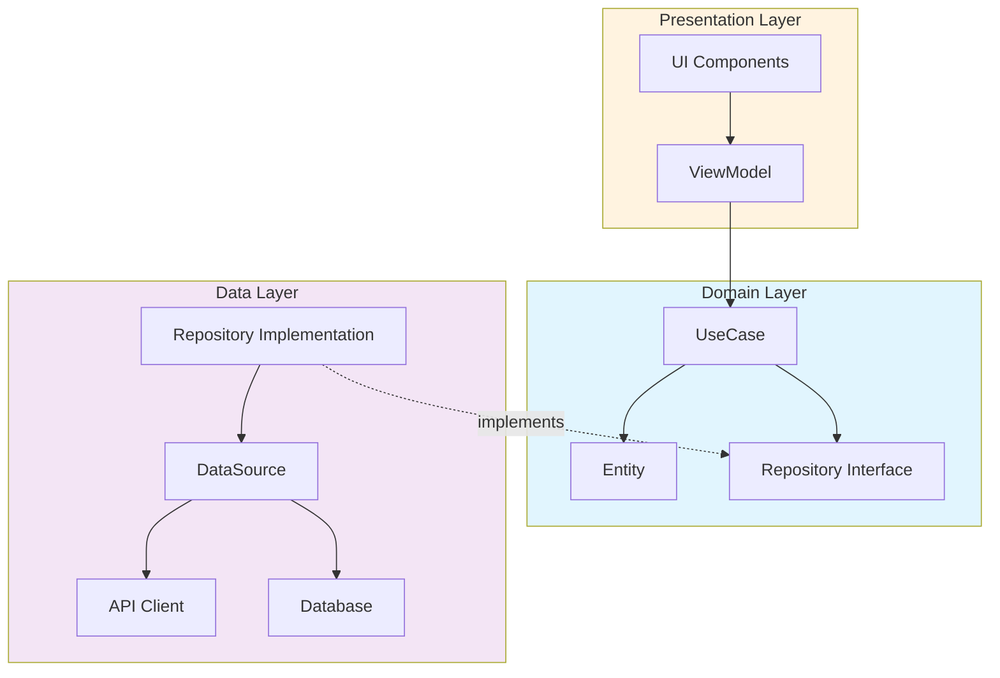

# Clean Architecture

## 1. 한 줄 요약

**비즈니스 로직을 외부 프레임워크나 데이터베이스로부터 독립시켜, 변경에 유연하고 테스트하기 쉬운 구조를 만드는 설계 방식**

---

## 2. 쉽게 설명

### 모바일 개발자를 위한 비유

Clean Architecture는 **양파** 같습니다. 여러 겹의 레이어로 구성되어 있고, 안쪽 레이어일수록 더 핵심적이고 안정적입니다.

모바일 앱 개발에서 겪는 흔한 문제를 생각해보세요:

```
문제 상황:
- Realm을 쓰다가 SQLite로 바꾸려니 앱 전체를 수정해야 함
- Retrofit을 Ktor로 바꾸려니 ViewModel이 다 깨짐
- 비즈니스 로직 테스트하려는데 Android SDK가 필요함
```

이런 문제가 생기는 이유는 **의존성 방향**이 잘못되었기 때문입니다.

### 핵심 원칙: 의존성 규칙

```
❌ 잘못된 방향
Domain (비즈니스 로직) → Data (데이터베이스, API)

✅ 올바른 방향
Data (데이터베이스, API) → Domain (비즈니스 로직)
```

**안쪽 레이어는 바깥쪽 레이어를 모릅니다.**

비즈니스 로직(Domain)은 "사용자 정보를 저장해야 해"라고만 알고,
그게 Realm인지 SQLite인지 Firebase인지는 모릅니다.

이게 바로 **인터페이스(추상화)**를 통한 의존성 역전입니다.

```kotlin
// Domain Layer - 인터페이스만 정의
interface UserRepository {
    suspend fun getUser(id: String): User
    suspend fun saveUser(user: User)
}

// Data Layer - 실제 구현
class RealmUserRepository : UserRepository {
    override suspend fun getUser(id: String): User { /* Realm 구현 */ }
    override suspend fun saveUser(user: User) { /* Realm 구현 */ }
}

// 나중에 교체 가능
class SQLiteUserRepository : UserRepository {
    override suspend fun getUser(id: String): User { /* SQLite 구현 */ }
    override suspend fun saveUser(user: User) { /* SQLite 구현 */ }
}
```

---

## 3. 구조 다이어그램

### 동심원 다이어그램 (Uncle Bob의 원본 구조)

```
                    ┌─────────────────────────────────────────────────────┐
                    │            Frameworks & Drivers                     │
                    │   (UI, DB, Web, Devices, External Interfaces)       │
                    │  ┌─────────────────────────────────────────────┐   │
                    │  │          Interface Adapters                 │   │
                    │  │   (Controllers, Gateways, Presenters)       │   │
                    │  │  ┌─────────────────────────────────────┐   │   │
                    │  │  │        Application Business          │   │   │
                    │  │  │           (Use Cases)                │   │   │
                    │  │  │  ┌─────────────────────────────┐    │   │   │
                    │  │  │  │     Enterprise Business     │    │   │   │
                    │  │  │  │        (Entities)           │    │   │   │
                    │  │  │  └─────────────────────────────┘    │   │   │
                    │  │  └─────────────────────────────────────┘   │   │
                    │  └─────────────────────────────────────────────┘   │
                    └─────────────────────────────────────────────────────┘

                    의존성 방향: 바깥쪽 → 안쪽 (화살표가 중심을 향함)
```

### Android/iOS 앱에서의 레이어 구조

```
┌─────────────────────────────────────────────────────────────────────┐
│                        Presentation Layer                            │
│  ┌───────────────┐  ┌───────────────┐  ┌───────────────┐           │
│  │   Activity    │  │   Fragment    │  │   Composable  │           │
│  └───────┬───────┘  └───────┬───────┘  └───────┬───────┘           │
│          │                  │                  │                    │
│          └──────────────────┼──────────────────┘                    │
│                             │                                        │
│                      ┌──────▼──────┐                                │
│                      │  ViewModel  │                                │
│                      └──────┬──────┘                                │
└─────────────────────────────┼────────────────────────────────────────┘
                              │ (의존)
┌─────────────────────────────▼────────────────────────────────────────┐
│                         Domain Layer                                  │
│  ┌──────────────────┐  ┌──────────────────┐  ┌──────────────────┐   │
│  │     UseCase      │  │     Entity       │  │   Repository     │   │
│  │  (비즈니스 로직)  │  │   (도메인 모델)   │  │   (인터페이스)    │   │
│  └──────────────────┘  └──────────────────┘  └──────────────────┘   │
└─────────────────────────────▲────────────────────────────────────────┘
                              │ (구현)
┌─────────────────────────────┴────────────────────────────────────────┐
│                          Data Layer                                   │
│  ┌──────────────────┐  ┌──────────────────┐  ┌──────────────────┐   │
│  │ RepositoryImpl   │  │   DataSource     │  │    API/DB        │   │
│  │  (실제 구현)      │  │  (Local/Remote)  │  │   (외부 라이브러리) │   │
│  └──────────────────┘  └──────────────────┘  └──────────────────┘   │
└─────────────────────────────────────────────────────────────────────┘
```

### Mermaid 다이어그램



---

## 4. 실무 적용 예시

### 예시: 이커머스 앱의 주문 기능

```kotlin
// ═══════════════════════════════════════════════════════
// Domain Layer
// ═══════════════════════════════════════════════════════

// Entity (도메인 모델)
data class Order(
    val id: String,
    val userId: String,
    val items: List<OrderItem>,
    val status: OrderStatus,
    val totalPrice: Money
) {
    // 비즈니스 규칙: 주문 가능 여부 검증
    fun canBeCancelled(): Boolean {
        return status == OrderStatus.PENDING || status == OrderStatus.CONFIRMED
    }
}

// Repository Interface (추상화)
interface OrderRepository {
    suspend fun createOrder(order: Order): Result<Order>
    suspend fun getOrder(orderId: String): Result<Order>
    suspend fun cancelOrder(orderId: String): Result<Unit>
}

// UseCase (비즈니스 로직)
class CreateOrderUseCase(
    private val orderRepository: OrderRepository,
    private val inventoryRepository: InventoryRepository,
    private val paymentService: PaymentService
) {
    suspend operator fun invoke(request: CreateOrderRequest): Result<Order> {
        // 1. 재고 확인
        val stockResult = inventoryRepository.checkStock(request.items)
        if (stockResult.isFailure) {
            return Result.failure(InsufficientStockException())
        }

        // 2. 결제 처리
        val paymentResult = paymentService.processPayment(request.payment)
        if (paymentResult.isFailure) {
            return Result.failure(PaymentFailedException())
        }

        // 3. 주문 생성
        val order = Order(
            id = generateOrderId(),
            userId = request.userId,
            items = request.items,
            status = OrderStatus.CONFIRMED,
            totalPrice = calculateTotal(request.items)
        )

        return orderRepository.createOrder(order)
    }
}

// ═══════════════════════════════════════════════════════
// Data Layer
// ═══════════════════════════════════════════════════════

// Repository 구현
class OrderRepositoryImpl(
    private val remoteDataSource: OrderRemoteDataSource,
    private val localDataSource: OrderLocalDataSource
) : OrderRepository {

    override suspend fun createOrder(order: Order): Result<Order> {
        return try {
            // API 호출
            val response = remoteDataSource.createOrder(order.toDto())

            // 로컬 캐싱
            localDataSource.saveOrder(response.toEntity())

            Result.success(response.toDomain())
        } catch (e: Exception) {
            Result.failure(e)
        }
    }

    override suspend fun getOrder(orderId: String): Result<Order> {
        // 캐시 우선 전략
        val cached = localDataSource.getOrder(orderId)
        if (cached != null) {
            return Result.success(cached.toDomain())
        }

        return try {
            val response = remoteDataSource.getOrder(orderId)
            localDataSource.saveOrder(response.toEntity())
            Result.success(response.toDomain())
        } catch (e: Exception) {
            Result.failure(e)
        }
    }
}

// ═══════════════════════════════════════════════════════
// Presentation Layer
// ═══════════════════════════════════════════════════════

class OrderViewModel(
    private val createOrderUseCase: CreateOrderUseCase
) : ViewModel() {

    private val _uiState = MutableStateFlow<OrderUiState>(OrderUiState.Idle)
    val uiState: StateFlow<OrderUiState> = _uiState.asStateFlow()

    fun createOrder(request: CreateOrderRequest) {
        viewModelScope.launch {
            _uiState.value = OrderUiState.Loading

            createOrderUseCase(request)
                .onSuccess { order ->
                    _uiState.value = OrderUiState.Success(order)
                }
                .onFailure { error ->
                    _uiState.value = OrderUiState.Error(error.message)
                }
        }
    }
}
```

### 패키지 구조 예시

```
com.example.app/
├── domain/                          # 순수 Kotlin, 의존성 없음
│   ├── model/
│   │   ├── Order.kt
│   │   ├── OrderItem.kt
│   │   └── Money.kt
│   ├── repository/
│   │   └── OrderRepository.kt       # 인터페이스
│   └── usecase/
│       ├── CreateOrderUseCase.kt
│       ├── GetOrderUseCase.kt
│       └── CancelOrderUseCase.kt
│
├── data/                            # 외부 라이브러리 의존
│   ├── repository/
│   │   └── OrderRepositoryImpl.kt
│   ├── datasource/
│   │   ├── remote/
│   │   │   ├── OrderRemoteDataSource.kt
│   │   │   └── OrderApi.kt          # Retrofit
│   │   └── local/
│   │       ├── OrderLocalDataSource.kt
│   │       └── OrderDao.kt          # Room
│   ├── dto/
│   │   └── OrderDto.kt
│   └── mapper/
│       └── OrderMapper.kt
│
├── presentation/                    # Android/UI 의존
│   ├── order/
│   │   ├── OrderViewModel.kt
│   │   ├── OrderScreen.kt           # Compose
│   │   └── OrderUiState.kt
│   └── di/
│       └── OrderModule.kt           # Hilt
│
└── App.kt
```

---

## 5. 장단점

### 장점

| 장점 | 설명 |
|:---|:---|
| **테스트 용이성** | 비즈니스 로직이 외부 의존성 없이 순수하므로 단위 테스트가 쉬움 |
| **유지보수성** | 변경 영향 범위가 명확하고 한정적 |
| **프레임워크 독립성** | DB, 네트워크 라이브러리 교체가 용이 |
| **관심사 분리** | 각 레이어가 명확한 책임을 가짐 |
| **병렬 개발** | 레이어별로 팀원이 독립적으로 작업 가능 |

### 단점

| 단점 | 설명 |
|:---|:---|
| **초기 복잡도** | 작은 프로젝트에서는 오버엔지니어링이 될 수 있음 |
| **보일러플레이트** | Mapper, DTO 등 반복적인 코드가 많아짐 |
| **학습 곡선** | 팀원 모두가 원칙을 이해해야 함 |
| **개발 속도** | 초기 세팅에 시간이 더 걸림 |

### 언제 적용하면 좋을까?

```
적용 권장                          신중하게 고려
─────────────                    ─────────────
✓ 장기 운영 예정 서비스            △ 프로토타입/MVP
✓ 팀 규모 3명 이상                 △ 1인 개발
✓ 비즈니스 로직이 복잡한 앱        △ 단순 CRUD 앱
✓ 테스트 커버리지 중요             △ 빠른 출시가 최우선
```

---

## 6. 내 생각

> 이 섹션은 학습 후 본인의 생각을 정리하는 공간입니다.

**Q1. 현재 프로젝트에 Clean Architecture를 적용한다면?**

```
(작성해보세요)


```

**Q2. 가장 어려울 것 같은 부분은?**

```
(작성해보세요)


```

**Q3. 기존 코드를 리팩토링한다면 어디서부터 시작할 것인가?**

```
(작성해보세요)


```

---

## 7. 추가 질문

더 깊이 학습하기 위한 질문들입니다.

### 기초 질문

**1. Domain Layer에서 Android SDK를 import하면 안 되는 이유는?**

> **답변**: Domain Layer는 비즈니스 로직의 핵심이며, 특정 플랫폼이나 프레임워크에 의존하지 않는 순수한 Kotlin/Java 코드여야 합니다. Android SDK를 import하면 다음과 같은 문제가 발생합니다:
>
> - **테스트 불가능**: Android SDK는 실제 기기나 에뮬레이터 없이 단위 테스트가 어렵습니다. `Context`, `SharedPreferences` 같은 클래스를 사용하면 Robolectric 같은 무거운 테스트 프레임워크가 필요합니다.
> - **플랫폼 종속**: 같은 비즈니스 로직을 iOS, 웹, 서버에서 재사용할 수 없습니다. Kotlin Multiplatform을 사용할 때 Domain Layer만 공유하고 싶어도 불가능해집니다.
> - **의존성 역전 위반**: Clean Architecture의 핵심 원칙인 "안쪽 레이어는 바깥쪽을 모른다"를 위반합니다.
>
> **실무 예시**: `Toast.makeText()`를 Domain Layer에서 호출하면 안 됩니다. 대신 UseCase가 `Result.failure()`를 반환하고, Presentation Layer의 ViewModel이 이를 받아 Toast를 표시해야 합니다.

**2. Repository 인터페이스는 왜 Domain Layer에 있고, 구현체는 왜 Data Layer에 있는가?**

> **답변**: 이것이 바로 **의존성 역전 원칙(DIP)**의 핵심입니다. 전통적인 계층형 구조에서는 상위 계층이 하위 계층에 의존하지만, Clean Architecture에서는 이를 역전시킵니다.
>
> - **인터페이스가 Domain에 있는 이유**: Domain Layer가 "어떤 데이터가 필요한지"를 정의합니다. 비즈니스 로직 관점에서 "사용자 정보를 가져와야 해"라는 요구사항만 표현하고, 어떻게 가져오는지(API? DB? 캐시?)는 관심사가 아닙니다.
> - **구현체가 Data에 있는 이유**: Data Layer가 실제로 데이터를 가져오는 "방법"을 구현합니다. Retrofit, Room, SharedPreferences 등 구체적인 기술이 여기서 사용됩니다.
>
> **Netflix 사례**: Netflix 앱은 여러 데이터 소스(캐시, 로컬 DB, CDN)에서 영상 메타데이터를 가져옵니다. Domain Layer의 `MovieRepository` 인터페이스는 동일하지만, 네트워크 상태에 따라 `CachedMovieRepository`, `RemoteMovieRepository` 구현체가 전환됩니다.

**3. UseCase를 만들지 않고 ViewModel에서 직접 Repository를 호출하면 어떤 문제가 생기는가?**

> **답변**: 작은 프로젝트에서는 당장 문제가 없어 보이지만, 규모가 커질수록 다음 문제들이 발생합니다:
>
> - **비즈니스 로직 중복**: "주문 생성" 로직이 `OrderViewModel`, `CartViewModel`, `QuickOrderViewModel`에 각각 구현됩니다. 하나를 수정하면 나머지도 찾아서 수정해야 합니다.
> - **테스트 복잡도 증가**: ViewModel 테스트 시 Android의 `ViewModel` 클래스와 Coroutine Scope를 모킹해야 합니다. UseCase는 순수 함수로 테스트가 훨씬 쉽습니다.
> - **재사용 불가**: 같은 로직을 Widget, WorkManager, Notification Handler에서 사용하려면 ViewModel을 참조할 수 없어 코드를 복사해야 합니다.
>
> **배달의민족 사례**: 주문 가능 여부 검증(영업시간, 최소주문금액, 배달가능지역)은 여러 화면에서 사용됩니다. `ValidateOrderUseCase`로 분리하면 장바구니, 메뉴 상세, 원터치 주문 화면에서 모두 동일한 로직을 사용할 수 있습니다.

### 심화 질문

**4. Clean Architecture와 MVVM, MVI는 어떤 관계인가?**

> **답변**: Clean Architecture는 **전체 시스템의 계층 구조**를 다루고, MVVM/MVI는 **Presentation Layer의 패턴**입니다. 이들은 상호 보완적인 관계입니다.
>
> ```
> Clean Architecture                    Presentation 패턴
> ─────────────────────────────────────────────────────
> Presentation Layer    ◄───────────    MVVM / MVI
> Domain Layer                          (UseCase 호출)
> Data Layer
> ```
>
> - **MVVM (Model-View-ViewModel)**: ViewModel이 상태를 관리하고 View가 관찰합니다. Clean Architecture에서 ViewModel은 UseCase를 호출하고 UI State를 노출합니다.
> - **MVI (Model-View-Intent)**: 단방향 데이터 흐름을 강조합니다. Intent(사용자 액션) → State Reducer → UI State 업데이트. 복잡한 상태 관리에 유리합니다.
>
> **실무 예시**: Airbnb 앱은 Clean Architecture + MVI를 조합합니다. 검색 화면에서 필터 변경, 날짜 선택, 게스트 수 변경이 모두 Intent로 들어와 하나의 SearchState로 관리됩니다.

**5. 멀티 모듈 프로젝트에서 Clean Architecture를 적용할 때 모듈은 어떻게 나눠야 하는가?**

> **답변**: 크게 두 가지 전략이 있습니다:
>
> **전략 1: 레이어 기반 모듈화**
> ```
> :domain          (순수 Kotlin, 의존성 없음)
> :data            (Retrofit, Room 등 의존)
> :presentation    (Android SDK 의존)
> :app             (DI 조립, 앱 진입점)
> ```
>
> **전략 2: 기능 기반 모듈화 (권장)**
> ```
> :feature:home      (:domain:home, :data:home 포함)
> :feature:search
> :feature:cart
> :feature:payment
> :core:domain       (공통 Entity, UseCase)
> :core:data         (공통 DataSource)
> :core:ui           (공통 UI 컴포넌트)
> ```
>
> **Google의 Now in Android 사례**: 기능 기반 모듈화를 채택했습니다. 각 feature 모듈이 독립적으로 빌드되어 빌드 시간이 단축되고, 팀별로 담당 모듈을 가져갈 수 있습니다. `:feature:topic` 모듈 개발자는 `:feature:bookmarks` 코드를 건드릴 필요가 없습니다.

**6. Mapper로 인한 보일러플레이트 코드를 줄이는 방법은?**

> **답변**: Mapper 코드가 많아지는 것은 Clean Architecture의 단점 중 하나입니다. 다음 방법으로 줄일 수 있습니다:
>
> - **Kotlin Extension Functions**: `fun UserDto.toDomain() = User(id, name, email)`처럼 확장 함수로 작성하면 호출이 자연스럽습니다.
> - **코드 생성 라이브러리**: `MapStruct`, `ModelMapper` 같은 라이브러리가 자동으로 매핑 코드를 생성합니다. 단, 빌드 시간이 늘어날 수 있습니다.
> - **동일 구조 활용**: Entity와 DTO 구조가 완전히 같다면 `typealias`나 공유 모델을 고려할 수 있습니다. 하지만 결합도가 높아지는 트레이드오프가 있습니다.
> - **자동 매핑 규칙**: 필드명과 타입이 같으면 자동 매핑되는 규칙을 정의하고, 다른 것만 명시적으로 작성합니다.
>
> ```kotlin
> // Extension Function 예시
> fun ProductResponse.toDomain() = Product(
>     id = this.productId,
>     name = this.productName,
>     price = Money(this.price, Currency.KRW)
> )
>
> // 호출
> val products = api.getProducts().map { it.toDomain() }
> ```

### 실전 질문

**7. 팀원이 Clean Architecture 원칙을 어기는 코드를 작성했을 때 어떻게 리뷰할 것인가?**

> **답변**: 코드 리뷰는 교육의 기회입니다. 비난이 아닌 학습 관점으로 접근해야 합니다:
>
> - **원칙 위반의 구체적 영향 설명**: "Domain Layer에서 Retrofit을 import하셨네요. 이렇게 되면 이 UseCase를 단위 테스트할 때 MockWebServer를 띄워야 해서 테스트가 10배 느려집니다."
> - **대안 제시**: "Repository 인터페이스를 통해 주입받으면, 테스트에서 FakeRepository로 교체할 수 있어요."
> - **팀 규칙으로 발전**: 반복되는 실수는 팀 위키나 lint 규칙으로 문서화합니다.
>
> **추천 Lint 규칙**: `domain` 패키지에서 `android.*`, `retrofit2.*`, `room.*` import를 금지하는 Custom Lint Rule을 만들면 PR 단계에서 자동으로 걸러집니다.

**8. 레거시 프로젝트에 점진적으로 Clean Architecture를 도입하는 전략은?**

> **답변**: Big Bang 리팩토링은 실패 확률이 높습니다. Strangler Fig 패턴처럼 점진적으로 교체하세요:
>
> **Step 1: 경계 정의 (1-2주)**
> - 새로운 기능부터 Clean Architecture로 작성
> - 레거시 코드는 건드리지 않음
>
> **Step 2: 핵심 기능 분리 (1-3개월)**
> - 가장 자주 수정되는 기능 식별
> - 해당 기능의 비즈니스 로직을 UseCase로 추출
> - 기존 코드에서 UseCase를 호출하도록 변경
>
> **Step 3: 데이터 레이어 분리 (1-3개월)**
> - Repository 인터페이스 정의
> - 기존 API/DB 코드를 RepositoryImpl로 래핑
>
> **Step 4: 점진적 확산**
> - 버그 수정이나 기능 추가 시 해당 부분만 리팩토링
> - 6개월~1년에 걸쳐 전체 전환
>
> **토스 사례**: 토스는 "새 기능은 새 아키텍처로, 기존 기능은 건드릴 때 리팩토링" 전략을 사용했습니다. 약 2년에 걸쳐 앱 전체를 Clean Architecture로 전환했습니다.

**9. Clean Architecture를 적용했는데도 테스트가 어렵다면 어떤 부분을 점검해야 하는가?**

> **답변**: Clean Architecture를 적용해도 테스트가 어렵다면 다음을 점검하세요:
>
> - **숨겨진 의존성**: UseCase 내부에서 `System.currentTimeMillis()`, `UUID.randomUUID()` 같은 전역 함수를 직접 호출하고 있지 않나요? 이들도 인터페이스로 추상화해야 합니다.
>   ```kotlin
>   // Bad
>   class CreateOrderUseCase {
>       fun execute() {
>           val orderId = UUID.randomUUID().toString()  // 테스트 불가
>       }
>   }
>
>   // Good
>   class CreateOrderUseCase(private val idGenerator: IdGenerator) {
>       fun execute() {
>           val orderId = idGenerator.generate()  // 테스트에서 고정값 반환
>       }
>   }
>   ```
>
> - **God UseCase**: UseCase가 너무 많은 일을 하고 있지 않나요? 하나의 UseCase가 5개 이상의 Repository를 사용한다면 책임을 분리해야 합니다.
>
> - **비동기 처리 복잡도**: Coroutine, RxJava 테스트가 어렵다면 `TestDispatcher`나 `TestScheduler`를 사용하고 있는지 확인하세요.
>
> - **모킹 과다**: 테스트 하나에 10개 이상의 Mock이 필요하다면 설계를 재검토해야 합니다. Fake 객체 사용을 고려하세요.

---

## 참고 자료

- [The Clean Architecture - Robert C. Martin](https://blog.cleancoder.com/uncle-bob/2012/08/13/the-clean-architecture.html)
- [Android Architecture Blueprints](https://github.com/android/architecture-samples)
- [iOS Clean Architecture](https://github.com/kudoleh/iOS-Clean-Architecture-MVVM)
