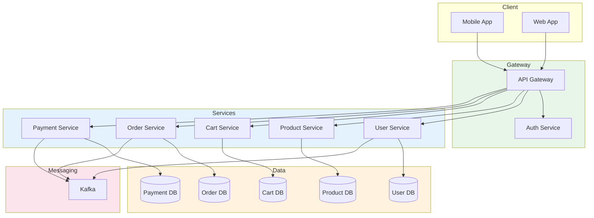

# Microservice Architecture

## 1. 한 줄 요약

**하나의 큰 애플리케이션을 독립적으로 배포 가능한 작은 서비스들로 분리하여, 각 서비스가 자체 데이터베이스와 비즈니스 로직을 가지고 운영되는 아키텍처**

---

## 2. 쉽게 설명

### 모바일 개발자를 위한 비유

모바일 개발자에게 Microservice를 설명하자면, **앱 모듈화**와 비슷합니다.

```
모바일 앱 모듈화                    서버 마이크로서비스
─────────────                    ─────────────
:feature-home                    User Service
:feature-search                  Product Service
:feature-cart                    Cart Service
:feature-payment                 Payment Service
    │                                │
    ▼                                ▼
각 모듈이 독립적인              각 서비스가 독립적인
빌드/테스트 가능                배포/스케일링 가능
```

하지만 중요한 차이가 있습니다:

| 모바일 모듈화 | 마이크로서비스 |
|:---|:---|
| 하나의 앱으로 빌드됨 | 각각 별도의 서버로 운영 |
| 같은 메모리 공간 공유 | 네트워크로 통신 |
| 버전 동기화 | 독립적인 배포 |

### 왜 마이크로서비스가 필요한가?

모놀리식(하나의 큰 서버)의 문제를 생각해보세요:

```
모놀리식의 문제점
───────────────────────────────────────────
1. 배포 공포증
   - 한 줄 수정해도 전체 배포
   - 배포할 때마다 긴장 😰

2. 확장의 한계
   - 검색만 트래픽이 많아도 전체 서버를 늘려야 함
   - 비용 낭비 💸

3. 기술 부채
   - 한 팀의 실수가 전체에 영향
   - 코드베이스가 커지면서 빌드 시간 증가

4. 팀 병목
   - 여러 팀이 하나의 코드베이스에서 작업
   - 머지 충돌 지옥 🔥
```

마이크로서비스는 이런 문제를 해결합니다:

```
마이크로서비스의 해결책
───────────────────────────────────────────
1. 독립 배포
   - User Service만 수정하면 User Service만 배포

2. 개별 확장
   - 검색 트래픽이 많으면 Search Service만 늘림

3. 장애 격리
   - Payment Service에 문제가 생겨도 다른 서비스는 정상

4. 팀 자율성
   - 각 팀이 담당 서비스를 자율적으로 운영
```

---

## 3. 구조 다이어그램

### 모놀리식 vs 마이크로서비스

```
┌─────────────────────────────────────────────────────────────────────┐
│                        모놀리식 (Monolithic)                         │
│                                                                      │
│  ┌────────────────────────────────────────────────────────────┐    │
│  │                      하나의 서버                             │    │
│  │  ┌──────────┬──────────┬──────────┬──────────┬──────────┐ │    │
│  │  │   User   │ Product  │   Cart   │  Order   │ Payment  │ │    │
│  │  │  Module  │  Module  │  Module  │  Module  │  Module  │ │    │
│  │  └──────────┴──────────┴──────────┴──────────┴──────────┘ │    │
│  │                         │                                   │    │
│  │                   ┌─────▼─────┐                            │    │
│  │                   │    DB     │                            │    │
│  │                   └───────────┘                            │    │
│  └────────────────────────────────────────────────────────────┘    │
└─────────────────────────────────────────────────────────────────────┘


┌─────────────────────────────────────────────────────────────────────┐
│                      마이크로서비스 (Microservice)                   │
│                                                                      │
│         ┌─────────────────────────────────────────┐                 │
│         │            API Gateway                   │                 │
│         └────────────────────┬────────────────────┘                 │
│                              │                                       │
│    ┌────────┬────────┬───────┴────┬────────┬────────┐              │
│    │        │        │            │        │        │              │
│    ▼        ▼        ▼            ▼        ▼        ▼              │
│ ┌──────┐ ┌──────┐ ┌──────┐  ┌──────┐ ┌──────┐ ┌──────┐           │
│ │ User │ │ Prod │ │ Cart │  │Order │ │Paymt │ │Search│           │
│ │ Svc  │ │ Svc  │ │ Svc  │  │ Svc  │ │ Svc  │ │ Svc  │           │
│ └──┬───┘ └──┬───┘ └──┬───┘  └──┬───┘ └──┬───┘ └──┬───┘           │
│    │        │        │         │        │        │                │
│    ▼        ▼        ▼         ▼        ▼        ▼                │
│ ┌──────┐ ┌──────┐ ┌──────┐  ┌──────┐ ┌──────┐ ┌──────┐           │
│ │  DB  │ │  DB  │ │  DB  │  │  DB  │ │  DB  │ │Elastic│          │
│ └──────┘ └──────┘ └──────┘  └──────┘ └──────┘ └──────┘           │
└─────────────────────────────────────────────────────────────────────┘
```

### 마이크로서비스 통신 패턴

```
                      ┌─────────────────┐
                      │   Mobile App    │
                      └────────┬────────┘
                               │ HTTPS
                               ▼
                      ┌─────────────────┐
                      │   API Gateway   │
                      │  (라우팅, 인증)  │
                      └────────┬────────┘
                               │
         ┌─────────────────────┼─────────────────────┐
         │                     │                     │
         ▼                     ▼                     ▼
┌─────────────────┐   ┌─────────────────┐   ┌─────────────────┐
│  Order Service  │   │  User Service   │   │ Product Service │
└────────┬────────┘   └────────┬────────┘   └────────┬────────┘
         │                     │                     │
         │     동기 통신 (REST/gRPC)                 │
         │◄────────────────────┼─────────────────────┤
         │                     │                     │
         │     비동기 통신 (Message Queue)           │
         │─────────────────────┼─────────────────────│
         │                     │                     │
         ▼                     ▼                     ▼
┌─────────────────┐   ┌─────────────────┐   ┌─────────────────┐
│   Message Bus   │◄──│   Message Bus   │──►│   Message Bus   │
│    (Kafka)      │   │    (Kafka)      │   │    (Kafka)      │
└─────────────────┘   └─────────────────┘   └─────────────────┘
```

### Mermaid 다이어그램



---

## 4. 실무 적용 예시

### 예시: 이커머스 서비스 분리

**시나리오**: 모놀리식 이커머스 서버를 마이크로서비스로 전환

```
Before (모놀리식)
──────────────────────────────────────
┌────────────────────────────────────┐
│           shop-server              │
│  - UserController                  │
│  - ProductController               │
│  - CartController                  │
│  - OrderController                 │
│  - PaymentController               │
│  - 모든 비즈니스 로직               │
│  - 하나의 거대한 DB                 │
└────────────────────────────────────┘

After (마이크로서비스)
──────────────────────────────────────
┌──────────┐ ┌──────────┐ ┌──────────┐
│user-svc  │ │product-  │ │cart-svc  │
│          │ │svc       │ │          │
│PostgreSQL│ │PostgreSQL│ │  Redis   │
└──────────┘ └──────────┘ └──────────┘

┌──────────┐ ┌──────────┐ ┌──────────┐
│order-svc │ │payment-  │ │search-svc│
│          │ │svc       │ │          │
│PostgreSQL│ │PostgreSQL│ │Elastic   │
└──────────┘ └──────────┘ └──────────┘
```

### 서비스 간 통신 예시

```python
# order-service/app.py

from flask import Flask, request
import requests

app = Flask(__name__)

# 서비스 디스커버리 (예: Kubernetes Service DNS)
USER_SERVICE = "http://user-service:8080"
PRODUCT_SERVICE = "http://product-service:8080"
PAYMENT_SERVICE = "http://payment-service:8080"

@app.route('/orders', methods=['POST'])
def create_order():
    data = request.json

    # 1. 사용자 검증 (동기 통신)
    user_response = requests.get(
        f"{USER_SERVICE}/users/{data['user_id']}"
    )
    if user_response.status_code != 200:
        return {"error": "User not found"}, 404

    # 2. 상품 정보 조회 (동기 통신)
    product_response = requests.get(
        f"{PRODUCT_SERVICE}/products/{data['product_id']}"
    )
    if product_response.status_code != 200:
        return {"error": "Product not found"}, 404

    product = product_response.json()

    # 3. 주문 생성
    order = create_order_in_db(data, product)

    # 4. 결제 요청 (동기 통신)
    payment_response = requests.post(
        f"{PAYMENT_SERVICE}/payments",
        json={
            "order_id": order['id'],
            "amount": product['price'],
            "user_id": data['user_id']
        }
    )

    if payment_response.status_code != 200:
        # 보상 트랜잭션: 주문 취소
        cancel_order(order['id'])
        return {"error": "Payment failed"}, 400

    return {"order": order}, 201
```

### 비동기 이벤트 처리 예시

```python
# order-service/events.py

from kafka import KafkaProducer, KafkaConsumer
import json

producer = KafkaProducer(
    bootstrap_servers=['kafka:9092'],
    value_serializer=lambda v: json.dumps(v).encode('utf-8')
)

def publish_order_created(order):
    """주문 생성 이벤트 발행"""
    producer.send('order-events', {
        'type': 'ORDER_CREATED',
        'order_id': order['id'],
        'user_id': order['user_id'],
        'items': order['items'],
        'total_price': order['total_price'],
        'timestamp': datetime.now().isoformat()
    })

# payment-service/consumer.py

def handle_order_events():
    """주문 이벤트 구독"""
    consumer = KafkaConsumer(
        'order-events',
        bootstrap_servers=['kafka:9092'],
        group_id='payment-service',
        value_deserializer=lambda v: json.loads(v.decode('utf-8'))
    )

    for message in consumer:
        event = message.value
        if event['type'] == 'ORDER_CREATED':
            process_payment(event)
        elif event['type'] == 'ORDER_CANCELLED':
            refund_payment(event)
```

### 모바일 앱에서의 API 호출

```kotlin
// 모바일 앱 입장에서는 API Gateway만 알면 됨

interface ShopApi {
    // API Gateway가 내부적으로 user-service로 라우팅
    @GET("/api/users/{userId}")
    suspend fun getUser(@Path("userId") userId: String): User

    // API Gateway가 내부적으로 product-service로 라우팅
    @GET("/api/products")
    suspend fun getProducts(): List<Product>

    // API Gateway가 내부적으로 order-service로 라우팅
    @POST("/api/orders")
    suspend fun createOrder(@Body request: CreateOrderRequest): Order
}

// 모바일 개발자가 알아야 할 것:
// 1. 백엔드 구조가 바뀌어도 API 스펙만 같으면 앱 코드 변경 불필요
// 2. 특정 API 응답이 느리다면 해당 서비스의 성능 문제일 가능성
// 3. 부분 장애 시 일부 기능만 안 될 수 있음 (Graceful Degradation 고려)
```

---

## 5. 장단점

### 장점

| 장점 | 설명 |
|:---|:---|
| **독립적 배포** | 각 서비스를 개별적으로 배포 가능, 배포 리스크 감소 |
| **기술 다양성** | 서비스별로 최적의 기술 스택 선택 가능 |
| **확장성** | 트래픽이 많은 서비스만 선택적으로 스케일 아웃 |
| **장애 격리** | 한 서비스의 장애가 전체 시스템에 영향을 주지 않음 |
| **팀 자율성** | 서비스별로 팀을 나눠 독립적으로 운영 |
| **작은 코드베이스** | 각 서비스가 작아서 이해하고 유지보수하기 쉬움 |

### 단점

| 단점 | 설명 |
|:---|:---|
| **분산 시스템 복잡성** | 네트워크 장애, 지연, 데이터 일관성 문제 |
| **운영 부담** | 수십 개의 서비스 모니터링, 로깅, 배포 파이프라인 |
| **데이터 일관성** | 분산 트랜잭션이 어려움, 최종 일관성 패턴 필요 |
| **테스트 복잡성** | 서비스 간 통합 테스트가 어려움 |
| **개발자 스킬 요구** | DevOps, 컨테이너, 메시지 큐 등 광범위한 지식 필요 |
| **초기 비용** | 인프라 구축, 모니터링 도구 등 초기 투자 필요 |

### 언제 마이크로서비스를 도입해야 하는가?

```
마이크로서비스 도입 체크리스트
═══════════════════════════════════════════

✓ 팀 규모가 충분히 큰가? (최소 2~3개 팀 이상)
✓ 서비스 간 경계가 명확한가?
✓ DevOps 역량이 있는가?
✓ 모놀리식의 한계를 실제로 겪고 있는가?

하나라도 NO라면 모놀리식 유지를 권장
───────────────────────────────────────────

"마이크로서비스는 모놀리식이 성공한 후에 분리하라"
                        - Martin Fowler
```

### 마이크로서비스 vs 모놀리식 비교

```
┌────────────────────┬──────────────────┬──────────────────┐
│       항목         │    모놀리식       │   마이크로서비스   │
├────────────────────┼──────────────────┼──────────────────┤
│ 배포              │ 전체 배포         │ 개별 배포         │
│ 확장              │ 전체 스케일링     │ 선택적 스케일링   │
│ 기술 스택         │ 단일 스택         │ 다양한 스택       │
│ 데이터 일관성     │ ACID 트랜잭션    │ 최종 일관성       │
│ 복잡성            │ 코드 복잡         │ 운영 복잡         │
│ 시작 비용         │ 낮음             │ 높음              │
│ 적합한 팀 규모    │ 1~20명           │ 20명 이상         │
└────────────────────┴──────────────────┴──────────────────┘
```

---

## 6. 내 생각

> 이 섹션은 학습 후 본인의 생각을 정리하는 공간입니다.

**Q1. 현재/과거 프로젝트에서 마이크로서비스가 필요했던 상황은?**

```
(작성해보세요)


```

**Q2. 모바일 개발자로서 마이크로서비스 환경에서 주의해야 할 점은?**

```
(작성해보세요)


```

**Q3. 마이크로서비스 도입 시 가장 어려울 것 같은 부분은?**

```
(작성해보세요)


```

---

## 7. 추가 질문

더 깊이 학습하기 위한 질문들입니다.

### 기초 질문

**1. 마이크로서비스에서 "마이크로"의 기준은 무엇인가? 얼마나 작아야 마이크로인가?**

> **답변**: "마이크로"는 코드 라인 수가 아니라 **책임의 범위**를 의미합니다. Sam Newman의 정의에 따르면, 마이크로서비스는 "한 팀이 소유하고, 독립적으로 배포할 수 있는 크기"입니다.
>
> **실용적인 기준**:
> - **2 Pizza Rule (Amazon)**: 한 서비스를 담당하는 팀이 피자 2판으로 식사할 수 있는 크기 (5-8명)
> - **인지적 부담**: 새로운 개발자가 2주 안에 전체 코드를 이해할 수 있어야 함
> - **단일 책임**: 하나의 비즈니스 도메인만 담당 (예: 결제, 재고, 배송)
> - **독립 배포 가능성**: 다른 서비스 수정 없이 단독 배포 가능해야 함
>
> **주의**: 너무 작게 나누면 "나노서비스(Nanoservice)"가 되어 오히려 복잡도가 증가합니다. 하나의 API 호출에 10개 서비스가 연쇄 호출된다면 너무 잘게 나눈 것입니다.
>
> **Netflix 사례**: Netflix는 약 700개의 마이크로서비스를 운영하지만, 각 서비스는 명확한 도메인 경계를 가집니다. 예: `playback-service`, `recommendation-service`, `billing-service`

**2. API Gateway의 역할은 무엇이고, 없으면 어떤 문제가 생기는가?**

> **답변**: API Gateway는 마이크로서비스의 **단일 진입점(Single Entry Point)**입니다. 클라이언트와 내부 서비스 사이의 중개자 역할을 합니다.
>
> **주요 역할**:
> - **라우팅**: `/users/*` → User Service, `/orders/*` → Order Service
> - **인증/인가**: JWT 검증, API Key 확인을 한 곳에서 처리
> - **속도 제한(Rate Limiting)**: 악의적인 요청이나 DDoS 방어
> - **요청/응답 변환**: 클라이언트에 맞게 응답 형식 변환
> - **로드 밸런싱**: 트래픽을 여러 인스턴스에 분산
> - **캐싱**: 자주 요청되는 데이터 캐싱으로 성능 향상
>
> **API Gateway 없이 발생하는 문제**:
> ```
> 모바일 앱이 직접 각 서비스 호출 시:
>
> ┌─────────────┐
> │ Mobile App  │
> └─────┬───────┘
>       ├──────► User Service (인증 구현)
>       ├──────► Product Service (인증 구현)
>       ├──────► Order Service (인증 구현)
>       └──────► Payment Service (인증 구현)
>
> 문제:
> - 앱이 모든 서비스 주소를 알아야 함
> - 인증 로직이 각 서비스에 중복
> - CORS 설정이 복잡해짐
> - 서비스 URL 변경 시 앱 업데이트 필요
> ```
>
> **실무 도구**: Kong, AWS API Gateway, Netflix Zuul, Spring Cloud Gateway

**3. 서비스 디스커버리란 무엇이고, 왜 필요한가?**

> **답변**: 서비스 디스커버리는 **동적으로 변하는 서비스 인스턴스의 위치를 자동으로 찾아주는 메커니즘**입니다.
>
> **왜 필요한가?**
> - 클라우드 환경에서 서비스 인스턴스는 수시로 생성/삭제됨
> - IP 주소가 고정되지 않음
> - Auto Scaling으로 인스턴스 수가 동적으로 변함
>
> **작동 방식**:
> ```
> 1. 서비스 등록 (Registration)
>    Order Service 시작 → Service Registry에 "나 여기 있어" 등록
>
> 2. 하트비트 (Heartbeat)
>    주기적으로 "나 살아있어" 신호 전송
>
> 3. 서비스 발견 (Discovery)
>    User Service가 Order Service 호출 필요
>    → Registry에서 Order Service 주소 조회
>    → 여러 인스턴스 중 하나 선택 (로드밸런싱)
>
> 4. 자동 제거 (Deregistration)
>    하트비트가 끊기면 Registry에서 자동 삭제
> ```
>
> **실무 도구**:
> - **Kubernetes**: 자체 DNS 기반 서비스 디스커버리 제공
> - **Consul**: HashiCorp의 서비스 메시 솔루션
> - **Eureka**: Netflix가 만든 서비스 디스커버리 (Spring Cloud와 잘 통합)

### 심화 질문

**4. 분산 트랜잭션 문제를 해결하는 Saga 패턴이란?**

> **답변**: Saga 패턴은 **여러 서비스에 걸친 트랜잭션을 일련의 로컬 트랜잭션으로 분해**하고, 실패 시 **보상 트랜잭션(Compensating Transaction)**으로 롤백하는 패턴입니다.
>
> **문제 상황**:
> ```
> 주문 프로세스:
> 1. Order Service: 주문 생성
> 2. Inventory Service: 재고 차감
> 3. Payment Service: 결제 처리  ← 여기서 실패하면?
>
> 기존 ACID 트랜잭션처럼 한번에 롤백 불가능!
> (각 서비스가 다른 DB를 사용하므로)
> ```
>
> **Saga 패턴의 두 가지 구현 방식**:
>
> **1. Choreography (이벤트 기반)**
> ```
> Order Created → Inventory가 듣고 재고 차감
>              → Inventory Reserved 이벤트 발행
>              → Payment가 듣고 결제 시도
>              → Payment Failed 이벤트 발행
>              → Inventory가 듣고 재고 복구 (보상)
>              → Order가 듣고 주문 취소 (보상)
> ```
>
> **2. Orchestration (중앙 조정자)**
> ```
> Order Saga Orchestrator:
> 1. Order Service 호출 → 성공
> 2. Inventory Service 호출 → 성공
> 3. Payment Service 호출 → 실패
> 4. Inventory 보상 호출 (재고 복구)
> 5. Order 보상 호출 (주문 취소)
> ```
>
> **배달의민족 사례**: 주문-결제-쿠폰-포인트가 각각 다른 서비스입니다. 결제 실패 시 이미 차감된 포인트와 적용된 쿠폰을 복구하는 보상 트랜잭션이 실행됩니다.

**5. 서비스 간 통신에서 동기(REST) vs 비동기(메시지 큐)를 어떻게 선택하는가?**

> **답변**: 선택 기준은 **즉시 응답 필요 여부**와 **실패 허용 범위**입니다.
>
> | 상황 | 동기 (REST/gRPC) | 비동기 (Message Queue) |
> |:---|:---|:---|
> | 즉시 응답 필요 | O (결제 결과 확인) | X |
> | 실패 시 재시도 | 호출자가 처리 | 자동 재시도 가능 |
> | 결합도 | 강함 (서비스 주소 알아야 함) | 약함 (토픽만 알면 됨) |
> | 처리량 | 동시 요청 수 제한 | 대량 처리 가능 |
> | 트레이싱 | 상대적으로 쉬움 | 복잡함 |
>
> **실무 가이드라인**:
> ```
> 동기 통신 사용:
> - 사용자가 결과를 기다리는 경우 (로그인, 결제)
> - 응답 데이터로 다음 로직을 실행해야 하는 경우
> - 트랜잭션 성공/실패를 즉시 알아야 하는 경우
>
> 비동기 통신 사용:
> - 시간이 오래 걸리는 작업 (이메일 발송, 썸네일 생성)
> - 여러 서비스에 동시 알림 (주문 완료 → 재고, 배송, 알림)
> - 일시적 장애 허용 가능한 경우
> - 피크 트래픽 완충이 필요한 경우
> ```
>
> **Uber 사례**: 배차 요청은 동기(즉시 드라이버 매칭), 영수증 발송은 비동기(나중에 이메일 발송)

**6. 마이크로서비스에서 데이터 중복(Denormalization)은 왜 필요한가?**

> **답변**: 마이크로서비스는 **각 서비스가 자체 DB를 소유**합니다(Database per Service). 다른 서비스의 DB를 직접 조회하면 결합도가 높아지므로, 필요한 데이터를 복제해서 가지고 있습니다.
>
> **예시: 주문 서비스에서 상품명 표시**
> ```
> 정규화된 구조 (모놀리식):
> Order 테이블: order_id, product_id, quantity
> Product 테이블: product_id, name, price
> → JOIN으로 조회
>
> 비정규화된 구조 (마이크로서비스):
> Order Service DB:
>   order_id, product_id, product_name, product_price, quantity
>   (product_name, product_price는 주문 시점에 복사)
>
> 장점:
> - Product Service 장애 시에도 주문 내역 조회 가능
> - JOIN 없이 빠른 조회
>
> 트레이드오프:
> - 상품명이 변경되면 동기화 필요 (이벤트로 처리)
> - 저장 공간 약간 증가
> ```
>
> **중요**: 모든 데이터를 복제하는 것이 아니라, **조회 시 자주 필요하고, 변경이 드문 데이터**만 복제합니다. 실시간 재고 수량 같은 자주 변하는 데이터는 API 호출로 조회합니다.

### 실전 질문

**7. 모놀리식에서 마이크로서비스로 전환할 때 어떤 서비스부터 분리해야 하는가?**

> **답변**: 다음 우선순위로 분리를 고려하세요:
>
> **1순위: 독립적인 도메인이면서 팀이 있는 경우**
> - 이미 담당 팀이 있고 도메인 경계가 명확한 기능
> - 예: 결제팀 → Payment Service, 검색팀 → Search Service
>
> **2순위: 확장 요구가 다른 기능**
> - 트래픽 패턴이 다른 기능 (검색은 읽기 집중, 결제는 쓰기 집중)
> - 블랙프라이데이에 주문 서비스만 10배 확장 필요
>
> **3순위: 기술 스택이 달라야 하는 기능**
> - ML 기반 추천은 Python, 주문 처리는 Java
> - 실시간 채팅은 Node.js
>
> **분리 순서 (점진적 접근)**:
> ```
> Phase 1: Strangler 패턴으로 API 레이어 분리
>          기존 코드 유지하면서 새 서비스로 트래픽 라우팅
>
> Phase 2: 데이터베이스 분리
>          가장 어려운 단계, 데이터 마이그레이션 필요
>
> Phase 3: 이벤트 기반 통신 도입
>          서비스 간 결합도 낮추기
> ```
>
> **실패 사례**: 한 스타트업이 한 번에 모든 것을 분리하려다 6개월간 새 기능 개발이 중단되었습니다. 점진적으로 하나씩 분리하는 것이 안전합니다.

**8. 마이크로서비스 환경에서 디버깅은 어떻게 하는가? (분산 추적)**

> **답변**: 분산 환경에서는 하나의 요청이 여러 서비스를 거치므로, **분산 추적(Distributed Tracing)**이 필수입니다.
>
> **핵심 개념**:
> - **Trace**: 하나의 요청 전체 여정 (예: 사용자의 주문 요청)
> - **Span**: 각 서비스에서의 작업 단위 (예: DB 쿼리, API 호출)
> - **Trace ID**: 전체 요청을 식별하는 고유 ID
> - **Parent Span ID**: 부모 작업을 연결하는 ID
>
> **작동 방식**:
> ```
> 사용자 요청 → API Gateway
>   │ trace_id: abc123, span_id: 1
>   └──► Order Service
>         │ trace_id: abc123, span_id: 2, parent: 1
>         ├──► User Service
>         │     trace_id: abc123, span_id: 3, parent: 2
>         └──► Payment Service
>               trace_id: abc123, span_id: 4, parent: 2
>
> Jaeger/Zipkin UI에서 abc123 검색
> → 전체 호출 흐름과 각 구간 소요 시간 확인
> ```
>
> **필수 도구**:
> - **Jaeger** (Uber 오픈소스): 가장 많이 사용
> - **Zipkin** (Twitter 오픈소스)
> - **AWS X-Ray** (AWS 환경)
> - **Datadog APM** (상용)
>
> **모바일 연동**: API 요청 헤더에 `X-Request-ID`를 포함하면, 앱에서 발생한 요청을 서버 로그에서 추적할 수 있습니다.

**9. 서비스가 100개 이상일 때 어떻게 관리하는가?**

> **답변**: 대규모 마이크로서비스 환경에서는 **플랫폼 엔지니어링**과 **자동화**가 핵심입니다.
>
> **Netflix의 전략 (700+ 서비스)**:
>
> **1. 표준화된 서비스 템플릿**
> ```
> 새 서비스 생성 시 자동으로:
> - CI/CD 파이프라인 설정
> - 모니터링 대시보드 생성
> - 로깅 설정
> - 알람 규칙 적용
> - 헬스체크 엔드포인트 포함
> ```
>
> **2. 서비스 카탈로그**
> - 모든 서비스의 메타데이터 관리 (담당 팀, API 문서, 의존성)
> - Backstage (Spotify 오픈소스) 같은 도구 활용
>
> **3. 서비스 메시 (Service Mesh)**
> - Istio, Linkerd로 서비스 간 통신 추상화
> - 트래픽 관리, mTLS, 관찰 가능성을 인프라 레벨에서 처리
> - 각 서비스가 직접 구현할 필요 없음
>
> **4. GitOps**
> - 모든 인프라 설정을 Git으로 관리
> - 서비스 배포, 롤백, 설정 변경을 PR로 처리
>
> **5. 팀 토폴로지**
> - Platform Team: 공통 인프라, 개발자 도구 제공
> - Stream-aligned Team: 비즈니스 기능 개발에 집중
>
> **Uber 사례**: 2,000개 이상의 마이크로서비스를 관리하며, 내부 PaaS인 "Up"을 통해 서비스 생성부터 배포까지 자동화했습니다.

---

## 참고 자료

- [Microservices - Martin Fowler](https://martinfowler.com/articles/microservices.html)
- [Building Microservices - Sam Newman](https://www.oreilly.com/library/view/building-microservices/9781491950340/)
- [Netflix Tech Blog - Microservices Journey](https://netflixtechblog.com/)
- [Uber Engineering Blog](https://eng.uber.com/)
