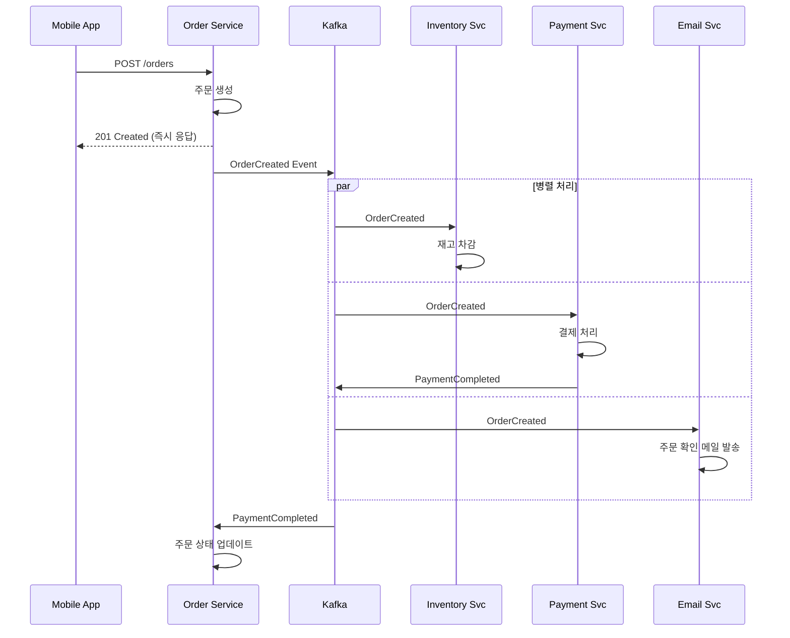

# Event-Driven Architecture

## 1. 한 줄 요약

**시스템 컴포넌트들이 이벤트(상태 변화)를 발행하고 구독하는 방식으로 통신하여, 느슨한 결합과 높은 확장성을 달성하는 아키텍처**

---

## 2. 쉽게 설명

### 모바일 개발자를 위한 비유

Event-Driven Architecture는 모바일 개발에서 자주 쓰는 패턴과 매우 유사합니다:

```
모바일 개발                        서버 Event-Driven
─────────────                    ─────────────
LiveData/Flow Observer           Event Publisher/Subscriber
NotificationCenter (iOS)         Message Queue (Kafka)
EventBus (Android)               Event Bus (RabbitMQ)
    │                                │
    ▼                                ▼
"무슨 일이 일어났다"를              "무슨 일이 일어났다"를
관심 있는 곳에 알림                 관심 있는 서비스에 알림
```

### 동기 통신 vs 이벤트 기반 통신

**동기 통신 (Request/Response)**

```
주문 서비스가 직접 다른 서비스들을 호출

┌─────────────┐
│ Order Svc   │
└──────┬──────┘
       │ 1. 재고 확인해줘
       ├──────────────────────►┌─────────────┐
       │                       │Inventory Svc│
       │◄──────────────────────└─────────────┘
       │
       │ 2. 결제 처리해줘
       ├──────────────────────►┌─────────────┐
       │                       │ Payment Svc │
       │◄──────────────────────└─────────────┘
       │
       │ 3. 배송 예약해줘
       ├──────────────────────►┌─────────────┐
       │                       │Shipping Svc │
       │◄──────────────────────└─────────────┘

문제점:
- Order Service가 모든 서비스를 알아야 함 (강한 결합)
- 하나라도 느리면 전체가 느림
- Shipping Service 추가 시 Order Service 코드 수정 필요
```

**이벤트 기반 통신**

```
주문 서비스는 이벤트만 발행, 관심 있는 서비스가 구독

┌─────────────┐
│ Order Svc   │──"주문 생성됨" 이벤트 발행
└─────────────┘
       │
       ▼
┌─────────────────────────────────────────────┐
│              Message Queue (Kafka)           │
└─────────────────────────────────────────────┘
       │              │              │
       ▼              ▼              ▼
┌───────────┐  ┌───────────┐  ┌───────────┐
│Inventory  │  │ Payment   │  │ Shipping  │
│   Svc     │  │   Svc     │  │   Svc     │
└───────────┘  └───────────┘  └───────────┘
 "재고 차감"    "결제 처리"    "배송 예약"

장점:
- Order Service는 다른 서비스를 모름 (느슨한 결합)
- 비동기 처리로 빠른 응답
- 새 서비스 추가 시 구독만 하면 됨
```

### 이벤트란?

```
이벤트 = 과거에 발생한 사실의 기록

┌─────────────────────────────────────┐
│ OrderCreatedEvent                   │
│ ─────────────────────────────────   │
│ eventId: "evt-123"                 │
│ eventType: "ORDER_CREATED"         │
│ timestamp: "2024-01-15T10:30:00Z"  │
│ data: {                            │
│   orderId: "order-456"             │
│   userId: "user-789"               │
│   items: [...]                     │
│   totalPrice: 50000                │
│ }                                  │
└─────────────────────────────────────┘

특징:
- 불변(Immutable): 한번 발생한 이벤트는 수정/삭제 불가
- 과거형: "OrderCreated" not "CreateOrder"
- 자기 설명적: 이벤트만 봐도 무슨 일이 일어났는지 알 수 있음
```

---

## 3. 구조 다이어그램

### Event-Driven Architecture 기본 구조

```
┌─────────────────────────────────────────────────────────────────────┐
│                     Event-Driven Architecture                        │
│                                                                      │
│  ┌─────────────┐                              ┌─────────────┐       │
│  │  Producer   │                              │  Consumer   │       │
│  │  (발행자)    │                              │  (구독자)    │       │
│  └──────┬──────┘                              └──────▲──────┘       │
│         │                                            │              │
│         │  1. 이벤트 발행                              │              │
│         │     (Publish)                              │              │
│         ▼                                            │              │
│  ┌─────────────────────────────────────────────────────────────┐   │
│  │                     Message Broker                           │   │
│  │  ┌─────────┐  ┌─────────┐  ┌─────────┐  ┌─────────┐        │   │
│  │  │ Topic A │  │ Topic B │  │ Topic C │  │ Topic D │        │   │
│  │  │(Orders) │  │(Payment)│  │(Shipping│  │(Notif)  │        │   │
│  │  └─────────┘  └─────────┘  └─────────┘  └─────────┘        │   │
│  └─────────────────────────────────────────────────────────────┘   │
│         │                                            ▲              │
│         │  2. 이벤트 저장                  3. 이벤트 소비 │              │
│         │     & 전달                      (Subscribe)  │              │
│         ▼                                            │              │
│  ┌─────────────────────────────────────────────────────────────┐   │
│  │                     Event Store (Optional)                   │   │
│  │           모든 이벤트의 영구 저장소 (이벤트 소싱용)              │   │
│  └─────────────────────────────────────────────────────────────┘   │
│                                                                      │
└─────────────────────────────────────────────────────────────────────┘
```

### 이커머스 시스템에서의 이벤트 흐름

```
사용자 주문 → 이벤트 흐름
════════════════════════════════════════════════════════════════

┌────────┐    ┌────────────┐    ┌─────────────────────────────┐
│ Mobile │───►│   Order    │───►│      Kafka (Event Bus)      │
│  App   │    │  Service   │    │                             │
└────────┘    └────────────┘    │  Topic: order-events        │
                                │  ┌─────────────────────────┐│
              OrderCreated ────►│  │ OrderCreated           ││
                                │  │ OrderPaid              ││
                                │  │ OrderShipped           ││
                                │  │ OrderDelivered         ││
                                │  └─────────────────────────┘│
                                └──────────────┬──────────────┘
                                               │
         ┌─────────────────┬───────────────────┼───────────────────┬─────────────────┐
         │                 │                   │                   │                 │
         ▼                 ▼                   ▼                   ▼                 ▼
    ┌─────────┐      ┌─────────┐         ┌─────────┐         ┌─────────┐      ┌─────────┐
    │Inventory│      │ Payment │         │Shipping │         │  Email  │      │Analytics│
    │ Service │      │ Service │         │ Service │         │ Service │      │ Service │
    └─────────┘      └─────────┘         └─────────┘         └─────────┘      └─────────┘
    재고 차감        결제 처리          배송 예약          이메일 발송       통계 집계

각 서비스는 필요한 이벤트만 구독
- Inventory: OrderCreated
- Payment: OrderCreated
- Shipping: OrderPaid
- Email: OrderCreated, OrderShipped, OrderDelivered
- Analytics: 모든 이벤트
```

### Mermaid 다이어그램



---

## 4. 실무 적용 예시

### 예시 1: 주문 생성 이벤트 처리

```python
# order_service/events.py

from dataclasses import dataclass
from datetime import datetime
from kafka import KafkaProducer
import json

# 이벤트 정의
@dataclass
class OrderCreatedEvent:
    event_id: str
    event_type: str = "ORDER_CREATED"
    timestamp: datetime = None
    order_id: str = ""
    user_id: str = ""
    items: list = None
    total_price: int = 0

    def to_dict(self):
        return {
            "event_id": self.event_id,
            "event_type": self.event_type,
            "timestamp": self.timestamp.isoformat(),
            "data": {
                "order_id": self.order_id,
                "user_id": self.user_id,
                "items": self.items,
                "total_price": self.total_price
            }
        }

# 이벤트 발행자
class OrderEventPublisher:
    def __init__(self):
        self.producer = KafkaProducer(
            bootstrap_servers=['kafka:9092'],
            value_serializer=lambda v: json.dumps(v).encode('utf-8')
        )

    def publish_order_created(self, order):
        event = OrderCreatedEvent(
            event_id=str(uuid.uuid4()),
            timestamp=datetime.now(),
            order_id=order.id,
            user_id=order.user_id,
            items=order.items,
            total_price=order.total_price
        )

        # 이벤트 발행
        self.producer.send('order-events', event.to_dict())
        self.producer.flush()

        print(f"Published: {event.event_type} for order {order.id}")


# order_service/api.py

class OrderService:
    def __init__(self):
        self.event_publisher = OrderEventPublisher()

    def create_order(self, request):
        # 1. 주문 저장 (동기)
        order = Order(
            id=generate_id(),
            user_id=request.user_id,
            items=request.items,
            total_price=calculate_total(request.items),
            status="CREATED"
        )
        self.order_repository.save(order)

        # 2. 이벤트 발행 (비동기 처리 트리거)
        self.event_publisher.publish_order_created(order)

        # 3. 즉시 응답 (결제/재고 처리를 기다리지 않음)
        return order
```

### 예시 2: 이벤트 소비자 구현

```python
# inventory_service/consumer.py

from kafka import KafkaConsumer
import json

class InventoryEventConsumer:
    def __init__(self):
        self.consumer = KafkaConsumer(
            'order-events',
            bootstrap_servers=['kafka:9092'],
            group_id='inventory-service',
            value_deserializer=lambda v: json.loads(v.decode('utf-8')),
            auto_offset_reset='earliest',
            enable_auto_commit=False  # 수동 커밋으로 안전하게
        )
        self.inventory_service = InventoryService()

    def start(self):
        print("Inventory consumer started...")

        for message in self.consumer:
            event = message.value

            try:
                self.handle_event(event)
                self.consumer.commit()  # 성공 시 커밋
            except Exception as e:
                print(f"Error processing event: {e}")
                # 실패 시 재시도 또는 Dead Letter Queue로 이동
                self.send_to_dlq(event, str(e))

    def handle_event(self, event):
        event_type = event.get('event_type')

        if event_type == 'ORDER_CREATED':
            self.handle_order_created(event)
        elif event_type == 'ORDER_CANCELLED':
            self.handle_order_cancelled(event)

    def handle_order_created(self, event):
        """주문 생성 시 재고 차감"""
        order_data = event['data']

        for item in order_data['items']:
            self.inventory_service.decrease_stock(
                product_id=item['product_id'],
                quantity=item['quantity']
            )

        print(f"Inventory decreased for order: {order_data['order_id']}")

    def handle_order_cancelled(self, event):
        """주문 취소 시 재고 복구"""
        order_data = event['data']

        for item in order_data['items']:
            self.inventory_service.increase_stock(
                product_id=item['product_id'],
                quantity=item['quantity']
            )

        print(f"Inventory restored for order: {order_data['order_id']}")
```

### 예시 3: 모바일 앱에서의 실시간 알림

```kotlin
// 서버에서 WebSocket/SSE로 이벤트 전달
// 모바일 앱에서 실시간으로 주문 상태 업데이트

class OrderTrackingViewModel(
    private val orderRepository: OrderRepository,
    private val eventStream: OrderEventStream  // WebSocket/SSE 연결
) : ViewModel() {

    private val _orderStatus = MutableStateFlow<OrderStatus?>(null)
    val orderStatus: StateFlow<OrderStatus?> = _orderStatus.asStateFlow()

    fun trackOrder(orderId: String) {
        viewModelScope.launch {
            // 실시간 이벤트 스트림 구독
            eventStream.subscribe(orderId)
                .collect { event ->
                    when (event.type) {
                        "ORDER_CONFIRMED" -> {
                            _orderStatus.value = OrderStatus.CONFIRMED
                        }
                        "ORDER_SHIPPED" -> {
                            _orderStatus.value = OrderStatus.SHIPPED
                            // 배송 시작 알림
                            showNotification("배송이 시작되었습니다!")
                        }
                        "ORDER_DELIVERED" -> {
                            _orderStatus.value = OrderStatus.DELIVERED
                            showNotification("배송이 완료되었습니다!")
                        }
                    }
                }
        }
    }
}

// Compose UI
@Composable
fun OrderTrackingScreen(viewModel: OrderTrackingViewModel) {
    val orderStatus by viewModel.orderStatus.collectAsState()

    Column {
        OrderStatusTimeline(
            steps = listOf(
                TimelineStep("주문 접수", orderStatus >= OrderStatus.CREATED),
                TimelineStep("결제 완료", orderStatus >= OrderStatus.CONFIRMED),
                TimelineStep("배송 시작", orderStatus >= OrderStatus.SHIPPED),
                TimelineStep("배송 완료", orderStatus >= OrderStatus.DELIVERED)
            )
        )
    }
}
```

---

## 5. 장단점

### 장점

| 장점 | 설명 |
|:---|:---|
| **느슨한 결합** | Producer는 Consumer를 모름, 서비스 독립성 보장 |
| **확장성** | Consumer를 쉽게 추가/제거 가능 |
| **비동기 처리** | 빠른 응답 시간, 시스템 부하 분산 |
| **장애 격리** | 한 Consumer의 장애가 다른 서비스에 영향 없음 |
| **이벤트 재처리** | 장애 복구 시 이벤트를 다시 처리 가능 |
| **감사 로그** | 모든 이벤트가 기록되어 추적 용이 |

### 단점

| 단점 | 설명 |
|:---|:---|
| **최종 일관성** | 즉각적인 일관성 보장 어려움 |
| **디버깅 어려움** | 이벤트 흐름 추적이 복잡함 |
| **메시지 순서** | 순서 보장이 필요한 경우 추가 처리 필요 |
| **중복 처리** | 멱등성(Idempotency) 보장 필요 |
| **복잡한 에러 처리** | 실패한 이벤트 재처리 로직 필요 |
| **운영 복잡도** | Message Broker 운영/모니터링 필요 |

### 주요 고려 사항

```
┌─────────────────────────────────────────────────────────────┐
│                    Event-Driven 설계 시 고려사항              │
├─────────────────────────────────────────────────────────────┤
│                                                             │
│  1. 멱등성 (Idempotency)                                    │
│     - 같은 이벤트를 여러 번 처리해도 결과가 같아야 함           │
│     - 예: 재고 차감 시 event_id로 중복 체크                   │
│                                                             │
│  2. 이벤트 순서                                              │
│     - Kafka: 같은 파티션 내에서만 순서 보장                   │
│     - 순서가 중요하면 같은 키(orderId)로 파티셔닝              │
│                                                             │
│  3. 이벤트 스키마 버전 관리                                   │
│     - 이벤트 구조 변경 시 하위 호환성 유지                     │
│     - Schema Registry 활용 (Avro, Protobuf)                 │
│                                                             │
│  4. Dead Letter Queue (DLQ)                                │
│     - 처리 실패한 이벤트를 별도 큐에 저장                      │
│     - 나중에 수동/자동으로 재처리                             │
│                                                             │
│  5. 모니터링                                                 │
│     - Consumer Lag 모니터링 (처리 지연)                      │
│     - 이벤트 처리 성공/실패율                                 │
│                                                             │
└─────────────────────────────────────────────────────────────┘
```

---

## 6. 내 생각

> 이 섹션은 학습 후 본인의 생각을 정리하는 공간입니다.

**Q1. 모바일 앱에서 Event-Driven 패턴을 사용한 경험이 있는가?**

```
(작성해보세요)


```

**Q2. Event-Driven 아키텍처의 "최종 일관성"이 문제가 될 수 있는 상황은?**

```
(작성해보세요)


```

**Q3. 현재 프로젝트에서 이벤트 기반으로 전환하면 좋을 부분은?**

```
(작성해보세요)


```

---

## 7. 추가 질문

더 깊이 학습하기 위한 질문들입니다.

### 기초 질문

**1. 이벤트와 커맨드(Command)의 차이점은 무엇인가?**

> **답변**: 둘 다 메시지지만, **의도와 시제**가 다릅니다.
>
> | 구분 | Command | Event |
> |:---|:---|:---|
> | 시제 | 미래/명령형 | 과거형 |
> | 의미 | "이것을 해라" | "이것이 일어났다" |
> | 대상 | 특정 서비스 지정 | 관심 있는 누구나 |
> | 결과 | 실패할 수 있음 | 이미 발생한 사실 |
> | 예시 | `CreateOrder` | `OrderCreated` |
>
> **실무 예시**:
> ```
> Command: CreateOrder (주문을 생성해라)
>   → Order Service가 받아서 처리
>   → 실패할 수 있음 (재고 부족, 결제 실패)
>
> Event: OrderCreated (주문이 생성되었다)
>   → 이미 발생한 사실의 기록
>   → 관심 있는 서비스들이 구독
>   → Inventory Service: 재고 차감
>   → Notification Service: 알림 발송
>   → Analytics Service: 통계 집계
> ```
>
> **모바일 비유**: Command는 `viewModel.loadData()` 호출, Event는 `LiveData`로 전달되는 상태 변경 알림과 유사합니다.

**2. Message Queue와 Event Stream의 차이점은?**

> **답변**: 가장 큰 차이는 **메시지 보존 여부**와 **소비 방식**입니다.
>
> | 구분 | Message Queue (RabbitMQ) | Event Stream (Kafka) |
> |:---|:---|:---|
> | 메시지 보존 | 소비 후 삭제 | 설정된 기간 보존 |
> | 재처리 | 불가능 (이미 삭제됨) | 가능 (오프셋 되돌리기) |
> | 소비자 패턴 | 경쟁 소비 (하나만 받음) | 모두 받을 수 있음 |
> | 순서 보장 | 전체 큐 순서 보장 | 파티션 내에서만 보장 |
> | 주 용도 | 작업 분배, 부하 분산 | 이벤트 기록, 스트림 처리 |
>
> **실무 선택 가이드**:
> ```
> Message Queue 적합:
> - 이메일 발송 작업 큐
> - 이미지 리사이징 작업
> - 한 번만 처리되면 되는 작업
>
> Event Stream 적합:
> - 주문 이력 기록 (나중에 재분석 가능)
> - 여러 서비스가 같은 이벤트를 소비해야 할 때
> - 이벤트 소싱 구현
> - 실시간 데이터 파이프라인
> ```
>
> **Netflix 사례**: Kafka로 모든 사용자 행동(시청 시작, 일시정지, 건너뛰기)을 기록합니다. 이 스트림을 추천 시스템, 품질 분석, 과금 시스템이 각각 소비합니다.

**3. Kafka의 Consumer Group이 필요한 이유는?**

> **답변**: Consumer Group은 **같은 토픽을 여러 Consumer가 분산 처리**하면서도 **다른 그룹은 독립적으로 소비**할 수 있게 합니다.
>
> **시나리오**: 주문 이벤트를 3개 서비스가 소비
> ```
> ┌─────────────────────────────────────────────────────────────┐
> │                   order-events Topic                        │
> │  ┌─────────┐ ┌─────────┐ ┌─────────┐ ┌─────────┐          │
> │  │Partition│ │Partition│ │Partition│ │Partition│          │
> │  │    0    │ │    1    │ │    2    │ │    3    │          │
> │  └────┬────┘ └────┬────┘ └────┬────┘ └────┬────┘          │
> └───────┼───────────┼───────────┼───────────┼────────────────┘
>         │           │           │           │
>         │   ┌───────┴───────────┴───────────┘
>         │   │
>         ▼   ▼
>    ┌──────────────────┐  Consumer Group: inventory-service
>    │ Consumer 1 (P0,1)│  ← 4개 파티션을 2개 Consumer가 분산
>    │ Consumer 2 (P2,3)│
>    └──────────────────┘
>
>         │   │
>         ▼   ▼
>    ┌──────────────────┐  Consumer Group: email-service
>    │ Consumer 1 (P0-3)│  ← 인스턴스 1개가 전부 처리
>    └──────────────────┘
>
>         │   │
>         ▼   ▼
>    ┌──────────────────┐  Consumer Group: analytics-service
>    │ Consumer 1 (P0,1)│  ← 3개 Consumer가 분산
>    │ Consumer 2 (P2)  │
>    │ Consumer 3 (P3)  │
>    └──────────────────┘
> ```
>
> **핵심 포인트**:
> - **같은 그룹 내**: 메시지는 한 Consumer만 받음 (부하 분산)
> - **다른 그룹 간**: 모두 같은 메시지를 받음 (브로드캐스트)
> - **파티션 수 >= Consumer 수**: 파티션보다 Consumer가 많으면 놀게 됨

### 심화 질문

**4. 이벤트 소싱(Event Sourcing)이란 무엇이고, 언제 사용하는가?**

> **답변**: 이벤트 소싱은 **상태를 직접 저장하는 대신, 상태 변경 이벤트를 순서대로 저장**하고, 현재 상태는 이벤트를 재생(replay)하여 계산하는 패턴입니다.
>
> **전통적 방식 vs 이벤트 소싱**:
> ```
> 전통적 CRUD:
> Account 테이블
> | id | balance |
> | 1  | 10000   |  ← 현재 잔액만 저장, 과거 기록 없음
>
> 이벤트 소싱:
> Account Events
> | event_id | type        | amount | timestamp  |
> | 1        | Deposited   | 5000   | 10:00:00  |
> | 2        | Deposited   | 7000   | 11:00:00  |
> | 3        | Withdrawn   | 2000   | 12:00:00  |
> 현재 잔액 = 5000 + 7000 - 2000 = 10000
>
> 장점: 10시, 11시, 12시 각각의 잔액을 언제든 재계산 가능
> ```
>
> **사용이 적합한 경우**:
> - **금융 시스템**: 모든 거래 이력이 법적으로 필요
> - **협업 도구**: Google Docs처럼 모든 변경 이력을 유지해야 할 때
> - **감사 로그 필수**: 누가, 언제, 무엇을 변경했는지 추적
> - **시간 여행 디버깅**: 특정 시점의 상태를 재현해야 할 때
>
> **주의**: 단순 CRUD 앱에 이벤트 소싱은 오버엔지니어링입니다. 복잡도가 크게 증가하므로 정말 필요한 경우에만 사용하세요.

**5. Saga 패턴에서 이벤트를 어떻게 활용하는가?**

> **답변**: Saga의 Choreography 방식에서 이벤트는 **서비스 간 통신의 매개체**입니다. 각 서비스는 이벤트를 발행하고, 다른 서비스는 관심 있는 이벤트를 구독하여 다음 단계를 실행합니다.
>
> **주문 Saga 이벤트 흐름**:
> ```
> ┌─────────────────────────────────────────────────────────────┐
> │                     정상 흐름                                │
> └─────────────────────────────────────────────────────────────┘
>
> [Order Service]          [Inventory]           [Payment]
>      │                       │                     │
>      │ OrderCreated ─────────┼─────────────────────┼──────►
>      │                       │                     │
>      │                       │ InventoryReserved───┼──────►
>      │                       │                     │
>      │                       │                     │ PaymentCompleted
>      │◄──────────────────────┼─────────────────────┼───────
>      │                       │                     │
>      │ OrderConfirmed ───────┼─────────────────────┼──────►
>
> ┌─────────────────────────────────────────────────────────────┐
> │                     실패 시 보상 흐름                         │
> └─────────────────────────────────────────────────────────────┘
>
> [Order Service]          [Inventory]           [Payment]
>      │                       │                     │
>      │                       │                     │ PaymentFailed
>      │◄──────────────────────┼─────────────────────┼───────
>      │                       │                     │
>      │                       │ InventoryReleased ◄─┼───────
>      │                       │ (보상 트랜잭션)       │
>      │                       │                     │
>      │ OrderCancelled ───────┼─────────────────────┼──────►
> ```
>
> **핵심 원칙**:
> - 각 서비스는 자신의 로컬 트랜잭션만 처리
> - 성공 이벤트와 실패 이벤트 모두 정의
> - 모든 단계에 대해 보상 로직 구현
> - 멱등성 보장 (같은 이벤트를 여러 번 받아도 안전)

**6. 이벤트 스키마 변경 시 하위 호환성을 어떻게 유지하는가?**

> **답변**: 이벤트 스키마 변경은 **Producer와 Consumer가 독립 배포**되는 환경에서 매우 신중해야 합니다.
>
> **하위 호환성 유지 규칙**:
> ```
> 안전한 변경 (하위 호환):
> ✓ 새 필드 추가 (Optional로)
> ✓ 필드에 기본값 설정
>
> 위험한 변경 (하위 호환 깨짐):
> ✗ 필드 삭제
> ✗ 필드 타입 변경
> ✗ 필드명 변경
> ✗ Required 필드 추가
> ```
>
> **실무 전략**:
>
> **1. Schema Registry 사용 (Confluent)**
> ```
> Producer가 스키마 등록 → Registry가 호환성 검사
> → 호환되지 않으면 거부
> ```
>
> **2. 버전 관리**
> ```json
> {
>   "event_type": "OrderCreated",
>   "version": "2",  // 버전 명시
>   "data": { ... }
> }
>
> Consumer는 버전별로 다르게 처리:
> if version == "1": handleV1(event)
> if version == "2": handleV2(event)
> ```
>
> **3. 점진적 마이그레이션**
> ```
> Phase 1: 새 필드 추가, Optional로 설정
> Phase 2: 모든 Producer가 새 필드 채우도록 수정
> Phase 3: 모든 Consumer가 새 필드 사용하도록 수정
> Phase 4: (선택) 구 필드 deprecation
> ```
>
> **Airbnb 사례**: Avro 스키마와 Schema Registry를 사용하여, 모든 이벤트 스키마 변경은 호환성 검사를 거쳐야만 배포됩니다.

### 실전 질문

**7. Consumer가 이벤트 처리에 실패했을 때 어떻게 대응하는가?**

> **답변**: 실패 처리 전략은 **재시도 → Dead Letter Queue → 알림/수동 처리** 순서로 구성합니다.
>
> **단계별 대응**:
> ```
> ┌─────────────────────────────────────────────────────────────┐
> │ 1. 재시도 (Retry)                                           │
> │    - 일시적 오류(네트워크, DB 연결)는 재시도로 해결           │
> │    - Exponential Backoff: 1초 → 2초 → 4초 → 8초            │
> │    - 최대 재시도 횟수 설정 (예: 5회)                         │
> └─────────────────────────────────────────────────────────────┘
>                              │
>                    재시도 실패 │
>                              ▼
> ┌─────────────────────────────────────────────────────────────┐
> │ 2. Dead Letter Queue (DLQ)                                  │
> │    - 처리 불가능한 메시지를 별도 큐로 이동                     │
> │    - 원본 메시지 + 에러 정보 + 재시도 횟수 저장               │
> │    - 나중에 분석/수동 처리                                   │
> └─────────────────────────────────────────────────────────────┘
>                              │
>                              ▼
> ┌─────────────────────────────────────────────────────────────┐
> │ 3. 알림 및 모니터링                                          │
> │    - DLQ 메시지 수 모니터링                                  │
> │    - 임계치 초과 시 Slack/PagerDuty 알림                     │
> │    - 대시보드에서 실패 원인 분석                              │
> └─────────────────────────────────────────────────────────────┘
> ```
>
> **코드 예시**:
> ```python
> def process_event(event):
>     for attempt in range(MAX_RETRIES):
>         try:
>             handle(event)
>             return  # 성공
>         except RetryableError:
>             sleep(2 ** attempt)  # Exponential backoff
>         except NonRetryableError:
>             break  # 재시도 무의미
>
>     # 모든 재시도 실패
>     send_to_dlq(event, error_info)
>     alert_team(event)
> ```

**8. 이벤트 순서가 뒤바뀌면 어떤 문제가 생기고 어떻게 해결하는가?**

> **답변**: 순서 역전은 **비즈니스 로직 오류**를 일으킬 수 있습니다.
>
> **문제 상황**:
> ```
> 의도한 순서: OrderCreated → OrderPaid → OrderShipped
> 실제 도착:   OrderPaid → OrderCreated → OrderShipped
>
> OrderPaid 처리 시점에 Order가 없어서 에러 발생!
> ```
>
> **해결 방법**:
>
> **1. Kafka 파티셔닝으로 순서 보장**
> ```python
> # 같은 order_id는 같은 파티션으로
> producer.send(
>     topic='order-events',
>     key=order_id,  # 파티션 키
>     value=event
> )
> # 같은 파티션 내에서는 순서 보장됨
> ```
>
> **2. Consumer 측 버퍼링**
> ```python
> # 선행 이벤트가 없으면 잠시 대기
> def handle_order_paid(event):
>     order = get_order(event.order_id)
>     if order is None:
>         # 아직 OrderCreated가 안 왔음 → 재시도 큐로
>         retry_later(event, delay=1000)
>         return
>     process_payment(order)
> ```
>
> **3. 이벤트에 시퀀스 번호 포함**
> ```json
> {
>   "order_id": "123",
>   "sequence": 2,  // OrderCreated=1, OrderPaid=2
>   "event_type": "OrderPaid"
> }
> // Consumer는 sequence가 순차적인지 검증
> ```
>
> **4. 멱등성 설계**
> ```python
> # 이미 처리된 이벤트는 무시
> if is_already_processed(event.event_id):
>     return
> mark_as_processed(event.event_id)
> process(event)
> ```

**9. 이벤트 기반 시스템에서 통합 테스트는 어떻게 하는가?**

> **답변**: 이벤트 기반 시스템의 테스트는 **비동기성**과 **서비스 간 의존성** 때문에 복잡합니다.
>
> **테스트 전략**:
>
> **1. 컴포넌트 테스트 (In-Memory Broker)**
> ```kotlin
> @Test
> fun `주문 생성 시 재고 차감 이벤트 발행`() {
>     // Given: In-memory Kafka (Embedded Kafka)
>     val testBroker = EmbeddedKafka()
>
>     // When: 주문 생성
>     orderService.createOrder(request)
>
>     // Then: 이벤트 발행 확인
>     val event = testBroker.consumeNext("order-events")
>     assertThat(event.type).isEqualTo("ORDER_CREATED")
> }
> ```
>
> **2. 계약 테스트 (Contract Testing)**
> ```
> Producer와 Consumer 간 계약 정의:
> - Producer: "나는 이 형식의 이벤트를 발행해"
> - Consumer: "나는 이 형식의 이벤트를 기대해"
> - Pact 같은 도구로 계약 검증
> ```
>
> **3. End-to-End 테스트 (Test Containers)**
> ```kotlin
> @Testcontainers
> class OrderIntegrationTest {
>     @Container
>     val kafka = KafkaContainer()
>
>     @Container
>     val orderService = GenericContainer("order-service")
>
>     @Container
>     val inventoryService = GenericContainer("inventory-service")
>
>     @Test
>     fun `주문부터 재고 차감까지 전체 플로우`() {
>         // 실제 서비스들을 컨테이너로 띄우고 테스트
>         createOrder()
>         await().until { inventoryDecreased() }
>     }
> }
> ```
>
> **4. 비동기 검증 (Awaitility)**
> ```kotlin
> // 비동기 결과를 기다리며 검증
> await()
>     .atMost(5, SECONDS)
>     .pollInterval(100, MILLISECONDS)
>     .until { orderRepository.findById(orderId)?.status == "PAID" }
> ```
>
> **Netflix 사례**: 각 서비스는 자체 Embedded Kafka로 단위/통합 테스트를 수행하고, 스테이징 환경에서 실제 Kafka로 E2E 테스트를 진행합니다.

---

## 참고 자료

- [Event-Driven Architecture - Martin Fowler](https://martinfowler.com/articles/201701-event-driven.html)
- [Apache Kafka Documentation](https://kafka.apache.org/documentation/)
- [Designing Event-Driven Systems - Ben Stopford](https://www.confluent.io/designing-event-driven-systems/)
- [The Log: What every software engineer should know](https://engineering.linkedin.com/distributed-systems/log-what-every-software-engineer-should-know-about-real-time-datas-unifying)
