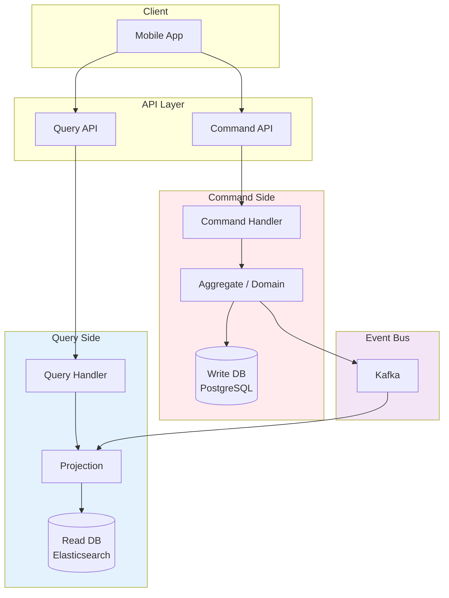

# CQRS (Command Query Responsibility Segregation)

## 1. 한 줄 요약

**데이터를 변경하는 명령(Command)과 데이터를 조회하는 쿼리(Query)를 별도의 모델로 분리하여, 각각 최적화된 방식으로 처리하는 패턴**

---

## 2. 쉽게 설명

### 모바일 개발자를 위한 비유

CQRS를 이해하려면, 도서관을 생각해보세요:

```
전통적인 방식 (CRUD)
───────────────────────────────
┌─────────────────────────────┐
│         도서관 데스크         │
│  - 책 대출                   │ ◄── 쓰기 (Write)
│  - 책 반납                   │
│  - 책 검색                   │ ◄── 읽기 (Read)
│  - 책 추천 받기              │
└─────────────────────────────┘
모든 업무를 한 곳에서 처리
→ 대출 줄이 길면 검색도 못함


CQRS 방식
───────────────────────────────
┌─────────────────┐  ┌─────────────────┐
│   대출/반납 창구  │  │    정보 데스크    │
│  (Command)      │  │    (Query)      │
│  - 책 대출      │  │  - 책 검색       │
│  - 책 반납      │  │  - 책 추천       │
│  - 책 등록      │  │  - 인기 도서     │
└─────────────────┘  └─────────────────┘
        │                    │
        ▼                    ▼
    ┌───────┐         ┌──────────┐
    │실시간DB│─동기화──►│검색최적화DB│
    └───────┘         └──────────┘
```

### 왜 읽기와 쓰기를 분리하는가?

대부분의 서비스에서 읽기와 쓰기의 특성은 매우 다릅니다:

```
┌─────────────────────────────────────────────────────────────┐
│                    읽기 vs 쓰기 비교                         │
├────────────────────────┬────────────────────────────────────┤
│         쓰기           │              읽기                  │
├────────────────────────┼────────────────────────────────────┤
│ 트래픽: 전체의 10~20%   │ 트래픽: 전체의 80~90%              │
│ 복잡한 비즈니스 검증    │ 다양한 형태의 조회 필요             │
│ 트랜잭션 필요          │ 빠른 응답 속도 중요                 │
│ 정규화된 데이터 구조    │ 비정규화된 조회 최적화 구조         │
│ 실시간 일관성 필요     │ 약간의 지연 허용 가능               │
└────────────────────────┴────────────────────────────────────┘

하나의 모델로 양쪽을 모두 만족시키기 어려움!
```

### 모바일 앱에서의 유사한 패턴

```kotlin
// 전통적인 방식 - 하나의 Repository가 모든 것 담당
class ProductRepository {
    fun getProducts(): List<Product>           // 조회
    fun getProductDetail(id: String): Product  // 조회
    fun searchProducts(query: String): List<Product>  // 조회
    fun createProduct(product: Product)        // 쓰기
    fun updateProduct(product: Product)        // 쓰기
}

// CQRS 스타일 - 읽기/쓰기 분리
class ProductQueryService {
    fun getProducts(): List<ProductSummary>    // 요약 정보만
    fun getProductDetail(id: String): ProductDetail  // 상세 정보
    fun searchProducts(query: String): List<SearchResult>  // 검색 최적화
}

class ProductCommandService {
    fun createProduct(command: CreateProductCommand): Result<ProductId>
    fun updateProduct(command: UpdateProductCommand): Result<Unit>
}
```

---

## 3. 구조 다이어그램

### 기본 CQRS 구조

```
┌─────────────────────────────────────────────────────────────────────┐
│                          CQRS Architecture                           │
│                                                                      │
│                         ┌─────────────┐                             │
│                         │   Client    │                             │
│                         │ (Mobile App)│                             │
│                         └──────┬──────┘                             │
│                                │                                     │
│              ┌─────────────────┴─────────────────┐                  │
│              │                                   │                  │
│              ▼                                   ▼                  │
│     ┌─────────────────┐               ┌─────────────────┐          │
│     │    Command      │               │      Query      │          │
│     │    Handler      │               │     Handler     │          │
│     │  (쓰기 담당)     │               │   (읽기 담당)    │          │
│     └────────┬────────┘               └────────┬────────┘          │
│              │                                  │                   │
│              │                                  │                   │
│              ▼                                  ▼                   │
│     ┌─────────────────┐               ┌─────────────────┐          │
│     │  Write Model    │               │   Read Model    │          │
│     │ (Domain Model)  │               │  (View Model)   │          │
│     │  - 비즈니스 로직  │               │  - 조회 최적화   │          │
│     │  - 유효성 검증   │               │  - 비정규화      │          │
│     └────────┬────────┘               └────────▲────────┘          │
│              │                                  │                   │
│              ▼                                  │                   │
│     ┌─────────────────┐       동기화       ┌─────────────────┐      │
│     │   Write DB      │─────────────────►│   Read DB       │      │
│     │  (PostgreSQL)   │    (이벤트 기반)   │ (Elasticsearch) │      │
│     └─────────────────┘                  └─────────────────┘      │
│                                                                      │
└─────────────────────────────────────────────────────────────────────┘
```

### 이벤트 소싱과 결합한 CQRS

```
┌─────────────────────────────────────────────────────────────────────┐
│                    CQRS + Event Sourcing                             │
│                                                                      │
│     Command Side                           Query Side                │
│     ────────────                           ──────────                │
│                                                                      │
│  ┌────────────────┐                    ┌────────────────┐           │
│  │ Command Handler│                    │  Query Handler │           │
│  └───────┬────────┘                    └───────▲────────┘           │
│          │                                     │                     │
│          ▼                                     │                     │
│  ┌────────────────┐                    ┌────────────────┐           │
│  │   Aggregate    │                    │  Read Model    │           │
│  │ (Domain Logic) │                    │  Projections   │           │
│  └───────┬────────┘                    └───────▲────────┘           │
│          │                                     │                     │
│          │ 이벤트 생성                          │ 이벤트 소비         │
│          ▼                                     │                     │
│  ┌─────────────────────────────────────────────┴────────────────┐   │
│  │                      Event Store                              │   │
│  │  ┌──────┐ ┌──────┐ ┌──────┐ ┌──────┐ ┌──────┐ ┌──────┐     │   │
│  │  │Evt 1 │→│Evt 2 │→│Evt 3 │→│Evt 4 │→│Evt 5 │→│Evt 6 │     │   │
│  │  └──────┘ └──────┘ └──────┘ └──────┘ └──────┘ └──────┘     │   │
│  │  (모든 상태 변경을 이벤트로 저장)                              │   │
│  └─────────────────────────────────────────────────────────────┘   │
│                                                                      │
└─────────────────────────────────────────────────────────────────────┘
```

### Mermaid 다이어그램



---

## 4. 실무 적용 예시

### 예시: 이커머스 상품 관리 시스템

**전통적인 CRUD 방식의 문제점**

```kotlin
// 하나의 Product 엔티티가 모든 것을 담당
data class Product(
    val id: String,
    val name: String,
    val description: String,
    val price: Int,
    val stock: Int,
    val category: Category,
    val seller: Seller,
    val reviews: List<Review>,
    val relatedProducts: List<Product>,
    val salesStats: SalesStats,
    // ... 20개 이상의 필드
)

// 문제점:
// 1. 목록 조회 시에도 불필요한 데이터 로딩
// 2. 검색 시 복잡한 JOIN 쿼리 필요
// 3. 가격 변경 같은 단순 업데이트도 전체 엔티티 로딩 필요
```

**CQRS 적용 후**

```kotlin
// ═══════════════════════════════════════════════════════
// Command Side - 쓰기 전용 모델
// ═══════════════════════════════════════════════════════

// Command 정의
sealed class ProductCommand {
    data class CreateProduct(
        val name: String,
        val description: String,
        val price: Int,
        val stock: Int,
        val categoryId: String,
        val sellerId: String
    ) : ProductCommand()

    data class UpdatePrice(
        val productId: String,
        val newPrice: Int,
        val reason: String
    ) : ProductCommand()

    data class DecreaseStock(
        val productId: String,
        val quantity: Int,
        val orderId: String
    ) : ProductCommand()
}

// Aggregate (도메인 로직)
class ProductAggregate(
    private val id: String,
    private var name: String,
    private var price: Int,
    private var stock: Int
) {
    private val events = mutableListOf<ProductEvent>()

    fun updatePrice(newPrice: Int, reason: String): Result<Unit> {
        // 비즈니스 규칙 검증
        if (newPrice < 0) {
            return Result.failure(IllegalArgumentException("가격은 0 이상이어야 합니다"))
        }
        if (newPrice > price * 2) {
            return Result.failure(IllegalArgumentException("가격 인상은 100%를 초과할 수 없습니다"))
        }

        val oldPrice = price
        price = newPrice

        // 이벤트 발행
        events.add(ProductPriceChanged(
            productId = id,
            oldPrice = oldPrice,
            newPrice = newPrice,
            reason = reason
        ))

        return Result.success(Unit)
    }

    fun decreaseStock(quantity: Int, orderId: String): Result<Unit> {
        if (stock < quantity) {
            return Result.failure(InsufficientStockException(id, stock, quantity))
        }

        stock -= quantity

        events.add(ProductStockDecreased(
            productId = id,
            quantity = quantity,
            remainingStock = stock,
            orderId = orderId
        ))

        return Result.success(Unit)
    }

    fun getUncommittedEvents(): List<ProductEvent> = events.toList()
}

// Command Handler
class ProductCommandHandler(
    private val repository: ProductWriteRepository,
    private val eventPublisher: EventPublisher
) {
    fun handle(command: ProductCommand.UpdatePrice): Result<Unit> {
        // 1. Aggregate 로드
        val product = repository.findById(command.productId)
            ?: return Result.failure(ProductNotFoundException(command.productId))

        // 2. 비즈니스 로직 실행
        val result = product.updatePrice(command.newPrice, command.reason)
        if (result.isFailure) {
            return result
        }

        // 3. 저장
        repository.save(product)

        // 4. 이벤트 발행 (Read Model 동기화용)
        product.getUncommittedEvents().forEach { event ->
            eventPublisher.publish(event)
        }

        return Result.success(Unit)
    }
}


// ═══════════════════════════════════════════════════════
// Query Side - 읽기 전용 모델
// ═══════════════════════════════════════════════════════

// 목적별로 최적화된 Read Model
data class ProductListItem(
    val id: String,
    val name: String,
    val thumbnailUrl: String,
    val price: Int,
    val discountRate: Int,
    val reviewCount: Int,
    val averageRating: Float
)

data class ProductDetail(
    val id: String,
    val name: String,
    val description: String,
    val images: List<String>,
    val price: Int,
    val originalPrice: Int,
    val stock: Int,
    val seller: SellerInfo,
    val category: CategoryInfo,
    val reviews: List<ReviewSummary>,
    val relatedProducts: List<ProductListItem>
)

data class ProductSearchResult(
    val id: String,
    val name: String,
    val thumbnailUrl: String,
    val price: Int,
    val categoryPath: String,
    val highlightedName: String  // 검색어 하이라이팅
)

// Query Handler
class ProductQueryHandler(
    private val readRepository: ProductReadRepository
) {
    // 상품 목록 - 빠른 응답을 위해 최소 데이터만
    fun getProductList(categoryId: String, page: Int): List<ProductListItem> {
        return readRepository.findByCategoryForList(categoryId, page)
    }

    // 상품 상세 - 필요한 모든 정보 한번에
    fun getProductDetail(productId: String): ProductDetail? {
        return readRepository.findByIdForDetail(productId)
    }

    // 검색 - Elasticsearch 활용
    fun searchProducts(query: String, filters: SearchFilters): List<ProductSearchResult> {
        return readRepository.search(query, filters)
    }
}


// ═══════════════════════════════════════════════════════
// Projection - Read Model 동기화
// ═══════════════════════════════════════════════════════

class ProductProjection(
    private val readRepository: ProductReadRepository
) {
    @EventHandler
    fun on(event: ProductCreated) {
        val listItem = ProductListItem(
            id = event.productId,
            name = event.name,
            thumbnailUrl = event.thumbnailUrl,
            price = event.price,
            discountRate = 0,
            reviewCount = 0,
            averageRating = 0f
        )
        readRepository.saveListItem(listItem)

        // Elasticsearch에도 색인
        readRepository.indexForSearch(event)
    }

    @EventHandler
    fun on(event: ProductPriceChanged) {
        readRepository.updatePrice(event.productId, event.newPrice)
    }

    @EventHandler
    fun on(event: ReviewAdded) {
        readRepository.updateReviewStats(
            event.productId,
            incrementCount = 1,
            newRating = event.rating
        )
    }
}
```

### 모바일 앱 API 설계 예시

```kotlin
// API Gateway에서 Command/Query 분리

// Command API (POST/PUT/DELETE)
interface ProductCommandApi {
    @POST("/admin/products")
    suspend fun createProduct(@Body command: CreateProductCommand): ProductId

    @PUT("/admin/products/{id}/price")
    suspend fun updatePrice(
        @Path("id") productId: String,
        @Body command: UpdatePriceCommand
    ): Unit
}

// Query API (GET) - 다양한 조회 용도별 엔드포인트
interface ProductQueryApi {
    // 목록 조회 - 가벼운 응답
    @GET("/products")
    suspend fun getProducts(
        @Query("category") categoryId: String,
        @Query("page") page: Int
    ): List<ProductListItem>

    // 상세 조회 - 상세 정보 포함
    @GET("/products/{id}")
    suspend fun getProductDetail(@Path("id") productId: String): ProductDetail

    // 검색 - 검색 최적화된 응답
    @GET("/products/search")
    suspend fun searchProducts(
        @Query("q") query: String,
        @Query("category") categoryId: String?,
        @Query("minPrice") minPrice: Int?,
        @Query("maxPrice") maxPrice: Int?
    ): List<ProductSearchResult>
}
```

---

## 5. 장단점

### 장점

| 장점 | 설명 |
|:---|:---|
| **읽기 성능 최적화** | Read Model을 조회 패턴에 맞게 비정규화하여 빠른 응답 |
| **쓰기 로직 단순화** | Write Model은 비즈니스 로직에만 집중 |
| **독립적 스케일링** | 읽기/쓰기 워크로드에 따라 별도 확장 가능 |
| **기술 최적화** | 쓰기는 RDB, 읽기는 Elasticsearch 등 최적 기술 선택 |
| **이벤트 소싱 호환** | Event Sourcing과 자연스럽게 결합 |

### 단점

| 단점 | 설명 |
|:---|:---|
| **복잡성 증가** | 두 개의 모델 관리, 동기화 로직 필요 |
| **최종 일관성** | Write → Read 동기화 지연으로 일시적 불일치 |
| **학습 곡선** | 팀 전체가 패턴을 이해해야 함 |
| **운영 부담** | 두 개의 데이터 저장소 관리 |
| **오버엔지니어링 위험** | 단순한 CRUD 앱에는 과도함 |

### 언제 CQRS를 적용해야 하는가?

```
CQRS 적용 체크리스트
═══════════════════════════════════════════

적용하면 좋은 경우:
✓ 읽기/쓰기 비율이 크게 다름 (예: 읽기 90% 이상)
✓ 복잡한 조회 요구사항 (검색, 통계, 리포트)
✓ 읽기/쓰기 성능 요구사항이 다름
✓ 이벤트 소싱을 사용하는 경우
✓ 여러 뷰가 같은 데이터를 다르게 표현해야 함

적용하지 않아도 되는 경우:
✗ 단순한 CRUD 애플리케이션
✗ 읽기/쓰기 패턴이 유사한 경우
✗ 즉각적인 일관성이 필수인 경우
✗ 팀이 분산 시스템 경험이 없는 경우
```

---

## 6. 내 생각

> 이 섹션은 학습 후 본인의 생각을 정리하는 공간입니다.

**Q1. 현재 프로젝트에서 읽기/쓰기 비율은 어떠한가?**

```
(작성해보세요)


```

**Q2. CQRS를 적용하면 가장 개선될 부분은?**

```
(작성해보세요)


```

**Q3. "최종 일관성"이 문제가 될 수 있는 화면은?**

```
(작성해보세요)


```

---

## 7. 추가 질문

더 깊이 학습하기 위한 질문들입니다.

### 기초 질문

**1. Command와 Query의 차이점은 무엇인가? Event와는 어떻게 다른가?**

> **답변**: 세 가지 모두 시스템의 메시지지만, **목적과 방향**이 다릅니다.
>
> | 구분 | Command | Query | Event |
> |:---|:---|:---|:---|
> | 목적 | 상태 변경 요청 | 상태 조회 요청 | 상태 변경 알림 |
> | 방향 | 클라이언트 → 시스템 | 클라이언트 → 시스템 | 시스템 → 관심자 |
> | 반환값 | 성공/실패 (void 또는 ID) | 데이터 | 없음 (fire-and-forget) |
> | 예시 | `CreateOrder(userId, items)` | `GetOrderById(orderId)` | `OrderCreated(orderId, ...)` |
> | 부수효과 | 있음 (DB 변경) | 없음 (읽기만) | 없음 (알림만) |
>
> **실무에서의 흐름**:
> ```
> 1. Client sends Command: CreateOrder
> 2. System processes Command, changes state
> 3. System publishes Event: OrderCreated
> 4. Client sends Query: GetOrderById
> 5. System returns data (no state change)
> ```
>
> **CQS 원칙 (Bertrand Meyer)**: "질문을 하는 것이 답을 변경해서는 안 된다" - Query는 상태를 변경하지 않고, Command는 값을 반환하지 않는 것이 이상적입니다. 단, 실무에서 Command가 생성된 ID를 반환하는 것은 허용됩니다.

**2. Read Model은 왜 비정규화(Denormalization)하는가?**

> **답변**: Read Model은 **조회 성능 최적화**가 목적이므로, 정규화의 이점(데이터 무결성, 저장 공간 절약)보다 **빠른 조회**가 더 중요합니다.
>
> **정규화 vs 비정규화 비교**:
> ```
> 정규화된 구조 (Write Model):
> ┌─────────┐     ┌─────────┐     ┌─────────┐
> │  Order  │────►│OrderItem│────►│ Product │
> └─────────┘     └─────────┘     └─────────┘
>       │
>       ▼
> ┌─────────┐
> │   User  │
> └─────────┘
>
> 주문 상세 조회 시: 4개 테이블 JOIN 필요
> SELECT * FROM orders o
> JOIN order_items oi ON o.id = oi.order_id
> JOIN products p ON oi.product_id = p.id
> JOIN users u ON o.user_id = u.id
> → 느림, 복잡함
>
>
> 비정규화된 구조 (Read Model):
> ┌──────────────────────────────────────┐
> │          order_details_view          │
> │  order_id, user_name, user_email,   │
> │  product_name, product_price,        │
> │  quantity, total_price, status       │
> └──────────────────────────────────────┘
>
> 주문 상세 조회 시: 단일 테이블 조회
> SELECT * FROM order_details_view WHERE order_id = ?
> → 빠름, 단순함
> ```
>
> **트레이드오프**:
> - **저장 공간 증가**: 같은 데이터가 여러 곳에 저장
> - **쓰기 복잡도 증가**: 원본 데이터 변경 시 Read Model도 업데이트 필요
> - **최종 일관성**: Write와 Read 사이에 동기화 지연 발생
>
> **실무 팁**: 모든 조회를 비정규화하지 않습니다. 자주 사용되고 복잡한 조회만 선택적으로 비정규화하세요.

**3. Write DB와 Read DB가 다를 수 있는 이유는?**

> **답변**: 읽기와 쓰기의 **요구사항이 근본적으로 다르기** 때문입니다.
>
> | 요구사항 | Write DB | Read DB |
> |:---|:---|:---|
> | 데이터 무결성 | 필수 (트랜잭션) | 덜 중요 |
> | 쿼리 복잡도 | 단순 (INSERT/UPDATE) | 복잡 (검색, 집계) |
> | 스키마 | 정규화 | 비정규화 |
> | 확장 방식 | 수직 확장 | 수평 확장 (Read Replica) |
> | 최적 기술 | PostgreSQL, MySQL | Elasticsearch, Redis, MongoDB |
>
> **실무 조합 예시**:
> ```
> 이커머스 상품 시스템:
>
> Write: PostgreSQL
>   - 상품 등록/수정
>   - 재고 관리 (트랜잭션 필요)
>   - ACID 보장
>
> Read: Elasticsearch
>   - 상품 검색 (형태소 분석, 유사어)
>   - 필터링 (가격, 카테고리, 브랜드)
>   - 정렬 (인기순, 최신순, 가격순)
>
> Read: Redis
>   - 상품 상세 캐싱
>   - 실시간 재고 수량
>   - 인기 상품 목록
> ```
>
> **쿠팡 사례**: 검색은 Elasticsearch, 상품 상세는 Redis 캐시, 주문 데이터는 PostgreSQL로 각각 최적화된 저장소를 사용합니다. 이벤트 기반으로 동기화됩니다.

### 심화 질문

**4. CQRS와 Event Sourcing은 왜 자주 함께 사용되는가?**

> **답변**: 두 패턴은 **상호 보완적**이지만, 반드시 함께 사용할 필요는 없습니다.
>
> **함께 사용하면 좋은 이유**:
> ```
> Event Sourcing만 사용:
> ┌─────────────────────────────────────────────┐
> │              Event Store                     │
> │  Event 1 → Event 2 → Event 3 → Event 4     │
> └─────────────────────────────────────────────┘
>
> 문제: 현재 상태를 알려면 모든 이벤트를 replay해야 함
>       → 조회할 때마다 느림
>
>
> Event Sourcing + CQRS:
> ┌─────────────────────────────────────────────┐
> │              Event Store                     │
> │  Event 1 → Event 2 → Event 3 → Event 4     │
> └──────────────────────┬──────────────────────┘
>                        │ 이벤트 구독
>                        ▼
> ┌─────────────────────────────────────────────┐
> │           Read Model (Projection)           │
> │        현재 상태가 미리 계산되어 저장         │
> └─────────────────────────────────────────────┘
>
> 장점: 조회 시 이미 계산된 상태를 바로 반환 → 빠름
> ```
>
> **각각 독립적으로 사용 가능**:
> - **CQRS만**: 이벤트 소싱 없이 Write/Read DB만 분리
> - **Event Sourcing만**: CQRS 없이 이벤트만 저장 (조회 시 replay)
>
> **함께 사용 시 추가 장점**:
> - Read Model 재구축: 이벤트를 다시 재생하여 새로운 형태의 View 생성
> - 시점 조회: 특정 시점의 상태를 Read Model로 재현
> - 다중 Read Model: 같은 이벤트로 여러 목적의 View 생성

**5. Read Model 동기화 지연으로 인한 문제를 어떻게 해결하는가?**

> **답변**: CQRS에서 가장 흔한 문제입니다. **최종 일관성(Eventual Consistency)**은 피할 수 없지만, 사용자 경험을 개선할 수 있습니다.
>
> **문제 상황**:
> ```
> 1. 사용자가 글 작성 (Command)
> 2. Write DB에 저장 완료
> 3. 이벤트 발행 → Read DB 업데이트 (몇 ms ~ 몇 초 지연)
> 4. 사용자가 목록 조회 (Query) → 방금 쓴 글이 안 보임!
> ```
>
> **해결 전략**:
>
> **1. Read Your Own Writes (낙관적 UI)**
> ```kotlin
> // 모바일 앱에서
> fun createPost(content: String) {
>     val tempId = generateTempId()
>
>     // 즉시 로컬 UI에 표시 (낙관적 업데이트)
>     localPostList.add(0, Post(tempId, content, "작성 중..."))
>
>     // 서버에 요청
>     api.createPost(content)
>         .onSuccess { realPost ->
>             // 성공 시 임시 데이터를 실제 데이터로 교체
>             localPostList.replace(tempId, realPost)
>         }
>         .onFailure {
>             // 실패 시 롤백
>             localPostList.remove(tempId)
>             showError("게시 실패")
>         }
> }
> ```
>
> **2. Write-through 캐시**
> ```
> Command 처리 시:
> 1. Write DB 저장
> 2. 캐시에 즉시 저장 (Redis)
> 3. 이벤트 발행 (Read DB 비동기 업데이트)
>
> Query 처리 시:
> 1. 캐시 먼저 조회 → 최신 데이터 반환
> 2. 캐시 미스 시 Read DB 조회
> ```
>
> **3. 버전 기반 폴링**
> ```kotlin
> // Command 응답에 버전 포함
> val response = api.createPost(content)  // returns { id, version: 5 }
>
> // Query 시 버전 확인
> api.getPostList(minVersion = response.version)
> // 서버는 Read Model이 해당 버전 이상이 될 때까지 짧게 대기
> ```
>
> **4. 동기화 완료 이벤트 (WebSocket/SSE)**
> ```
> 1. Command 완료 후 클라이언트에 "동기화 중" 상태 반환
> 2. Read Model 업데이트 완료 시 WebSocket으로 알림
> 3. 클라이언트가 목록 새로고침
> ```

**6. 하나의 Command가 여러 Read Model을 업데이트해야 할 때 어떻게 하는가?**

> **답변**: 이벤트 기반 Projection을 사용하면, **하나의 이벤트를 여러 Projection이 독립적으로 소비**합니다.
>
> **구조**:
> ```
> ┌─────────────────┐
> │ CreateOrder     │  Command
> │   Command       │
> └────────┬────────┘
>          │
>          ▼
> ┌─────────────────┐
> │ Order Aggregate │  Domain
> └────────┬────────┘
>          │ OrderCreated Event
>          ▼
> ┌─────────────────────────────────────────────┐
> │              Event Bus (Kafka)              │
> └─────────────────────┬───────────────────────┘
>                       │
>     ┌─────────────────┼─────────────────┐
>     │                 │                 │
>     ▼                 ▼                 ▼
> ┌─────────┐     ┌─────────┐     ┌─────────┐
> │ Order   │     │ User    │     │Analytics│  Projections
> │ List    │     │ Orders  │     │ Stats   │
> │Projection│    │Projection│   │Projection│
> └─────────┘     └─────────┘     └─────────┘
>     │               │               │
>     ▼               ▼               ▼
> ┌─────────┐     ┌─────────┐     ┌─────────┐
> │Elastic  │     │PostgreSQL│    │ClickHouse│ Read DBs
> │(검색용)  │     │(상세용)  │     │(분석용)  │
> └─────────┘     └─────────┘     └─────────┘
> ```
>
> **핵심 원칙**:
> - **각 Projection은 독립적**: 하나가 실패해도 다른 것에 영향 없음
> - **멱등성 보장**: 같은 이벤트를 여러 번 처리해도 결과 동일
> - **독립적 재구축**: 특정 Read Model만 이벤트를 다시 replay하여 재생성 가능
>
> **배달의민족 사례**: `OrderCreated` 이벤트 하나로 주문 목록(사용자용), 주문 현황(가게용), 배달 큐(라이더용), 매출 통계(관리자용) 4개의 Read Model이 각각 업데이트됩니다.

### 실전 질문

**7. 기존 CRUD 시스템에 CQRS를 점진적으로 도입하는 방법은?**

> **답변**: Big Bang 전환은 위험합니다. **가장 이점이 큰 부분부터** 점진적으로 적용하세요.
>
> **단계별 도입**:
>
> **Phase 1: 코드 레벨 분리 (1-2주)**
> ```kotlin
> // Before: 하나의 Service
> class ProductService {
>     fun create(dto: ProductDto): Product { ... }
>     fun update(id: String, dto: ProductDto): Product { ... }
>     fun getById(id: String): Product { ... }
>     fun search(query: String): List<Product> { ... }
> }
>
> // After: Command/Query 분리 (같은 DB)
> class ProductCommandService {
>     fun create(command: CreateProduct): ProductId { ... }
>     fun update(command: UpdateProduct) { ... }
> }
>
> class ProductQueryService {
>     fun getById(id: String): ProductDetail { ... }
>     fun search(query: SearchQuery): List<ProductSummary> { ... }
> }
> ```
>
> **Phase 2: Read Model 최적화 (2-4주)**
> - 복잡한 조회에 대해 Materialized View 또는 캐시 도입
> - 동일 DB 내에서 View 테이블 생성
>
> **Phase 3: 이벤트 기반 동기화 (4-8주)**
> - Command 처리 시 이벤트 발행
> - Event Handler가 Read Model 업데이트
> - 아직은 동일 DB 내에서
>
> **Phase 4: 저장소 분리 (선택)**
> - 검색은 Elasticsearch로 분리
> - 캐시는 Redis로 분리
> - 이벤트 기반으로 동기화
>
> **중요**: Phase 4까지 갈 필요가 없는 경우가 많습니다. 필요할 때만 진행하세요.

**8. Read Model 재구축(Replay)은 언제, 어떻게 하는가?**

> **답변**: Read Model을 처음부터 다시 만들어야 하는 상황은 생각보다 자주 발생합니다.
>
> **재구축이 필요한 경우**:
> - Read Model 스키마 변경 (새 필드 추가, 인덱스 변경)
> - Projection 로직 버그 수정 후 잘못된 데이터 교정
> - 새로운 Read Model 추가 (신규 대시보드)
> - 데이터 마이그레이션
>
> **재구축 방법**:
> ```
> 1. Event Store에서 모든 이벤트 조회 (처음부터)
> 2. 새 Read Model 테이블에 순차적으로 Projection 적용
> 3. 완료 후 트래픽 전환
>
> ┌─────────────────────────────────────────────┐
> │              Event Store                     │
> │  [Event 1] → [Event 2] → ... → [Event N]   │
> └──────────────────────┬──────────────────────┘
>                        │ Replay
>                        ▼
> ┌─────────────────────────────────────────────┐
> │           New Read Model                     │
> │     (처음부터 이벤트를 다시 적용)              │
> └─────────────────────────────────────────────┘
> ```
>
> **실무 전략**:
>
> **1. Blue-Green Deployment**
> ```
> 1. 새 Read Model(Blue) 구축 (기존 Green은 계속 서비스)
> 2. 실시간 이벤트도 Blue에 적용 시작
> 3. Blue가 현재 상태까지 따라잡으면 트래픽 전환
> 4. Green 제거
> ```
>
> **2. 스냅샷 활용**
> ```
> 전체 replay는 느림 → 중간중간 스냅샷 저장
>
> [Event 1~1000] → Snapshot A
> [Event 1001~2000] → Snapshot B
>
> 재구축 시 가장 최근 스냅샷부터 시작
> ```
>
> **주의**: Event Store 없이 CQRS만 사용하면 재구축이 어렵습니다. Write DB의 현재 상태만 있기 때문입니다.

**9. 모바일 앱에서 "내가 방금 작성한 글이 안 보여요" 문제를 어떻게 해결하는가?**

> **답변**: 이 문제는 CQRS의 **최종 일관성** 때문에 발생합니다. 사용자 경험 관점에서 여러 해결책을 조합해야 합니다.
>
> **해결책 조합**:
>
> **1. 낙관적 UI (Optimistic Update) - 필수**
> ```kotlin
> // 글 작성 버튼 클릭 시
> fun onSubmitPost(content: String) {
>     // 1. 즉시 로컬 목록에 추가 (pending 상태)
>     val tempPost = Post(
>         id = "temp-${UUID.randomUUID()}",
>         content = content,
>         status = PostStatus.PENDING
>     )
>     _posts.value = listOf(tempPost) + _posts.value
>
>     // 2. 서버에 요청
>     viewModelScope.launch {
>         createPostUseCase(content)
>             .onSuccess { realPost ->
>                 // temp를 실제 데이터로 교체
>                 _posts.value = _posts.value.map {
>                     if (it.id == tempPost.id) realPost else it
>                 }
>             }
>             .onFailure { error ->
>                 // 실패 시 롤백 + 에러 표시
>                 _posts.value = _posts.value.filter { it.id != tempPost.id }
>                 _error.value = "게시 실패: ${error.message}"
>             }
>     }
> }
> ```
>
> **2. Response에 생성된 데이터 포함**
> ```kotlin
> // 서버 응답
> data class CreatePostResponse(
>     val id: String,
>     val createdPost: PostDetail  // 생성된 데이터를 응답에 포함
> )
>
> // 클라이언트
> val response = api.createPost(content)
> // Read API 호출 없이 응답의 데이터를 바로 사용
> localCache.save(response.createdPost)
> ```
>
> **3. 특정 기간 동안 로컬 데이터 우선**
> ```kotlin
> fun getPosts(): List<Post> {
>     val localRecent = localCache.getRecentlyCreated(within = 5.seconds)
>     val serverPosts = api.getPosts()
>
>     // 내가 최근 작성한 글은 로컬 데이터 우선
>     return mergeWithLocalPriority(serverPosts, localRecent)
> }
> ```
>
> **4. 실시간 동기화 알림 (대규모 서비스)**
> ```kotlin
> // WebSocket으로 동기화 완료 알림 수신
> websocket.on("sync-complete") { syncedIds ->
>     if (syncedIds.contains(myRecentPostId)) {
>         // 이제 서버에서 조회해도 보임
>         refreshPostList()
>     }
> }
> ```
>
> **인스타그램 사례**: 게시물 업로드 시 "업로드 중..." UI를 보여주고, 로컬에 먼저 표시합니다. 실제 서버 동기화는 백그라운드에서 진행되며, 완료되면 조용히 상태가 업데이트됩니다. 사용자는 지연을 거의 인지하지 못합니다.

---

## 참고 자료

- [CQRS - Martin Fowler](https://martinfowler.com/bliki/CQRS.html)
- [CQRS Documents by Greg Young](https://cqrs.files.wordpress.com/2010/11/cqrs_documents.pdf)
- [Microsoft - CQRS Pattern](https://docs.microsoft.com/en-us/azure/architecture/patterns/cqrs)
- [Event Sourcing - Martin Fowler](https://martinfowler.com/eaaDev/EventSourcing.html)
