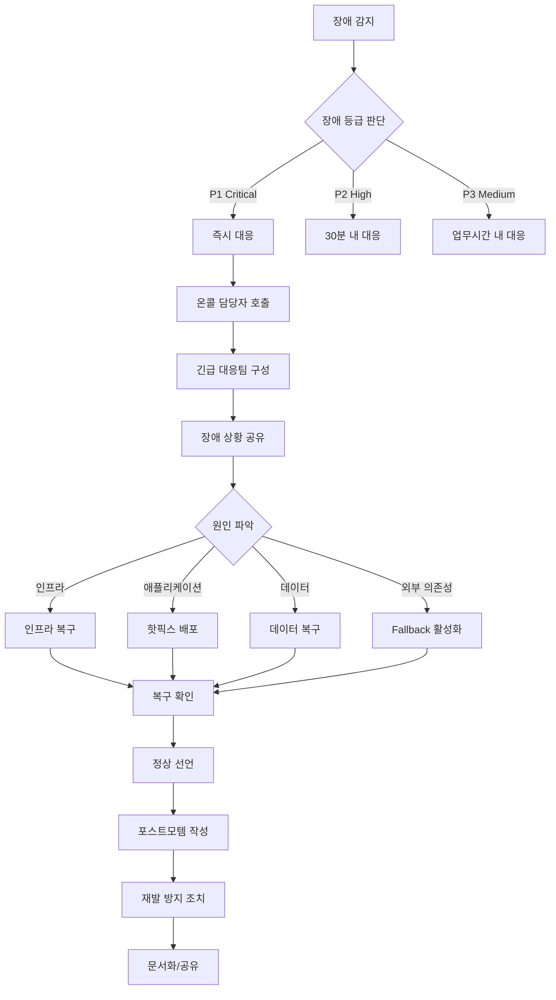

# 장애 대응 전략

## 1. 한 줄 요약

**시스템 장애를 예방하고, 발생 시 신속하게 감지/대응/복구하며, 재발을 방지하기 위한 체계적인 전략과 프로세스**

---

## 2. 쉽게 설명

### 모바일 개발자를 위한 비유

장애 대응은 **소방서**와 같습니다:

```
소방서의 역할                       장애 대응의 역할
─────────────                     ─────────────
화재 예방 교육                     → 모니터링/알림 설정
화재 감지 시스템                   → 알람 시스템
신속한 출동                        → 온콜 대응
진화 작업                          → 장애 복구
화재 원인 조사                     → 포스트모템 (사후 분석)
재발 방지 대책                     → 시스템 개선
```

### 모바일 개발자가 알아야 하는 이유

앱 개발만 하더라도 장애 상황을 이해해야 합니다:

```
서버 장애 시 모바일 앱의 대응
═══════════════════════════════════════════

1. API 타임아웃 처리
   - 무한 로딩 방지
   - 적절한 에러 메시지

2. 오프라인 모드
   - 캐시된 데이터 표시
   - 오프라인에서도 사용 가능한 기능

3. 재시도 로직
   - Exponential Backoff
   - 무한 재시도 방지

4. 사용자 커뮤니케이션
   - "현재 서비스 점검 중입니다"
   - 예상 복구 시간 안내
```

### 장애의 종류

```
┌─────────────────────────────────────────────────────────────┐
│                      장애 유형 분류                          │
├─────────────────────────────────────────────────────────────┤
│                                                             │
│  1. 인프라 장애                                              │
│     - 서버 다운                                              │
│     - 네트워크 단절                                          │
│     - 디스크 용량 부족                                        │
│     - 클라우드 리전 장애                                      │
│                                                             │
│  2. 애플리케이션 장애                                        │
│     - 메모리 누수 (OOM)                                      │
│     - 무한 루프                                              │
│     - 데드락                                                 │
│     - 잘못된 설정                                            │
│                                                             │
│  3. 데이터 장애                                              │
│     - 데이터베이스 장애                                       │
│     - 데이터 불일치                                          │
│     - 백업 실패                                              │
│                                                             │
│  4. 외부 의존성 장애                                         │
│     - 결제 PG사 장애                                         │
│     - 외부 API 장애                                          │
│     - CDN 장애                                               │
│                                                             │
│  5. 보안 장애                                                │
│     - DDoS 공격                                              │
│     - 데이터 유출                                            │
│     - 인증 시스템 장애                                        │
│                                                             │
└─────────────────────────────────────────────────────────────┘
```

---

## 3. 구조 다이어그램

### 장애 대응 프로세스 전체 흐름

```
┌─────────────────────────────────────────────────────────────────────┐
│                       장애 대응 라이프사이클                          │
│                                                                      │
│  ┌──────────┐    ┌──────────┐    ┌──────────┐    ┌──────────┐      │
│  │   예방    │───►│   감지    │───►│   대응    │───►│   복구    │      │
│  │Prevention│    │Detection │    │ Response │    │ Recovery │      │
│  └──────────┘    └──────────┘    └──────────┘    └──────────┘      │
│       │              │              │              │                 │
│       │              │              │              │                 │
│       │              ▼              ▼              ▼                 │
│       │         ┌──────────┐  ┌──────────┐  ┌──────────┐           │
│       │         │ 모니터링  │  │ 장애등급  │  │  복구    │           │
│       │         │ 알람     │  │ 판단     │  │  확인    │           │
│       │         └──────────┘  └──────────┘  └──────────┘           │
│       │                                                              │
│       │                           ┌──────────┐                      │
│       │                           │ 포스트모템 │                      │
│       │                           │(사후분석) │                      │
│       │                           └────┬─────┘                      │
│       │                                │                             │
│       └────────────────────────────────┘                             │
│                    재발 방지 조치 반영                                 │
│                                                                      │
└─────────────────────────────────────────────────────────────────────┘
```

### 장애 대응 체계

```
                              장애 발생!
                                  │
                                  ▼
                    ┌─────────────────────────┐
                    │     모니터링 시스템       │
                    │   (Prometheus, Grafana)  │
                    └────────────┬────────────┘
                                 │
                                 ▼
                    ┌─────────────────────────┐
                    │      알람 발송           │
                    │  (Slack, PagerDuty)     │
                    └────────────┬────────────┘
                                 │
         ┌───────────────────────┼───────────────────────┐
         │                       │                       │
         ▼                       ▼                       ▼
┌─────────────────┐   ┌─────────────────┐   ┌─────────────────┐
│    P1 (Critical) │   │    P2 (High)    │   │   P3 (Medium)   │
│   전체 서비스 불능  │   │   일부 기능 불능  │   │  성능 저하      │
│                  │   │                  │   │                  │
│ 즉시 대응        │   │ 30분 내 대응     │   │ 업무시간 내 대응  │
│ CEO 보고        │   │ 팀장 보고        │   │ 팀 내 공유       │
│ 전사 공지        │   │ 영향팀 공지      │   │ 담당자 처리      │
└─────────────────┘   └─────────────────┘   └─────────────────┘
```

### 장애 복구 패턴

```
┌─────────────────────────────────────────────────────────────────────┐
│                        장애 복구 패턴들                              │
│                                                                      │
│  1. Circuit Breaker (회로 차단기)                                   │
│  ───────────────────────────────                                    │
│     정상 상태          장애 감지           복구 시도                   │
│     ┌──────┐          ┌──────┐          ┌──────┐                   │
│     │CLOSED│────────►│ OPEN │────────►│HALF- │                    │
│     │(연결)│ 실패 N회  │(차단)│ 타임아웃 │OPEN  │                    │
│     └──────┘          └──────┘          └──────┘                   │
│         ▲                                   │                       │
│         └───────────────────────────────────┘                       │
│                      성공 시 CLOSED로 복귀                           │
│                                                                      │
│  2. Retry with Exponential Backoff                                 │
│  ──────────────────────────────────                                 │
│     1차 시도 → 1초 대기 → 2차 시도 → 2초 대기 → 3차 시도 → 4초 대기   │
│                                                                      │
│  3. Bulkhead (격벽)                                                 │
│  ─────────────────                                                  │
│     ┌─────────┐ ┌─────────┐ ┌─────────┐                           │
│     │Service A│ │Service B│ │Service C│  ← 서비스별 리소스 격리     │
│     │ Pool    │ │ Pool    │ │ Pool    │                           │
│     └─────────┘ └─────────┘ └─────────┘                           │
│     장애가 전파되지 않음                                              │
│                                                                      │
│  4. Fallback (대체 응답)                                            │
│  ───────────────────────                                            │
│     Primary 실패 시 → 캐시 데이터 반환 또는 기본값 반환               │
│                                                                      │
└─────────────────────────────────────────────────────────────────────┘
```

### Mermaid - 장애 대응 플로우



---

## 4. 실무 적용 예시

### 예시 1: 모니터링 및 알람 설정

```yaml
# prometheus/alert-rules.yml
groups:
  - name: api-alerts
    rules:
      # P1: API 서버 다운
      - alert: APIServerDown
        expr: up{job="api-server"} == 0
        for: 1m
        labels:
          severity: critical
          priority: P1
        annotations:
          summary: "API 서버 다운"
          description: "{{ $labels.instance }} 서버가 1분 이상 응답하지 않습니다."

      # P2: 높은 에러율
      - alert: HighErrorRate
        expr: rate(http_requests_total{status=~"5.."}[5m]) / rate(http_requests_total[5m]) > 0.05
        for: 5m
        labels:
          severity: high
          priority: P2
        annotations:
          summary: "높은 에러율 감지"
          description: "5분간 에러율이 5%를 초과했습니다. 현재: {{ $value | humanizePercentage }}"

      # P2: 느린 응답 시간
      - alert: SlowResponseTime
        expr: histogram_quantile(0.95, rate(http_request_duration_seconds_bucket[5m])) > 2
        for: 5m
        labels:
          severity: high
          priority: P2
        annotations:
          summary: "API 응답 시간 지연"
          description: "95퍼센타일 응답 시간이 2초를 초과했습니다."

      # P3: 디스크 용량 경고
      - alert: DiskSpaceWarning
        expr: (node_filesystem_avail_bytes / node_filesystem_size_bytes) * 100 < 20
        for: 10m
        labels:
          severity: medium
          priority: P3
        annotations:
          summary: "디스크 용량 부족 경고"
          description: "{{ $labels.instance }} 디스크 여유 공간이 20% 미만입니다."
```

### 예시 2: Circuit Breaker 구현

```kotlin
// Resilience4j를 사용한 Circuit Breaker 설정
@Configuration
class CircuitBreakerConfig {

    @Bean
    fun paymentCircuitBreaker(): CircuitBreaker {
        val config = CircuitBreakerConfig.custom()
            .failureRateThreshold(50f)           // 실패율 50% 이상이면 열림
            .slowCallRateThreshold(50f)          // 느린 호출 50% 이상이면 열림
            .slowCallDurationThreshold(Duration.ofSeconds(2))
            .waitDurationInOpenState(Duration.ofSeconds(30))  // 30초 후 Half-Open
            .permittedNumberOfCallsInHalfOpenState(5)         // Half-Open에서 5번 테스트
            .slidingWindowSize(10)               // 최근 10번 호출 기준
            .build()

        return CircuitBreakerRegistry.of(config)
            .circuitBreaker("payment-service")
    }
}

// 사용 예시
@Service
class PaymentService(
    private val circuitBreaker: CircuitBreaker,
    private val paymentClient: PaymentClient,
    private val fallbackService: PaymentFallbackService
) {
    fun processPayment(request: PaymentRequest): PaymentResult {
        return try {
            circuitBreaker.executeSupplier {
                paymentClient.charge(request)
            }
        } catch (e: CallNotPermittedException) {
            // Circuit이 Open 상태 - Fallback 처리
            logger.warn("Circuit breaker is open. Using fallback.")
            fallbackService.queueForRetry(request)
            PaymentResult.Pending("결제가 지연되고 있습니다. 잠시 후 다시 확인해주세요.")
        } catch (e: Exception) {
            logger.error("Payment failed", e)
            throw PaymentException("결제 처리 중 오류가 발생했습니다.")
        }
    }
}
```

### 예시 3: 모바일 앱의 장애 대응 코드

```kotlin
// 네트워크 에러 처리 및 재시도 로직
class NetworkClient(
    private val okHttpClient: OkHttpClient
) {
    companion object {
        private const val MAX_RETRIES = 3
        private const val INITIAL_BACKOFF_MS = 1000L
    }

    suspend fun <T> executeWithRetry(
        request: suspend () -> T
    ): Result<T> {
        var lastException: Exception? = null
        var backoffMs = INITIAL_BACKOFF_MS

        repeat(MAX_RETRIES) { attempt ->
            try {
                return Result.success(request())
            } catch (e: IOException) {
                lastException = e
                if (attempt < MAX_RETRIES - 1) {
                    delay(backoffMs)
                    backoffMs *= 2  // Exponential backoff
                }
            } catch (e: HttpException) {
                // 5xx 에러만 재시도
                if (e.code() in 500..599 && attempt < MAX_RETRIES - 1) {
                    lastException = e
                    delay(backoffMs)
                    backoffMs *= 2
                } else {
                    return Result.failure(e)
                }
            }
        }

        return Result.failure(lastException ?: UnknownError())
    }
}

// ViewModel에서 에러 처리
class ProductViewModel(
    private val getProductsUseCase: GetProductsUseCase,
    private val errorHandler: ErrorHandler
) : ViewModel() {

    private val _uiState = MutableStateFlow<ProductUiState>(ProductUiState.Loading)
    val uiState: StateFlow<ProductUiState> = _uiState.asStateFlow()

    fun loadProducts() {
        viewModelScope.launch {
            _uiState.value = ProductUiState.Loading

            getProductsUseCase()
                .onSuccess { products ->
                    _uiState.value = ProductUiState.Success(products)
                }
                .onFailure { error ->
                    val errorState = errorHandler.handle(error)
                    _uiState.value = ProductUiState.Error(errorState)
                }
        }
    }
}

// 에러 핸들러 - 사용자 친화적 메시지 변환
class ErrorHandler {
    fun handle(error: Throwable): ErrorState {
        return when (error) {
            is IOException -> ErrorState(
                message = "네트워크 연결을 확인해주세요.",
                isRetryable = true,
                showOfflineMode = true
            )
            is HttpException -> when (error.code()) {
                401 -> ErrorState(
                    message = "로그인이 필요합니다.",
                    action = ErrorAction.LOGIN
                )
                503 -> ErrorState(
                    message = "서비스 점검 중입니다. 잠시 후 다시 시도해주세요.",
                    isRetryable = true
                )
                else -> ErrorState(
                    message = "일시적인 오류가 발생했습니다.",
                    isRetryable = true
                )
            }
            is ServerMaintenanceException -> ErrorState(
                message = error.message,
                expectedRecoveryTime = error.expectedEndTime
            )
            else -> ErrorState(
                message = "알 수 없는 오류가 발생했습니다.",
                isRetryable = true
            )
        }
    }
}
```

### 예시 4: 포스트모템 템플릿

```markdown
# [날짜] [서비스명] 장애 포스트모템

## 요약
- **장애 등급**: P1 (Critical)
- **영향 시간**: 2024-01-15 14:30 ~ 15:45 (1시간 15분)
- **영향 범위**: 전체 사용자의 결제 기능
- **비즈니스 영향**: 약 5000건 결제 실패, 예상 매출 손실 약 2억원

## 타임라인

| 시간 | 이벤트 |
|:---|:---|
| 14:30 | 결제 API 에러율 증가 알람 발생 |
| 14:33 | 온콜 담당자 확인, 대응 시작 |
| 14:40 | 원인 파악: PG사 연동 타임아웃 |
| 14:45 | PG사 담당자 연락, 내부 장애 확인 |
| 15:00 | Fallback PG사로 전환 시도 |
| 15:20 | Fallback 전환 완료 |
| 15:30 | PG사 복구 완료 통보 |
| 15:40 | 원복 및 모니터링 |
| 15:45 | 정상 선언 |

## 근본 원인

PG사 내부 데이터베이스 장애로 인해 결제 API 응답 지연 발생.
당사 시스템은 타임아웃 30초로 설정되어 있었으나, PG사 응답이
60초 이상 지연되며 타임아웃 에러 다량 발생.

## 영향

- 사용자 영향
  - 결제 시도 시 "결제 실패" 에러 노출
  - 약 5000건 결제 실패
  - CS 문의 약 200건

- 비즈니스 영향
  - 예상 매출 손실 약 2억원
  - 일부 사용자 이탈

## 대응 내용

1. PG사 담당자에게 즉시 연락하여 장애 상황 공유
2. Fallback PG사로 전환 (수동 설정 변경)
3. 영향받은 사용자에게 푸시 알림 발송
4. 복구 후 실패한 결제 재시도 안내

## 재발 방지 조치

| 조치 | 담당자 | 기한 | 상태 |
|:---|:---|:---|:---|
| PG사 타임아웃 10초로 단축 | 결제팀 | 1/20 | 완료 |
| Circuit Breaker 적용 | 백엔드팀 | 1/25 | 진행중 |
| Fallback PG 자동 전환 구현 | 인프라팀 | 2/1 | 대기중 |
| PG사 헬스체크 모니터링 추가 | SRE팀 | 1/22 | 완료 |

## 교훈

1. 외부 의존성에 대한 Fallback이 수동으로만 가능했음
2. PG사 장애를 우리 모니터링에서 먼저 감지하지 못함
3. 타임아웃 설정이 너무 길었음

## 참석자

- 장애 대응: @backend-oncall, @infra-oncall
- 포스트모템 작성: @tech-lead
- 리뷰: @cto, @product-owner
```

---

## 5. 장단점

### 장애 대응 전략의 중요 원칙

| 원칙 | 설명 |
|:---|:---|
| **빠른 감지** | 사용자보다 먼저 장애를 알아야 함 |
| **빠른 복구** | 원인 분석보다 서비스 복구가 우선 |
| **커뮤니케이션** | 이해관계자에게 상황을 투명하게 공유 |
| **비난 없는 문화** | 개인이 아닌 시스템을 탓하라 |
| **자동화** | 반복되는 대응은 자동화 |
| **지속적 개선** | 매 장애에서 교훈을 얻고 개선 |

### SLA/SLO/SLI 이해하기

```
┌─────────────────────────────────────────────────────────────┐
│                    SLA / SLO / SLI                          │
├─────────────────────────────────────────────────────────────┤
│                                                             │
│  SLI (Service Level Indicator) - 측정 지표                   │
│  ─────────────────────────────────────────                  │
│  "무엇을 측정하는가?"                                         │
│  예: API 응답 시간, 에러율, 가용성                            │
│                                                             │
│  SLO (Service Level Objective) - 목표                       │
│  ─────────────────────────────────────────                  │
│  "어느 수준을 목표로 하는가?"                                  │
│  예: 99.9% 가용성, p95 응답시간 200ms 이하                   │
│                                                             │
│  SLA (Service Level Agreement) - 계약                       │
│  ─────────────────────────────────────────                  │
│  "어기면 어떤 책임을 지는가?"                                  │
│  예: 99% 미만 시 요금 환불                                    │
│                                                             │
│  관계: SLI를 측정 → SLO 달성 여부 판단 → SLA 이행            │
│                                                             │
└─────────────────────────────────────────────────────────────┘

예시: 이커머스 서비스
───────────────────────────────────────────
SLI: 결제 API 성공률
SLO: 월간 99.9% 성공률 (다운타임 43분/월 허용)
SLA: 99% 미만 시 해당 월 요금 10% 환불
```

### 장애 대응 체계의 장단점

**장점**

| 장점 | 설명 |
|:---|:---|
| **피해 최소화** | 체계적 대응으로 장애 영향 시간 단축 |
| **학습 기회** | 포스트모템을 통한 지속적 개선 |
| **신뢰 구축** | 투명한 커뮤니케이션으로 사용자 신뢰 유지 |
| **팀 역량 강화** | 장애 대응 경험이 팀의 자산이 됨 |

**단점/도전**

| 도전 | 대응 방안 |
|:---|:---|
| **온콜 부담** | 적절한 온콜 로테이션, 보상 체계 |
| **알람 피로** | 알람 우선순위 정리, 불필요한 알람 제거 |
| **문서화 부담** | 템플릿 활용, 필수 항목만 기록 |
| **비난 문화** | Blameless 포스트모템 문화 정착 |

---

## 6. 내 생각

> 이 섹션은 학습 후 본인의 생각을 정리하는 공간입니다.

**Q1. 경험한 장애 상황과 그때의 대응은 어땠는가?**

```
(작성해보세요)


```

**Q2. 현재 팀의 장애 대응 체계에서 개선할 점은?**

```
(작성해보세요)


```

**Q3. 모바일 앱에서 서버 장애 시 사용자 경험을 어떻게 개선할 수 있을까?**

```
(작성해보세요)


```

---

## 7. 추가 질문

더 깊이 학습하기 위한 질문들입니다.

### 기초 질문

**1. SLA 99.9%와 99.99%의 차이는 실제로 얼마나 되는가?**

> **답변**: 숫자상 0.09% 차이지만, **실제 다운타임**은 10배 차이입니다.
>
> | SLA | 연간 다운타임 | 월간 다운타임 | 일간 다운타임 |
> |:---|:---|:---|:---|
> | 99% (Two Nines) | 3.65일 | 7.31시간 | 14.4분 |
> | 99.9% (Three Nines) | 8.77시간 | 43.8분 | 1.44분 |
> | 99.99% (Four Nines) | 52.6분 | 4.38분 | 8.6초 |
> | 99.999% (Five Nines) | 5.26분 | 26초 | 0.86초 |
>
> **비용 관점**:
> ```
> 일 매출 10억원 서비스 기준:
>
> 99.9% SLA (월 43분 다운타임)
> → 월 손실: 약 2,900만원 (10억 / 1440분 * 43분)
>
> 99.99% SLA (월 4.4분 다운타임)
> → 월 손실: 약 290만원
>
> 하지만 99.99% 달성을 위한 인프라 비용이 훨씬 더 높음
> → 비즈니스 관점에서 적절한 SLA 선택 필요
> ```
>
> **실무 팁**: 대부분의 스타트업은 99.9%면 충분합니다. 99.99%는 금융, 의료, 항공 등 미션 크리티컬 서비스에 필요하며, 이를 위해선 멀티 리전, 자동 페일오버, 전담 SRE 팀이 필요합니다.

**2. 온콜(On-Call) 담당자의 역할과 책임은?**

> **답변**: 온콜 담당자는 **근무 시간 외에도 시스템 이상 시 즉시 대응하는 1차 대응자**입니다.
>
> **주요 책임**:
> ```
> ┌─────────────────────────────────────────────────────────────┐
> │                    온콜 담당자의 책임                         │
> ├─────────────────────────────────────────────────────────────┤
> │                                                             │
> │  1. 알람 모니터링 및 즉시 확인                                │
> │     - 알람 발생 15분 이내 확인                               │
> │     - 심각도 판단 (P1/P2/P3)                                │
> │                                                             │
> │  2. 초기 대응                                                │
> │     - 장애 범위 파악                                         │
> │     - 긴급 조치 (재시작, 롤백, 스케일업)                      │
> │     - 필요시 에스컬레이션                                    │
> │                                                             │
> │  3. 커뮤니케이션                                             │
> │     - 장애 채널에 상황 공유                                   │
> │     - 필요한 팀/인력 호출                                    │
> │     - 경영진/CS팀에 상황 보고                                │
> │                                                             │
> │  4. 문서화                                                   │
> │     - 장애 타임라인 기록                                     │
> │     - 복구 후 포스트모템 초안 작성                            │
> │                                                             │
> └─────────────────────────────────────────────────────────────┘
> ```
>
> **온콜 로테이션 예시**:
> ```
> Week 1: 개발자 A (Primary), 개발자 B (Secondary)
> Week 2: 개발자 B (Primary), 개발자 C (Secondary)
> Week 3: 개발자 C (Primary), 개발자 A (Secondary)
> ...
>
> Primary: 1차 대응, 알람 직접 수신
> Secondary: Primary 부재 시 백업, P1 장애 시 함께 대응
> ```
>
> **보상**: 온콜 수당, 대체 휴무, 피로도에 따른 적절한 로테이션 주기가 중요합니다.

**3. 장애 등급(P1, P2, P3)을 어떤 기준으로 나누는가?**

> **답변**: 장애 등급은 **비즈니스 영향도**와 **사용자 영향 범위**를 기준으로 합니다.
>
> | 등급 | 정의 | 예시 | 대응 SLA |
> |:---|:---|:---|:---|
> | **P1 Critical** | 전체 서비스 불능 또는 핵심 기능 장애 | 결제 불가, 로그인 불가, 전체 서버 다운 | 즉시 대응, 30분 내 1차 조치 |
> | **P2 High** | 주요 기능 일부 장애, 다수 사용자 영향 | 특정 페이지 에러, 검색 느림, 알림 안감 | 1시간 내 대응 |
> | **P3 Medium** | 부가 기능 장애, 소수 사용자 영향 | 특정 기기 버그, 일부 데이터 누락 | 업무 시간 내 대응 |
> | **P4 Low** | 불편하지만 서비스 사용 가능 | UI 깨짐, 오타, 마이너 버그 | 다음 스프린트 처리 |
>
> **판단 플로우차트**:
> ```
> 서비스 접속 불가? ──────► Yes ──► P1
>        │
>        No
>        │
> 결제/로그인 불가? ──────► Yes ──► P1
>        │
>        No
>        │
> 30% 이상 사용자 영향? ──► Yes ──► P2
>        │
>        No
>        │
> 주요 기능 장애? ────────► Yes ──► P2
>        │
>        No
>        │
> 일부 기능/사용자 영향? ──► Yes ──► P3
>        │
>        No
>        │
>      P4
> ```
>
> **주의**: 등급 기준은 서비스마다 다릅니다. 이커머스에서 결제 장애는 P1이지만, 커뮤니티 서비스에서는 P2일 수 있습니다. 팀과 함께 기준을 정의하세요.

### 심화 질문

**4. Chaos Engineering이란 무엇이고, 왜 필요한가?**

> **답변**: Chaos Engineering은 **프로덕션 환경에서 의도적으로 장애를 주입**하여, 시스템의 취약점을 사전에 발견하고 복원력을 검증하는 방법론입니다.
>
> **핵심 원칙 (Netflix)**:
> ```
> 1. 정상 상태 정의 (Steady State)
>    "우리 시스템이 정상일 때 어떤 지표를 보이는가?"
>
> 2. 가설 수립
>    "X 장애가 발생해도 정상 상태를 유지할 것이다"
>
> 3. 실험 설계
>    네트워크 지연, 서버 종료, CPU 과부하 등
>
> 4. 실험 실행 (최소 범위부터)
>    스테이징 → 프로덕션 일부 → 프로덕션 전체
>
> 5. 결과 분석 및 개선
>    취약점 발견 시 아키텍처 개선
> ```
>
> **실험 예시**:
> ```
> ┌─────────────────────────────────────────────────────────────┐
> │                    Chaos 실험 예시                           │
> ├─────────────────────────────────────────────────────────────┤
> │                                                             │
> │  1. 서버 종료 (Kill Instance)                               │
> │     → Auto Scaling이 제대로 작동하는가?                     │
> │     → 로드밸런서가 헬시 인스턴스로만 트래픽을 보내는가?       │
> │                                                             │
> │  2. 네트워크 지연 (Latency Injection)                       │
> │     → 타임아웃 설정이 적절한가?                             │
> │     → 서킷 브레이커가 작동하는가?                           │
> │                                                             │
> │  3. DB 장애 (Database Failure)                              │
> │     → 레플리카로 자동 전환되는가?                           │
> │     → Graceful Degradation이 작동하는가?                   │
> │                                                             │
> │  4. DNS 장애 (DNS Failure)                                  │
> │     → 캐시가 작동하는가?                                    │
> │     → Fallback 로직이 있는가?                               │
> │                                                             │
> └─────────────────────────────────────────────────────────────┘
> ```
>
> **도구**:
> - **Chaos Monkey (Netflix)**: EC2 인스턴스 무작위 종료
> - **Gremlin**: 상용 Chaos Engineering 플랫폼
> - **LitmusChaos**: Kubernetes 환경용 오픈소스
> - **AWS Fault Injection Simulator**: AWS 네이티브 도구
>
> **Netflix 사례**: "Simian Army"라는 도구 모음으로 정기적으로 프로덕션에서 장애를 주입합니다. 이를 통해 실제 장애 발생 시 이미 검증된 복구 메커니즘이 작동합니다.

**5. 장애 시 롤백 vs 롤포워드 결정 기준은?**

> **답변**: **빠른 복구**가 목표이며, 상황에 따라 최선의 선택이 다릅니다.
>
> | 상황 | 롤백 (Rollback) | 롤포워드 (Roll Forward) |
> |:---|:---|:---|
> | **정의** | 이전 버전으로 되돌리기 | 문제를 수정한 새 버전 배포 |
> | **소요 시간** | 보통 빠름 (수 분) | 수정 시간에 따라 다름 |
> | **DB 스키마 변경** | 어려움 (마이그레이션 롤백 필요) | 상대적으로 쉬움 |
> | **데이터 손실 위험** | 있음 (새 데이터 유실 가능) | 낮음 |
> | **적합한 상황** | 원인이 명확하고 이전 버전이 안정적 | 원인은 명확하나 롤백이 복잡 |
>
> **결정 플로우차트**:
> ```
> 장애 원인이 이번 배포인가? ──► No ──► 다른 원인 조사
>        │
>       Yes
>        │
> DB 스키마 변경이 있는가? ──► Yes ──► 롤포워드 고려
>        │                           (롤백 시 데이터 손실 위험)
>        No
>        │
> 수정에 30분 이상 걸리는가? ──► Yes ──► 롤백
>        │
>        No
>        │
> 수정 후 바로 배포 가능? ──► Yes ──► 롤포워드
>        │
>        No
>        │
>      롤백
> ```
>
> **롤백 방지 전략 (권장)**:
> ```
> 1. Feature Flag 사용
>    새 기능을 플래그로 제어 → 문제 시 플래그만 끄면 됨
>
> 2. 점진적 배포 (Canary)
>    10% → 50% → 100% 단계적 배포
>    문제 감지 시 10% 단계에서 중단
>
> 3. Blue-Green 배포
>    새 버전(Blue)에 문제 시 즉시 구버전(Green)으로 트래픽 전환
> ```

**6. 멀티 리전 장애 대응 전략은?**

> **답변**: 멀티 리전은 **지역 장애(리전 전체 다운)**에 대비하는 가장 강력한 전략이지만, 복잡도와 비용이 높습니다.
>
> **아키텍처 패턴**:
> ```
> ┌─────────────────────────────────────────────────────────────┐
> │                    Active-Passive                           │
> │                                                             │
> │  Region A (Active)        Region B (Passive/Standby)       │
> │  ┌─────────────┐          ┌─────────────┐                  │
> │  │   Traffic   │          │   Traffic   │  ← 평소 트래픽 X │
> │  │     ▼       │          │     ▼       │                  │
> │  │   Server    │          │   Server    │                  │
> │  │     ▼       │  복제    │     ▼       │                  │
> │  │  Primary DB │─────────►│  Replica DB │                  │
> │  └─────────────┘          └─────────────┘                  │
> │                                                             │
> │  장점: 상대적으로 간단, 비용 낮음                            │
> │  단점: 전환 시간 필요 (수 분~수십 분)                        │
> └─────────────────────────────────────────────────────────────┘
>
> ┌─────────────────────────────────────────────────────────────┐
> │                    Active-Active                            │
> │                                                             │
> │  Region A (Active)        Region B (Active)                │
> │  ┌─────────────┐          ┌─────────────┐                  │
> │  │   Traffic   │          │   Traffic   │                  │
> │  │     ▼       │          │     ▼       │                  │
> │  │   Server    │◄────────►│   Server    │  트래픽 분산     │
> │  │     ▼       │          │     ▼       │                  │
> │  │    DB       │◄────────►│    DB       │  양방향 복제    │
> │  └─────────────┘          └─────────────┘                  │
> │                                                             │
> │  장점: 무중단 전환, 더 나은 지연 시간                        │
> │  단점: 데이터 충돌 해결 복잡, 비용 2배                       │
> └─────────────────────────────────────────────────────────────┘
> ```
>
> **핵심 고려사항**:
> - **데이터 일관성**: 양방향 복제 시 충돌 해결 전략 필요
> - **DNS/로드밸런서**: Global Load Balancer로 트래픽 전환
> - **상태 동기화**: 세션, 캐시 등 상태 정보 공유
> - **비용**: 인프라 비용 최소 2배, 운영 복잡도 증가
>
> **Netflix 사례**: 3개 AWS 리전(us-east, us-west, eu-west)에 Active-Active로 운영합니다. 2012년 AWS 대규모 장애 시에도 다른 리전에서 정상 서비스되었습니다.

### 실전 질문

**7. 포스트모템에서 "비난 없는 문화"를 어떻게 정착시키는가?**

> **답변**: Blameless Postmortem은 **개인이 아닌 시스템과 프로세스**에 초점을 맞추는 문화입니다.
>
> **핵심 원칙**:
> ```
> ┌─────────────────────────────────────────────────────────────┐
> │              Blameless Postmortem 원칙                       │
> ├─────────────────────────────────────────────────────────────┤
> │                                                             │
> │  1. 가정: "모든 사람은 그 시점에 최선의 결정을 했다"          │
> │     → "왜 이런 실수를 했나" 대신 "왜 시스템이 이를 허용했나"  │
> │                                                             │
> │  2. 질문 방식 전환                                          │
> │     ❌ "누가 이 코드를 배포했나요?"                          │
> │     ✅ "이 코드가 프로덕션에 배포될 수 있었던 이유는?"        │
> │                                                             │
> │  3. 시스템 개선에 집중                                       │
> │     ❌ "담당자 교육 강화"                                    │
> │     ✅ "코드 리뷰 체크리스트 추가", "자동화 테스트 강화"      │
> │                                                             │
> │  4. 공유와 학습                                              │
> │     장애 사례를 팀 전체에 공유                               │
> │     → 같은 실수 반복 방지                                   │
> │     → 장애 대응 역량 향상                                   │
> │                                                             │
> └─────────────────────────────────────────────────────────────┘
> ```
>
> **실천 방법**:
>
> **1. 언어 사용 가이드**
> ```
> Before: "개발자 A가 테스트 없이 배포해서 장애가 발생했습니다"
> After: "테스트 커버리지가 부족한 상태에서 배포가 가능한 시스템이었습니다"
> ```
>
> **2. 5 Whys 기법 활용**
> ```
> 장애: 결제 API 500 에러
>
> Why 1: DB 커넥션 풀이 고갈되었다
> Why 2: 느린 쿼리가 커넥션을 오래 점유했다
> Why 3: 인덱스 없이 전체 테이블 스캔했다
> Why 4: 코드 리뷰에서 쿼리 성능을 체크하지 않았다
> Why 5: 쿼리 성능 리뷰 체크리스트가 없었다
>
> → 개선: 코드 리뷰 시 쿼리 실행 계획 확인 항목 추가
> ```
>
> **3. 리더가 솔선수범**
> - 자신의 실수도 투명하게 공유
> - "좋은 포스트모템" 칭찬, 비난하는 포스트모템 수정 요청
>
> **Etsy 사례**: "Just Culture" 정책으로, 의도적 악의가 아닌 실수에 대해서는 절대 처벌하지 않습니다. 덕분에 개발자들이 장애를 숨기지 않고 빠르게 보고합니다.

**8. 알람이 너무 많아 피로도가 높을 때 어떻게 개선하는가?**

> **답변**: Alert Fatigue(알람 피로)는 정작 중요한 알람을 놓치게 만드는 심각한 문제입니다.
>
> **개선 전략**:
>
> **1. 알람 분류 및 정리**
> ```
> ┌─────────────────────────────────────────────────────────────┐
> │ 1주간 알람 분석                                              │
> ├─────────────────────────────────────────────────────────────┤
> │                                                             │
> │  [ ] 실제 조치가 필요했던 알람: 15%                          │
> │  [ ] 자동 복구된 알람 (flapping): 30%                       │
> │  [ ] 임계값이 너무 낮아 불필요하게 발생: 25%                  │
> │  [ ] 중복/관련 알람: 20%                                    │
> │  [ ] 더 이상 유효하지 않은 알람: 10%                         │
> │                                                             │
> └─────────────────────────────────────────────────────────────┘
> ```
>
> **2. 개선 액션**
> ```
> 1. 자동 복구 가능한 항목은 알람 대신 자동화
>    - 디스크 80% → 자동으로 오래된 로그 삭제
>    - 인스턴스 불안정 → 자동 재시작
>
> 2. 임계값 조정
>    - CPU 70% 알람 → 90%로 상향 (순간 스파이크 무시)
>    - 5분간 지속 시에만 알람
>
> 3. 알람 집계
>    - "서버 A 다운" + "서버 B 다운" + "서버 C 다운"
>    → "서버 클러스터 장애 (3/10 다운)"
>
> 4. 우선순위 명확화
>    - P1: SMS + 전화
>    - P2: Slack + 이메일
>    - P3: 대시보드만 (알림 X)
>
> 5. 정기 리뷰
>    - 월 1회 알람 유효성 검토
>    - 3개월 동안 한 번도 조치 안 한 알람 삭제
> ```
>
> **3. "2주 규칙"**
> ```
> 2주 동안 같은 알람이 계속 발생하면:
> → 근본 원인 해결 (시스템 개선)
> → 또는 알람 조건 수정
> → 또는 알람 삭제
>
> "조치할 수 없는 알람은 알람이 아니다"
> ```
>
> **PagerDuty 권장**: 한 사람이 주당 받는 알람은 **20개 미만**이어야 합니다. 그 이상이면 알람 피로로 대응 품질이 떨어집니다.

**9. 테크리드로서 장애 상황에서 팀을 어떻게 리딩해야 하는가?**

> **답변**: 테크리드는 장애 상황에서 **Incident Commander(지휘자)** 역할을 수행합니다.
>
> **역할 분담 (ICS 모델)**:
> ```
> ┌─────────────────────────────────────────────────────────────┐
> │              장애 대응 팀 역할 분담                           │
> ├─────────────────────────────────────────────────────────────┤
> │                                                             │
> │  Incident Commander (테크리드)                              │
> │  ├── 전체 상황 파악 및 우선순위 결정                        │
> │  ├── 역할 배분 및 조율                                      │
> │  ├── 의사결정 (롤백? 핫픽스?)                               │
> │  └── 에스컬레이션 판단                                      │
> │                                                             │
> │  Technical Lead (백엔드 시니어)                             │
> │  ├── 기술적 원인 분석                                       │
> │  ├── 해결 방안 제시                                         │
> │  └── 코드 수정/배포                                         │
> │                                                             │
> │  Communications Lead (PM/운영)                              │
> │  ├── 경영진/CS팀에 상황 공유                                │
> │  ├── 사용자 공지 작성                                       │
> │  └── 타임라인 기록                                          │
> │                                                             │
> │  Operations Lead (인프라)                                   │
> │  ├── 인프라 상태 모니터링                                   │
> │  ├── 스케일링/롤백 실행                                     │
> │  └── 로그/메트릭 수집                                       │
> │                                                             │
> └─────────────────────────────────────────────────────────────┘
> ```
>
> **테크리드 체크리스트**:
> ```
> [ ] 장애 선언 (Slack 채널에 공지)
> [ ] 영향 범위 파악 (어떤 기능? 몇 % 사용자?)
> [ ] 역할 배분 ("A님은 로그 분석, B님은 인프라 상태 확인")
> [ ] 타이머 설정 (15분마다 상황 공유)
> [ ] 에스컬레이션 판단 (30분 내 해결 불가 시 CEO 보고)
> [ ] 복구 후 정상 선언
> [ ] 포스트모템 일정 잡기 (24-48시간 내)
> ```
>
> **중요한 원칙**:
>
> **1. 침착함 유지**
> ```
> 리더가 당황하면 팀 전체가 당황합니다.
> 목소리 톤을 낮추고, 명확하게 지시하세요.
> ```
>
> **2. 한 번에 하나씩**
> ```
> "동시에 3가지 가설을 테스트하자" ← 혼란
> "먼저 A를 확인하고, 아니면 B로 넘어가자" ← 명확
> ```
>
> **3. 기록 남기기**
> ```
> 장애 채널에 모든 액션과 결과를 기록
> → 포스트모템 작성이 쉬워짐
> → 다른 팀원이 상황 파악 가능
> ```
>
> **4. 비기술적 커뮤니케이션**
> ```
> CS팀: "고객이 결제가 안 된다고 하는데요?"
> → "현재 결제 서비스에 문제가 있어 30분 내 복구 예정입니다.
>    고객님께 잠시 후 다시 시도해달라고 안내 부탁드립니다."
> ```
>
> **Google SRE 사례**: 모든 P1 장애에는 반드시 Incident Commander가 지정됩니다. Commander는 직접 코드를 수정하지 않고, 오직 조율과 의사결정에만 집중합니다. 이렇게 해야 전체 그림을 볼 수 있습니다.

---

## 체크리스트: 장애 대응 준비 상태 점검

```
[ ] 모니터링
    [ ] 주요 지표(응답시간, 에러율, CPU, 메모리) 대시보드 구축
    [ ] 임계치 기반 알람 설정
    [ ] 알람 수신 채널 확인 (Slack, PagerDuty 등)

[ ] 온콜 체계
    [ ] 온콜 로테이션 일정 수립
    [ ] 에스컬레이션 경로 정의
    [ ] 비상 연락망 최신화

[ ] 문서화
    [ ] 서비스 아키텍처 문서
    [ ] Runbook (장애 유형별 대응 절차)
    [ ] 포스트모템 템플릿

[ ] 복구 준비
    [ ] 데이터베이스 백업 및 복구 테스트
    [ ] 롤백 절차 숙지
    [ ] Fallback 시스템 점검

[ ] 커뮤니케이션
    [ ] 장애 공지 템플릿
    [ ] 이해관계자 연락처 목록
    [ ] 상태 페이지 (status page) 운영
```

---

## 참고 자료

- [Google SRE Book](https://sre.google/sre-book/table-of-contents/)
- [PagerDuty Incident Response](https://response.pagerduty.com/)
- [Atlassian Incident Management](https://www.atlassian.com/incident-management)
- [Netflix Chaos Engineering](https://netflixtechblog.com/tagged/chaos-engineering)
- [AWS Well-Architected Framework - Reliability](https://docs.aws.amazon.com/wellarchitected/latest/reliability-pillar/welcome.html)
