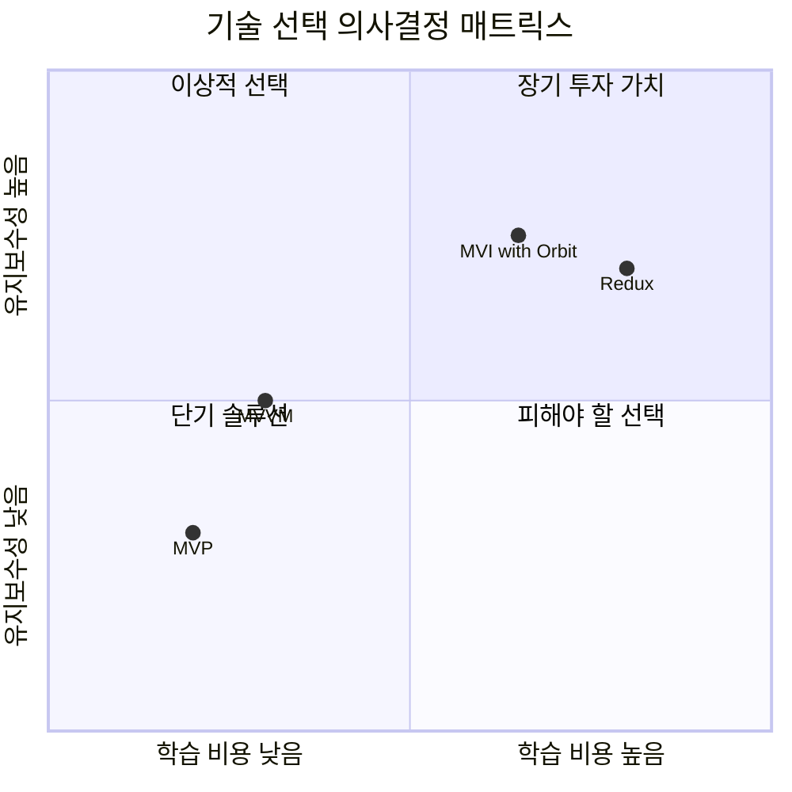

# 기술 의사결정 프레임워크

## 1. 한 줄 요약

**기술 의사결정 프레임워크는 "왜 이 기술을 선택했는가?"에 대한 명확한 근거를 만들고 기록하는 체계적인 방법이다.**

---

## 2. 쉽게 설명

### 모바일 개발자 관점 비유

앱 개발을 할 때 "Swift vs Kotlin Multiplatform", "MVVM vs MVI", "Retrofit vs Ktor" 같은 선택을 해야 합니다. 주니어 때는 "많이 쓰니까", "블로그에서 추천하니까"로 결정했다면, 테크리드는 **"우리 팀과 프로젝트 상황에서 왜 이것이 최선인가"**를 설명할 수 있어야 합니다.

마치 **건축가가 건물을 지을 때 도면과 함께 "왜 이 구조로 설계했는지" 문서를 남기는 것**과 같습니다. 나중에 리모델링(리팩토링)할 때, 원래 설계 의도를 알아야 현명한 변경이 가능하죠.

### 핵심 개념

| 개념 | 설명 | 모바일 개발 예시 |
|------|------|-----------------|
| **ADR** (Architecture Decision Record) | 아키텍처 결정을 기록하는 문서 | "왜 MVI 패턴을 선택했는가" |
| **RFC** (Request for Comments) | 큰 변경에 대해 팀 피드백을 받는 과정 | "모듈화 전략 제안서" |
| **트레이드오프 분석** | 각 선택지의 장단점 비교 | "Room vs Realm 비교표" |
| **기술 로드맵** | 중장기 기술 방향성 계획 | "2024년 기술 부채 해결 계획" |

---

## 3. 구조 다이어그램

### 의사결정 프로세스 흐름

```
┌─────────────────────────────────────────────────────────────────────┐
│                     기술 의사결정 프로세스                            │
└─────────────────────────────────────────────────────────────────────┘

    ┌──────────┐     ┌──────────┐     ┌──────────┐     ┌──────────┐
    │ 1. 문제  │────▶│ 2. 조사  │────▶│ 3. 분석  │────▶│ 4. 결정  │
    │   정의   │     │   수집   │     │   평가   │     │   문서화 │
    └──────────┘     └──────────┘     └──────────┘     └──────────┘
         │                │                │                │
         ▼                ▼                ▼                ▼
    ┌──────────┐     ┌──────────┐     ┌──────────┐     ┌──────────┐
    │ 현재상황 │     │ 후보기술 │     │ 트레이드 │     │   ADR    │
    │ 제약조건 │     │ 벤치마크 │     │ 오프분석 │     │  작성    │
    │ 요구사항 │     │ PoC      │     │ 점수화   │     │  공유    │
    └──────────┘     └──────────┘     └──────────┘     └──────────┘
                                                            │
                           ┌────────────────────────────────┘
                           ▼
                     ┌──────────┐     ┌──────────┐
                     │ 5. 실행  │────▶│ 6. 회고  │
                     │   적용   │     │   개선   │
                     └──────────┘     └──────────┘
```

### ADR 문서 구조

```
┌─────────────────────────────────────────────────────────────┐
│                    ADR-001: MVI 패턴 도입                    │
├─────────────────────────────────────────────────────────────┤
│  상태: [제안됨] → [논의중] → [승인됨] → [구현됨]              │
├─────────────────────────────────────────────────────────────┤
│                                                             │
│  ┌─────────────┐                                           │
│  │  컨텍스트   │  왜 결정이 필요한가?                        │
│  └─────────────┘  - 현재 MVVM의 한계                        │
│         │         - 상태 관리 복잡도 증가                    │
│         ▼                                                   │
│  ┌─────────────┐                                           │
│  │   결정      │  무엇을 선택했는가?                         │
│  └─────────────┘  - MVI + Orbit 라이브러리                  │
│         │                                                   │
│         ▼                                                   │
│  ┌─────────────┐                                           │
│  │   근거      │  왜 이것을 선택했는가?                      │
│  └─────────────┘  - 단방향 데이터 플로우                     │
│         │         - 테스트 용이성                            │
│         │         - 상태 추적 가능                           │
│         ▼                                                   │
│  ┌─────────────┐                                           │
│  │   결과      │  어떤 영향이 있는가?                        │
│  └─────────────┘  - 학습 곡선 2주                           │
│                   - 보일러플레이트 증가                       │
│                   - 디버깅 용이성 향상                        │
└─────────────────────────────────────────────────────────────┘
```

### 트레이드오프 분석 매트릭스



---

## 4. 실무 적용 예시

### 예시 1: 상태관리 라이브러리 선택

**상황**: 신규 Android 앱 개발, 팀원 5명, 복잡한 상태 관리 필요

```markdown
# ADR-003: Android 상태관리 라이브러리 선택

## 상태
승인됨 (2024-01-15)

## 컨텍스트
- 신규 쇼핑 앱 개발 시작
- 장바구니, 결제, 주문 상태 등 복잡한 상태 흐름
- 팀원 중 3명은 MVI 경험 없음
- 출시 목표: 3개월 후

## 고려한 옵션

### 옵션 A: MVI + Orbit
| 항목 | 점수(1-5) | 비고 |
|------|----------|------|
| 학습 곡선 | 3 | 중간, 공식 문서 잘 됨 |
| 상태 추적 | 5 | 단방향 플로우로 추적 용이 |
| 테스트 용이성 | 5 | Side Effect 분리됨 |
| 생산성 | 4 | 초기 투자 후 빠름 |
| 커뮤니티 | 4 | Kotlin 생태계에서 성장중 |
| **총점** | **21** | |

### 옵션 B: MVVM + StateFlow
| 항목 | 점수(1-5) | 비고 |
|------|----------|------|
| 학습 곡선 | 5 | 팀 전원 익숙함 |
| 상태 추적 | 3 | 여러 Flow 동시 추적 어려움 |
| 테스트 용이성 | 3 | Side Effect 분리 어려움 |
| 생산성 | 5 | 즉시 개발 가능 |
| 커뮤니티 | 5 | 풍부한 자료 |
| **총점** | **21** | |

### 옵션 C: Redux (Kotlin)
| 항목 | 점수(1-5) | 비고 |
|------|----------|------|
| 학습 곡선 | 2 | 팀 전원 처음 |
| 상태 추적 | 5 | Time-travel debugging |
| 테스트 용이성 | 5 | 순수 함수 기반 |
| 생산성 | 2 | 보일러플레이트 많음 |
| 커뮤니티 | 2 | Android에서 제한적 |
| **총점** | **16** | |

## 결정
**옵션 A: MVI + Orbit 선택**

## 근거
1. **총점은 동일하나 프로젝트 특성 고려**
   - 결제 흐름의 상태 추적이 핵심 → 상태 추적 가중치 높음
   - QA 리소스 제한 → 테스트 용이성 중요

2. **학습 곡선 대응 방안**
   - 1주차: Orbit 스터디 (공식 튜토리얼)
   - 2주차: 샘플 기능 구현 (장바구니)
   - 이후: 본 개발 진행

3. **MVVM 대비 장점**
   - Intent → State → SideEffect 흐름 명확
   - 디버깅 시 상태 로깅 용이
   - 신입 온보딩 시 패턴 학습 체계적

## 결과
### 예상 영향
- (+) 상태 관련 버그 50% 감소 기대
- (+) 코드리뷰 시 상태 흐름 파악 용이
- (-) 초기 2주 개발 속도 저하
- (-) 보일러플레이트 코드 약간 증가

### 필요 작업
1. [ ] Orbit 버전 고정 (현재 6.1.0)
2. [ ] 팀 스터디 일정 수립
3. [ ] 샘플 코드 작성
4. [ ] 코딩 컨벤션 문서화

## 참여자
- 작성: 홍길동 (Tech Lead)
- 검토: 김철수, 이영희
- 승인일: 2024-01-15
```

### 예시 2: 기술 로드맵 수립

**상황**: 분기별 기술 방향성 계획 필요

```
┌─────────────────────────────────────────────────────────────────┐
│                   2024년 기술 로드맵                             │
├─────────────────────────────────────────────────────────────────┤
│                                                                 │
│  Q1                Q2                Q3                Q4       │
│  ─────────────────────────────────────────────────────────────  │
│                                                                 │
│  ┌─────────┐                                                   │
│  │ MVI     │                                                   │
│  │ 패턴    │──────────────▶ 전체 적용 완료                      │
│  │ 도입    │                                                   │
│  └─────────┘                                                   │
│                                                                 │
│              ┌─────────┐                                       │
│              │ 모듈화  │                                       │
│              │ 1단계   │────────────────▶ 코어 모듈 분리        │
│              └─────────┘                                       │
│                                                                 │
│                          ┌─────────┐                           │
│                          │ CI/CD   │                           │
│                          │ 개선    │──────────▶ 빌드 10분 이하  │
│                          └─────────┘                           │
│                                                                 │
│                                      ┌─────────┐               │
│                                      │ KMP     │               │
│                                      │ 파일럿  │──▶ 공용 모듈   │
│                                      └─────────┘    검증       │
│                                                                 │
│  ─────────────────────────────────────────────────────────────  │
│  기술 부채: ████████████████░░░░░░░░░░░░░░░░░░ 40% 해결 목표    │
└─────────────────────────────────────────────────────────────────┘
```

### 예시 3: RFC 작성 (대규모 변경)

**상황**: 모듈화 전략 팀 논의 필요

```markdown
# RFC: 앱 모듈화 전략

## 요약
현재 단일 모듈 앱을 멀티 모듈 구조로 전환하여
빌드 시간 단축과 코드 의존성 관리를 개선한다.

## 동기
- 현재 빌드 시간: 8분 (clean build)
- 코드베이스: 15만 라인
- 팀 규모: 8명 → 충돌 빈번

## 제안하는 구조
app/
├── app/                 # 앱 진입점
├── feature/
│   ├── home/           # 홈 화면
│   ├── cart/           # 장바구니
│   └── payment/        # 결제
├── core/
│   ├── ui/             # 공통 UI
│   ├── data/           # 데이터 계층
│   └── network/        # 네트워크
└── shared/
    └── model/          # 공유 모델

## 예상 효과
- 빌드 시간: 8분 → 3분 (증분 빌드 시)
- 병렬 개발 가능
- 기능별 책임 분리

## 우려 사항 & 대응
1. **모듈 간 순환 의존성**
   → 의존성 규칙 명확화, CI에서 검증

2. **학습 비용**
   → 단계별 마이그레이션, 문서화

3. **초기 설정 복잡도**
   → Convention Plugin으로 중앙화

## 타임라인
- 1-2주: 코어 모듈 분리
- 3-4주: feature 모듈 분리 (home)
- 5-8주: 나머지 feature 모듈

## 피드백 요청
- [ ] 모듈 구조 적절한가?
- [ ] 우선순위 동의하는가?
- [ ] 빠진 고려사항 있는가?

**피드백 마감: 2024-01-20**
```

---

## 5. 장단점

### 장점

| 장점 | 설명 |
|------|------|
| **의사결정 투명성** | 왜 그런 결정을 했는지 누구나 이해 가능 |
| **온보딩 효율화** | 신규 입사자가 기존 결정 맥락 빠르게 파악 |
| **실수 방지** | 과거 실패한 결정을 반복하지 않음 |
| **책임 분산** | 개인이 아닌 팀 차원의 결정으로 인식 |
| **리팩토링 가이드** | 나중에 변경 시 원래 의도 파악 가능 |

### 단점

| 단점 | 완화 방안 |
|------|----------|
| **문서화 오버헤드** | 중요 결정만 ADR 작성, 템플릿 활용 |
| **과도한 분석** | 타임박스 설정 (분석에 최대 N일) |
| **합의 도출 어려움** | 최종 결정권자 명확화 |
| **문서 최신화** | 결정 변경 시 ADR 업데이트 프로세스 |

### 언제 사용하면 좋은가?

```
ADR 작성이 필요한 경우:
- 새로운 프레임워크/라이브러리 도입
- 아키텍처 패턴 변경
- 주요 의존성 버전 업그레이드
- 개발 프로세스 변경
- 되돌리기 어려운 결정

ADR 작성이 불필요한 경우:
- 작은 유틸리티 라이브러리 추가
- 버그 수정
- 사소한 리팩토링
- 이미 합의된 컨벤션 적용
```

---

## 6. 실제 회사 사례

### 구글 (Google)

구글은 **Design Docs** 문화를 통해 기술 의사결정을 체계적으로 관리합니다. 모든 중요한 기술 변경은 Design Doc을 작성해야 하며, 이 문서에는 문제 정의, 제안된 해결책, 대안 분석, 위험 요소 등이 포함됩니다. 구글의 Design Doc은 일반적으로 10-20페이지 분량이며, 여러 팀의 리뷰를 거쳐 승인됩니다.

### 아마존 (Amazon)

아마존은 **6-Pager** 문화로 유명합니다. 프레젠테이션 대신 6페이지 이내의 서술형 문서를 작성하고, 회의 시작 시 참석자들이 조용히 읽은 후 논의합니다. 이 방식은 깊이 있는 사고와 명확한 커뮤니케이션을 촉진합니다. 기술 의사결정에서도 이 형식을 활용하여 모든 이해관계자가 동일한 맥락을 공유합니다.

### 네이버 (Naver)

네이버는 기술 의사결정 시 **TDR(Technical Decision Record)**을 활용합니다. 특히 대규모 트래픽을 처리하는 서비스 특성상, 성능과 확장성에 대한 깊이 있는 분석이 포함됩니다. 네이버의 검색 서비스 팀은 새로운 인덱싱 알고리즘 도입 시 수개월간의 PoC와 함께 상세한 TDR을 작성했습니다.

### 카카오 (Kakao)

카카오는 **RFC(Request for Comments)** 프로세스를 적극 활용합니다. 카카오톡, 카카오페이 등 대규모 서비스에서 아키텍처 변경 시 반드시 RFC를 작성하고 전사 리뷰를 받습니다. 특히 마이크로서비스 전환 시 각 서비스별로 RFC를 작성하여 독립적이면서도 일관된 아키텍처를 유지했습니다.

---

## 7. 어려운 상황에서의 의사결정 가이드

### 시간 압박 속에서의 의사결정

```
┌─────────────────────────────────────────────────────────────────┐
│                   긴급 의사결정 프레임워크                        │
├─────────────────────────────────────────────────────────────────┤
│                                                                 │
│  1단계: 분류 (5분)                                              │
│  ─────────────────                                              │
│  • 되돌릴 수 있는 결정인가? → 빠르게 결정, 나중에 수정          │
│  • 되돌릴 수 없는 결정인가? → 최소한의 분석 후 결정             │
│                                                                 │
│  2단계: 최소 분석 (30분-2시간)                                  │
│  ─────────────────                                              │
│  • 핵심 제약 조건 3가지만 파악                                  │
│  • 후보 옵션 2개로 압축                                         │
│  • 최악의 시나리오 확인                                         │
│                                                                 │
│  3단계: 결정 및 문서화 (15분)                                   │
│  ─────────────────                                              │
│  • 결정 내용 Slack/이메일로 즉시 공유                           │
│  • "왜"를 한 문장으로 정리                                      │
│  • 나중에 상세 ADR 작성 일정 잡기                               │
│                                                                 │
│  4단계: 회고 (결정 후 1주일 내)                                 │
│  ─────────────────                                              │
│  • 결정이 적절했는가?                                           │
│  • 놓친 고려사항은 없었는가?                                    │
│  • 다음에 개선할 점은?                                          │
│                                                                 │
└─────────────────────────────────────────────────────────────────┘
```

### 정보가 불충분할 때

1. **가역성 원칙 적용**: 결정이 되돌릴 수 있다면, 70%의 정보로 결정하고 나머지 30%는 실행하면서 수집합니다.
2. **실험 설계**: A/B 테스트, 파일럿 프로젝트, 스파이크 솔루션 등을 통해 작은 규모로 먼저 검증합니다.
3. **전문가 자문**: 내부에 전문가가 없다면 외부 컨설팅이나 커뮤니티 조언을 구합니다.

### 이해관계자 간 의견 충돌 시

```markdown
## 갈등 해결 4단계

1. **공통 목표 확인**
   "우리 모두 사용자에게 빠른 앱을 제공하고 싶은 것 맞죠?"

2. **각 입장의 핵심 우려사항 청취**
   각자 3분씩 핵심 우려사항만 이야기하게 합니다.

3. **제3의 대안 탐색**
   기존 옵션을 조합하거나 새로운 접근법을 찾습니다.

4. **시간 제한 결정**
   합의가 안 되면, 테크리드가 결정하되 회고 일정을 잡습니다.
```

---

## 8. 경영진/비개발자와의 소통 팁

### 기술 결정을 비즈니스 언어로 번역하기

| 기술 용어 | 비즈니스 번역 |
|-----------|---------------|
| 기술 부채 | "유지보수 비용이 증가하고 있어요" |
| 리팩토링 | "기존 기능을 더 안정적으로 만드는 작업" |
| 아키텍처 개선 | "미래 기능을 더 빨리 개발할 수 있는 기반 마련" |
| 테스트 자동화 | "버그를 사전에 잡아서 CS 비용 절감" |
| 성능 최적화 | "앱 로딩이 1초 빨라지면 전환율 N% 증가" |

### 경영진 보고 템플릿

```markdown
# 기술 의사결정 요약 (경영진용)

## 한 줄 요약
[결정 내용을 비즈니스 영향 중심으로]

## 비즈니스 영향
- 비용: [절감/증가 금액]
- 일정: [출시 일정에 미치는 영향]
- 품질: [사용자 경험 변화]

## 위험 요소
- [핵심 위험 1]: 대응 방안
- [핵심 위험 2]: 대응 방안

## 필요한 것
- [리소스/예산/승인 필요 사항]

## 의사결정 포인트
- [경영진이 결정해야 할 사항]
```

---

## 9. 템플릿 모음

### ADR 간소화 템플릿

```markdown
# ADR-XXX: [제목]

**상태**: [제안됨/승인됨/폐기됨]
**날짜**: YYYY-MM-DD
**의사결정자**: [이름]

## 배경
[왜 이 결정이 필요한가? 2-3문장]

## 결정
[무엇을 결정했는가? 1문장]

## 이유
[왜 이 결정을 내렸는가? 핵심 이유 3가지]
1.
2.
3.

## 결과
[이 결정으로 인해 무엇이 달라지는가?]

## 대안
[고려했지만 선택하지 않은 옵션과 그 이유]
```

### RFC 템플릿

```markdown
# RFC: [제목]

**작성자**: [이름]
**상태**: [초안/리뷰중/승인됨/폐기됨]
**피드백 마감**: YYYY-MM-DD

## 개요
[제안 내용 한 문단으로 요약]

## 동기
[왜 이 변경이 필요한가?]

## 상세 설계
[구체적인 기술 설계]

## 대안
[고려한 다른 접근법]

## 영향 분석
### 긍정적 영향
### 부정적 영향/위험

## 마이그레이션 계획
[기존 시스템에서 어떻게 전환할 것인가?]

## 미해결 질문
[아직 결정되지 않은 사항]

## 피드백 요청
[리뷰어에게 특히 의견을 구하고 싶은 부분]
```

---

## 10. 체크리스트

### 의사결정 전 체크리스트

- [ ] 문제가 명확하게 정의되었는가?
- [ ] 이해관계자가 식별되었는가?
- [ ] 시간 제약이 파악되었는가?
- [ ] 되돌릴 수 있는 결정인지 확인했는가?
- [ ] 충분한 후보 옵션을 검토했는가?

### 의사결정 중 체크리스트

- [ ] 각 옵션의 장단점을 분석했는가?
- [ ] 팀의 역량과 컨텍스트를 고려했는가?
- [ ] 비용(시간, 리소스)을 추정했는가?
- [ ] 위험 요소를 식별하고 대응 방안을 마련했는가?
- [ ] 필요한 경우 PoC를 진행했는가?

### 의사결정 후 체크리스트

- [ ] ADR을 작성하고 팀에 공유했는가?
- [ ] 실행 계획이 수립되었는가?
- [ ] 성공 지표가 정의되었는가?
- [ ] 회고 일정이 잡혀 있는가?
- [ ] 필요한 경우 이해관계자에게 보고했는가?

---

## 11. 내 생각

> *이 섹션은 학습 후 본인의 생각을 정리하는 공간입니다.*

### 학습 후 느낀 점


### 우리 팀에 적용한다면


### 추가로 알아보고 싶은 것


---

## 12. 추가 질문

### 기본 이해 확인

1. ADR과 RFC의 차이점은 무엇인가? 각각 언제 사용하는 것이 적절한가?

> **답변**: ADR(Architecture Decision Record)은 **이미 내린 결정을 기록**하는 문서이고, RFC(Request for Comments)는 **결정을 내리기 전에 팀의 피드백을 받기 위한 제안서**입니다. ADR은 "우리가 X를 선택했다"를 기록하고, RFC는 "X를 하려고 하는데 어떻게 생각하나요?"를 묻는 것입니다. 일반적으로 소규모 기술 결정(라이브러리 선택, 작은 아키텍처 변경)은 ADR로 충분하고, 대규모 변경(전체 아키텍처 전환, 새로운 개발 프로세스 도입)이나 여러 팀에 영향을 주는 결정은 RFC를 통해 먼저 합의를 구하는 것이 좋습니다. 실무에서는 RFC로 시작해서 승인 후 ADR로 최종 문서화하는 흐름을 많이 사용합니다.

2. "되돌릴 수 없는 결정"과 "되돌릴 수 있는 결정"을 구분하는 기준은 무엇인가?

> **답변**: 아마존의 제프 베조스가 말한 "Type 1/Type 2 결정"의 개념이 유용합니다. **되돌릴 수 없는 결정(Type 1)**은 변경 비용이 매우 크거나 불가능한 결정입니다. 예를 들어, 프로그래밍 언어 변경, 데이터베이스 스키마의 근본적 변경, 외부 API 공개 등이 이에 해당합니다. 반면 **되돌릴 수 있는 결정(Type 2)**은 비용은 들지만 변경이 가능한 결정입니다. 예를 들어, UI 라이브러리 변경, 내부 API 설계, 대부분의 리팩토링이 이에 해당합니다. 실무에서 구분하는 팁은 "이 결정을 바꾸려면 얼마나 걸리는가?"를 질문하는 것입니다. 1-2주 내에 바꿀 수 있다면 되돌릴 수 있는 결정이고, 수개월이 걸리거나 외부 의존성이 있다면 되돌릴 수 없는 결정으로 분류합니다.

3. 기술 의사결정에서 "충분한 조사"의 기준은 어떻게 정해야 하는가?

> **답변**: "충분한 조사"는 **일정 대비 위험도**로 결정합니다. 실무에서 사용하는 기준은: (1) 핵심 질문 3-5개에 대한 답을 얻었는가, (2) 최소 2개의 대안을 비교했는가, (3) 최악의 시나리오를 검토했는가입니다. 일정이 촉박한 상황에서는 "70% 확신 규칙"을 적용합니다. 70%의 정보로 결정하고 나머지 30%는 실행하면서 수집하는 것입니다. 반면 되돌릴 수 없는 결정이나 비용이 큰 결정은 90% 이상의 확신이 필요합니다. 또한 PoC(Proof of Concept)를 통해 실제로 검증하는 것이 문서 조사보다 훨씬 가치 있습니다. "조사만 하다 시간을 다 쓰는" 분석 마비(Analysis Paralysis)를 피하기 위해 타임박스를 설정하는 것을 권장합니다.

### 심화 질문

4. 팀원 간 의견이 팽팽히 맞설 때, 테크리드로서 어떻게 결론을 내려야 하는가?

> **답변**: 먼저, 의견 충돌은 건강한 팀의 신호임을 인식해야 합니다. 제가 실제로 사용하는 프로세스는 다음과 같습니다. (1) **공통 목표 재확인**: "우리 모두 X를 달성하고 싶은 것 맞죠?"라고 물어 같은 방향을 보고 있는지 확인합니다. (2) **핵심 우려사항 청취**: 각자 핵심 우려사항을 3분 이내로 이야기하게 합니다. 종종 표면적 의견 뒤에 다른 우려가 있습니다. (3) **데이터 기반 논의**: 가능하면 벤치마크, PoC, 또는 업계 사례로 논의를 객관화합니다. (4) **시간 제한 결정**: 30분 논의 후에도 합의가 안 되면, 테크리드가 결정하되 "1개월 후 회고에서 재검토하자"고 약속합니다. 핵심은 결정의 질보다 **결정 후 팀의 동의와 실행**이 중요하다는 것입니다. "disagree and commit"(동의하지 않더라도 결정에 헌신하기) 문화를 만드는 것이 테크리드의 역할입니다.

5. 과거의 잘못된 기술 결정을 발견했을 때, 어떻게 대응해야 하는가?

> **답변**: 먼저, **비난하지 않는 문화**가 중요합니다. 과거 결정은 그 당시의 정보와 제약 조건에서 최선이었을 수 있습니다. 대응 프로세스는: (1) **현재 영향 평가**: 이 결정이 현재 얼마나 문제를 일으키고 있는가? 일주일에 몇 시간의 낭비가 발생하는가? (2) **수정 비용 추정**: 바꾸려면 얼마나 걸리는가? 다른 우선순위와 비교했을 때 어떤가? (3) **ADR 업데이트**: 원래 ADR에 "상태: 대체됨"으로 표시하고, 왜 변경하는지 기록합니다. 이것이 미래의 팀원에게 귀중한 학습 자료가 됩니다. (4) **점진적 수정**: 빅뱅 교체보다는 스트랭글러 패턴으로 점진적으로 수정합니다. 구글에서는 "Postmortem(사후 분석)"을 비난 없이 진행하는 문화가 있어, 잘못된 결정도 학습 기회로 전환합니다.

6. 빠른 의사결정과 신중한 의사결정 사이의 균형을 어떻게 잡아야 하는가?

> **답변**: 핵심은 **결정의 유형에 따라 속도를 조절**하는 것입니다. 아마존의 "Type 1/Type 2" 프레임워크를 활용합니다. **되돌릴 수 있는 결정(Type 2)**은 빠르게 결정합니다. 70%의 확신으로 결정하고 실행하면서 조정합니다. 예: UI 컴포넌트 라이브러리 선택, 코딩 컨벤션. **되돌릴 수 없는 결정(Type 1)**은 신중하게 결정합니다. 여러 이해관계자의 검토를 받고, 충분한 PoC를 진행합니다. 예: 프로그래밍 언어 변경, 클라우드 벤더 선택. 실무 팁으로는, 매 결정마다 "이건 Type 1인가 Type 2인가?"를 먼저 물어보는 습관을 들이는 것입니다. 또한 "완벽한 결정을 내리려다 아무 결정도 못 하는 것"이 최악이라는 것을 기억하세요. 빠른 결정 + 빠른 회고가 느린 결정보다 낫습니다.

### 실습 과제

7. 현재 프로젝트에서 문서화되지 않은 기술 결정을 하나 찾아 ADR을 작성해보자.

> **답변**: 이 과제를 수행할 때 다음 단계를 따르세요. (1) 프로젝트에서 "왜 이렇게 했지?"라고 궁금했던 부분을 떠올립니다. 예: 왜 이 HTTP 클라이언트를 쓰지? 왜 이 아키텍처 패턴을 선택했지? (2) 그 결정을 내린 사람(또는 알 것 같은 사람)과 15분 대화합니다. (3) 대화 내용을 바탕으로 ADR 템플릿을 채웁니다. (4) 팀 위키나 레포지토리의 `/docs/adr/` 폴더에 추가합니다. 제 경험상, 가장 가치 있는 ADR은 "당시에는 다들 알았지만 지금은 아무도 모르는 것"입니다. 이런 암묵지를 명시지로 만드는 것이 ADR의 핵심 가치입니다. 첫 ADR은 완벽하지 않아도 됩니다. 시작하는 것이 중요합니다.

8. 다가오는 기술 변경에 대해 RFC를 작성하고 팀 피드백을 받아보자.

> **답변**: RFC 작성 시 유용한 팁입니다. (1) **짧게 시작하세요**: 첫 RFC는 2-3페이지로 충분합니다. 완벽한 문서보다 피드백을 받을 수 있는 최소한의 문서가 중요합니다. (2) **명확한 질문 포함**: "이 부분에 대해 특히 의견을 듣고 싶습니다"를 명시하면 피드백 품질이 올라갑니다. (3) **피드백 마감일 설정**: "금요일까지 피드백 부탁드립니다"처럼 구체적 기한을 정합니다. (4) **피드백 처리 공개**: 받은 피드백과 어떻게 반영했는지 공개하면 다음 RFC에서 더 적극적인 참여를 유도합니다. (5) **동기화 세션**: 비동기 피드백 후 30분 동기 미팅을 잡아 주요 논점을 정리합니다. 처음에는 작은 변경(예: 새 유틸리티 라이브러리 도입)에 대해 RFC를 써보고, 점차 큰 변경으로 확대하세요.

9. 최근 6개월간의 기술 결정들을 목록화하고, 패턴을 분석해보자.

> **답변**: 이 분석을 위한 구체적 가이드입니다. (1) **목록 만들기**: 최근 6개월간 주요 기술 결정을 나열합니다. Git 커밋, Slack 논의, 회의록을 참고합니다. (2) **분류하기**: 각 결정을 성공/실패/진행중으로 분류합니다. (3) **패턴 찾기**: 성공한 결정의 공통점은? 실패한 결정의 공통점은? 예를 들어, "PoC 없이 결정한 것은 대부분 실패했다", "팀 전체 논의 없이 한 결정은 저항이 많았다" 등. (4) **개선점 도출**: 발견한 패턴을 바탕으로 앞으로의 의사결정 프로세스 개선점을 정리합니다. 이 분석은 분기별로 반복하면 팀의 의사결정 역량이 지속적으로 향상됩니다. 저는 분기 회고 때 이 분석을 포함시키는 것을 권장합니다.

### 토론 주제

10. "기술 결정에 민주주의는 없다"는 말에 동의하는가? 최종 결정권은 누구에게 있어야 하는가?

> **답변**: 이 주제는 미묘한 뉘앙스가 필요합니다. **절반은 동의**합니다. 모든 기술 결정에 다수결을 적용하면 "중간값 함정"에 빠집니다. 아무도 만족하지 못하는 타협안이 나오거나, 결정이 지연됩니다. 그러나 **완전한 독재도 위험**합니다. 한 사람의 맹점이 그대로 반영됩니다. 제가 실천하는 원칙은: (1) **의견 수렴은 민주적으로**: 모든 팀원이 의견을 낼 기회를 보장합니다. (2) **결정은 책임자가**: 테크리드(또는 해당 도메인 오너)가 최종 결정합니다. (3) **결정 후는 전체가**: 결정에 동의하지 않더라도 팀 전체가 헌신합니다(disagree and commit). 최종 결정권은 **책임질 수 있는 사람**에게 있어야 합니다. 테크리드가 기술 방향에 책임을 진다면 결정권도 테크리드에게 있어야 합니다. 단, 결정의 배경을 투명하게 공유하는 것이 필수입니다.

11. 데이터 기반 의사결정 vs 직관 기반 의사결정, 각각 언제 적절한가?

> **답변**: **둘 다 필요**하며, 상황에 따라 비중이 다릅니다. **데이터 기반이 적합한 경우**: 성능 최적화(벤치마크), A/B 테스트 결과에 따른 선택, 비용 비교, 이전 프로젝트 실패 사례 분석. 데이터가 명확하고 측정 가능할 때 효과적입니다. **직관 기반이 적합한 경우**: 새로운 기술 도입(아직 데이터가 없음), 팀 문화/프로세스 관련 결정, 미래 트렌드 예측, 사용자 경험 관련 결정. 직관은 경험의 압축이므로, 경험이 풍부한 영역에서는 직관이 빠른 결정을 가능하게 합니다. **실무 팁**: 직관으로 가설을 세우고, 데이터로 검증하는 하이브리드 접근이 이상적입니다. "직관적으로 A가 좋을 것 같다. 한 주간 PoC로 확인해보자." 데이터 없이 직관만 믿는 것도, 직관 없이 데이터만 따르는 것도 위험합니다.

12. 외부 전문가(컨설턴트)의 조언과 내부 팀의 의견이 충돌할 때 어떻게 해야 하는가?

> **답변**: 이 상황은 생각보다 자주 발생하며, 신중하게 다뤄야 합니다. **먼저 충돌의 원인 파악**: (1) 컨텍스트 차이: 컨설턴트가 우리 팀/제품의 특수성을 충분히 이해하지 못할 수 있습니다. (2) 지식 차이: 컨설턴트가 우리 팀이 모르는 업계 베스트 프랙티스를 알 수 있습니다. (3) 인센티브 차이: 컨설턴트는 '최신 기술 도입'을 권할 수 있지만, 내부 팀은 유지보수를 걱정합니다. **대응 방법**: (1) 양측이 동일한 정보를 갖게 합니다. 컨설턴트에게 우리 제약 조건을 상세히 설명하고, 내부 팀에게 컨설턴트의 근거를 공유합니다. (2) 구체적 시나리오로 논의합니다. "이 상황에서 어떻게 하실 건가요?"라고 물어 추상적 논쟁을 피합니다. (3) 작은 실험으로 검증합니다. 한 기능에 컨설턴트 방식을 적용해보고 결과를 확인합니다. **최종적으로**: 우리 팀이 유지보수할 것이므로, 내부 팀의 이해와 동의가 더 중요합니다. 컨설턴트 조언은 참고하되, 팀이 납득하지 못하는 결정은 실패할 가능성이 높습니다.

---

## 참고 자료

- [Architecture Decision Records](https://adr.github.io/)
- [Documenting Architecture Decisions - Michael Nygard](https://cognitect.com/blog/2011/11/15/documenting-architecture-decisions)
- [RFC Process at Rust](https://rust-lang.github.io/rfcs/)
- [How Spotify makes decisions](https://engineering.atspotify.com/)
- [Google Design Docs](https://www.industrialempathy.com/posts/design-docs-at-google/)
- [Amazon's 6-Pager](https://writingcooperative.com/the-anatomy-of-an-amazon-6-pager-fc79f31a41c9)
