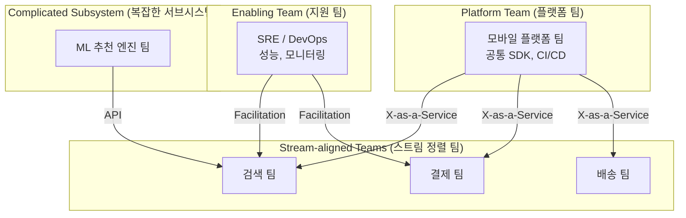

# 팀 구조 설계

## 1. 한 줄 요약

**팀 구조는 소프트웨어 아키텍처에 직접적인 영향을 미치며, 효과적인 팀 설계는 좋은 제품을 만드는 첫걸음이다. (콘웨이 법칙)**

---

## 2. 쉽게 설명

### 모바일 개발자 관점 비유

앱의 모듈 구조를 설계할 때를 생각해보세요. `feature/`, `core/`, `shared/` 같은 모듈을 어떻게 나눌지 고민하죠? 팀 구조도 마찬가지입니다.

**앱의 모듈이 잘 나눠져야 개발이 효율적인 것처럼, 팀의 구조도 잘 나눠져야 협업이 효율적**입니다.

콘웨이 법칙(Conway's Law)이 이를 설명합니다:
> "소프트웨어의 구조는 그것을 만드는 조직의 구조를 닮는다"

즉, 팀을 iOS/Android로 나누면 앱의 iOS 버전과 Android 버전이 달라지고, 팀을 기능(검색, 결제, 배송)으로 나누면 각 기능이 독립적으로 발전합니다.

### 핵심 개념

| 개념 | 설명 | 모바일 예시 |
|------|------|------------|
| **스쿼드(Squad)** | 제품/기능 중심의 크로스펑셔널 팀 | 결제 스쿼드: iOS + Android + Backend + QA |
| **챕터(Chapter)** | 직군별 전문성 그룹 | iOS 챕터: 모든 스쿼드의 iOS 개발자 |
| **길드(Guild)** | 관심사 기반 커뮤니티 | 성능 최적화 길드, 접근성 길드 |
| **트라이브(Tribe)** | 연관된 스쿼드들의 집합 | 커머스 트라이브: 검색 + 상품 + 결제 스쿼드 |

---

## 3. 구조 다이어그램

### Spotify 모델 (스쿼드 기반)

```
┌─────────────────────────────────────────────────────────────────────┐
│                           Tribe (트라이브)                           │
│                         커머스 트라이브                               │
├─────────────────────────────────────────────────────────────────────┤
│                                                                     │
│  ┌───────────────────┐  ┌───────────────────┐  ┌───────────────────┐│
│  │  Squad: 검색      │  │  Squad: 상품      │  │  Squad: 결제      ││
│  │                   │  │                   │  │                   ││
│  │  iOS 개발자       │  │  iOS 개발자       │  │  iOS 개발자       ││
│  │  Android 개발자   │  │  Android 개발자   │  │  Android 개발자   ││
│  │  Backend 개발자   │  │  Backend 개발자   │  │  Backend 개발자   ││
│  │  디자이너         │  │  디자이너         │  │  디자이너         ││
│  │  PO               │  │  PO               │  │  PO               ││
│  └───────────────────┘  └───────────────────┘  └───────────────────┘│
│           │                     │                     │             │
│           └─────────────────────┼─────────────────────┘             │
│                                 │                                   │
│                                 ▼                                   │
│  ┌──────────────────────────────────────────────────────────────┐  │
│  │                    Chapter (챕터)                             │  │
│  │  iOS Chapter    │  Android Chapter  │  Backend Chapter       │  │
│  │  - 코드 표준    │  - 코드 표준      │  - 코드 표준           │  │
│  │  - 기술 교육    │  - 기술 교육      │  - 기술 교육           │  │
│  │  - 커리어 성장  │  - 커리어 성장    │  - 커리어 성장         │  │
│  └──────────────────────────────────────────────────────────────┘  │
│                                                                     │
│  ┌──────────────────────────────────────────────────────────────┐  │
│  │                      Guild (길드)                             │  │
│  │  성능 최적화 Guild  │  접근성 Guild  │  테스트 자동화 Guild   │  │
│  │  (자발적 참여)      │  (자발적 참여)  │  (자발적 참여)         │  │
│  └──────────────────────────────────────────────────────────────┘  │
└─────────────────────────────────────────────────────────────────────┘
```

### 플랫폼 팀 vs 피처 팀

```
┌─────────────────────────────────────────────────────────────────────┐
│                    전통적 구조 (플랫폼 기반)                          │
├─────────────────────────────────────────────────────────────────────┤
│                                                                     │
│    ┌──────────────┐    ┌──────────────┐    ┌──────────────┐        │
│    │   iOS 팀     │    │  Android 팀  │    │  Backend 팀  │        │
│    │              │    │              │    │              │        │
│    │  모든 기능   │    │  모든 기능   │    │  모든 기능   │        │
│    │  담당        │    │  담당        │    │  담당        │        │
│    └──────────────┘    └──────────────┘    └──────────────┘        │
│           │                   │                   │                 │
│           └───────────────────┼───────────────────┘                 │
│                               │                                     │
│                               ▼                                     │
│                    ┌──────────────────┐                            │
│                    │  커뮤니케이션    │                            │
│                    │  오버헤드 높음   │                            │
│                    │  (핸드오프 多)   │                            │
│                    └──────────────────┘                            │
└─────────────────────────────────────────────────────────────────────┘

                              VS

┌─────────────────────────────────────────────────────────────────────┐
│                    현대적 구조 (피처 기반)                            │
├─────────────────────────────────────────────────────────────────────┤
│                                                                     │
│  ┌──────────────────┐  ┌──────────────────┐  ┌──────────────────┐  │
│  │  검색 팀        │  │  결제 팀        │  │  배송 팀        │  │
│  │  ───────────── │  │  ───────────── │  │  ───────────── │  │
│  │  iOS + Android  │  │  iOS + Android  │  │  iOS + Android  │  │
│  │  + Backend      │  │  + Backend      │  │  + Backend      │  │
│  │  + Design       │  │  + Design       │  │  + Design       │  │
│  │                 │  │                 │  │                 │  │
│  │  독립적 배포    │  │  독립적 배포    │  │  독립적 배포    │  │
│  │  End-to-End     │  │  End-to-End     │  │  End-to-End     │  │
│  └──────────────────┘  └──────────────────┘  └──────────────────┘  │
│                                                                     │
│                    ┌──────────────────┐                            │
│                    │  플랫폼 팀       │                            │
│                    │  (공통 인프라)   │                            │
│                    │  CI/CD, 공통 SDK │                            │
│                    └──────────────────┘                            │
└─────────────────────────────────────────────────────────────────────┘
```

### Team Topologies 패턴



---

## 4. 실무 적용 예시

### 예시 1: 스타트업 초기 (팀원 5명)

**상황**: 초기 스타트업, 모바일 개발자 3명, 백엔드 1명, 디자이너 1명

```
┌─────────────────────────────────────────────────────────────────────┐
│                    초기 스타트업 팀 구조                              │
├─────────────────────────────────────────────────────────────────────┤
│                                                                     │
│  ┌─────────────────────────────────────────────────────────────┐   │
│  │                      단일 제품 팀                            │   │
│  │                                                             │   │
│  │   테크리드 (iOS + 전반적 기술 결정)                         │   │
│  │   Android 개발자                                            │   │
│  │   iOS 개발자                                                │   │
│  │   Backend 개발자                                            │   │
│  │   디자이너                                                  │   │
│  │                                                             │   │
│  │   특징:                                                     │   │
│  │   - 모두가 모든 것에 관여                                   │   │
│  │   - 빠른 커뮤니케이션                                       │   │
│  │   - 코드리뷰: 1명 필수                                      │   │
│  │   - 회의: 데일리 스탠드업 15분                              │   │
│  └─────────────────────────────────────────────────────────────┘   │
│                                                                     │
│  권장 방식:                                                         │
│  - 역할보다 책임 중심 (누구나 필요하면 다른 영역 지원)              │
│  - 주간 기술 공유 시간 (30분)                                      │
│  - 페어 프로그래밍 적극 활용                                        │
└─────────────────────────────────────────────────────────────────────┘
```

### 예시 2: 성장 단계 (팀원 15명)

**상황**: 시리즈 A 이후, 모바일 개발자 8명, 백엔드 4명, 디자이너 3명

```
┌─────────────────────────────────────────────────────────────────────┐
│                    성장 단계 팀 구조                                 │
├─────────────────────────────────────────────────────────────────────┤
│                                                                     │
│  ┌─────────────────┐      ┌─────────────────┐                      │
│  │  핵심 경험 팀    │      │  성장 팀        │                      │
│  │  ─────────────  │      │  ─────────────  │                      │
│  │  iOS 2명        │      │  iOS 2명        │                      │
│  │  Android 2명    │      │  Android 2명    │                      │
│  │  Backend 2명    │      │  Backend 2명    │                      │
│  │  디자이너 1명   │      │  디자이너 1명   │                      │
│  │                 │      │                 │                      │
│  │  담당:          │      │  담당:          │                      │
│  │  - 메인 기능    │      │  - 신규 기능    │                      │
│  │  - 안정성       │      │  - 실험/A/B     │                      │
│  │  - 성능         │      │  - 사용자 획득  │                      │
│  └─────────────────┘      └─────────────────┘                      │
│           │                       │                                 │
│           └───────────┬───────────┘                                 │
│                       │                                             │
│                       ▼                                             │
│           ┌─────────────────────┐                                  │
│           │  플랫폼 팀 (1명)    │                                  │
│           │  - CI/CD 관리       │                                  │
│           │  - 공통 모듈        │                                  │
│           │  - 개발 환경        │                                  │
│           └─────────────────────┘                                  │
│                                                                     │
│  + iOS Chapter (주 1회)                                            │
│  + Android Chapter (주 1회)                                        │
│  + 전체 기술 공유 (격주 1회)                                       │
└─────────────────────────────────────────────────────────────────────┘
```

### 예시 3: 스케일업 (팀원 40명+)

**상황**: 대규모 조직, 여러 제품 라인

```
┌─────────────────────────────────────────────────────────────────────┐
│                    스케일업 팀 구조 (Spotify 모델 변형)              │
├─────────────────────────────────────────────────────────────────────┤
│                                                                     │
│  ┌─────────────────────────────────────────────────────────────┐   │
│  │                 Commerce Tribe (커머스 트라이브)             │   │
│  │                                                             │   │
│  │  ┌────────────┐  ┌────────────┐  ┌────────────┐            │   │
│  │  │ 검색 Squad │  │ 상품 Squad │  │ 결제 Squad │            │   │
│  │  │ 6-8명      │  │ 6-8명      │  │ 6-8명      │            │   │
│  │  └────────────┘  └────────────┘  └────────────┘            │   │
│  └─────────────────────────────────────────────────────────────┘   │
│                                                                     │
│  ┌─────────────────────────────────────────────────────────────┐   │
│  │                Logistics Tribe (물류 트라이브)               │   │
│  │                                                             │   │
│  │  ┌────────────┐  ┌────────────┐  ┌────────────┐            │   │
│  │  │ 배송 Squad │  │ 재고 Squad │  │ 반품 Squad │            │   │
│  │  └────────────┘  └────────────┘  └────────────┘            │   │
│  └─────────────────────────────────────────────────────────────┘   │
│                                                                     │
│  ┌─────────────────────────────────────────────────────────────┐   │
│  │                    Platform Tribe (플랫폼)                   │   │
│  │                                                             │   │
│  │  ┌────────────────┐  ┌────────────────┐                    │   │
│  │  │ Mobile Platform │  │ Infrastructure │                    │   │
│  │  │ - 공통 SDK     │  │ - CI/CD        │                    │   │
│  │  │ - 디자인시스템  │  │ - 모니터링     │                    │   │
│  │  └────────────────┘  └────────────────┘                    │   │
│  └─────────────────────────────────────────────────────────────┘   │
│                                                                     │
│  횡단 조직:                                                         │
│  ─────────────────────────────────────────────────────────────────  │
│  │ iOS Chapter │ Android Chapter │ Backend Chapter │ QA Chapter │   │
│  └──────────────────────────────────────────────────────────────┘   │
│                                                                     │
│  길드:                                                              │
│  ─────────────────────────────────────────────────────────────────  │
│  │ 성능 Guild │ 접근성 Guild │ 테스트 Guild │ 보안 Guild │         │
│  └──────────────────────────────────────────────────────────────┘   │
└─────────────────────────────────────────────────────────────────────┘
```

### 예시 4: 온보딩 프로세스 설계

**테크리드가 설계해야 할 신규 입사자 온보딩**

```markdown
# 모바일 개발자 온보딩 가이드

## 1주차: 환경 설정 & 팀 이해
### Day 1-2: 기본 설정
- [ ] 장비 수령 및 계정 생성
- [ ] 개발 환경 설정 (문서 따라하기)
- [ ] Slack 채널 가입
- [ ] 첫 번째 1:1 (테크리드)

### Day 3-5: 코드베이스 탐색
- [ ] 아키텍처 문서 읽기
- [ ] 주요 ADR 3개 읽기
- [ ] 앱 빌드 및 실행
- [ ] 버디(Buddy)와 페어 프로그래밍

## 2주차: 작은 기여
### 목표: 첫 PR 머지
- [ ] Good First Issue 할당받기
- [ ] 코드 컨벤션 문서 숙지
- [ ] PR 작성 및 리뷰 경험
- [ ] 팀 스탠드업 참여

## 3-4주차: 독립적 기여
### 목표: 독립적으로 작은 기능 개발
- [ ] 담당 기능 영역 정하기
- [ ] 스프린트 플래닝 참여
- [ ] 코드리뷰 2건 이상 수행
- [ ] 챕터 미팅 참석

## 첫 달 완료 기준
- [ ] 독립적으로 PR 작성 가능
- [ ] 팀 프로세스 이해
- [ ] 3명 이상과 1:1 완료
- [ ] 온보딩 피드백 제출
```

---

## 5. 장단점

### 스쿼드 모델 장단점

| 장점 | 단점 |
|------|------|
| End-to-end 책임으로 속도 향상 | 플랫폼 전문성 희석 가능 |
| 커뮤니케이션 오버헤드 감소 | iOS-Android 일관성 유지 어려움 |
| 자율성과 오너십 강화 | 작은 조직에서 비효율적 |
| 빠른 의사결정 | 스쿼드 간 중복 작업 가능성 |

### 플랫폼 팀 모델 장단점

| 장점 | 단점 |
|------|------|
| 플랫폼별 전문성 강화 | 핸드오프 오버헤드 |
| iOS-Android 일관성 유지 | 책임 분산 (누구 책임?) |
| 작은 팀에서 효율적 | 커뮤니케이션 비용 증가 |
| 명확한 코드 오너십 | 전체 기능 파악 어려움 |

### 팀 규모별 권장 구조

```
┌─────────────────────────────────────────────────────────────────────┐
│  팀 규모별 권장 구조                                                 │
├─────────────────────────────────────────────────────────────────────┤
│                                                                     │
│  5명 이하:  단일 팀 (역할보다 책임 중심)                            │
│             └─ 모두가 제너럴리스트                                  │
│                                                                     │
│  6-15명:    2-3개 피처 팀 + 파트타임 플랫폼 역할                    │
│             └─ 플랫폼 담당자 지정 (전담은 아님)                     │
│                                                                     │
│  16-40명:   스쿼드 모델 도입 + 챕터 운영                            │
│             └─ 플랫폼 팀 전담 구성                                  │
│                                                                     │
│  40명 이상: 트라이브 + 스쿼드 + 챕터 + 길드                         │
│             └─ Team Topologies 적극 활용                           │
│                                                                     │
└─────────────────────────────────────────────────────────────────────┘
```

---

## 6. 실제 회사 사례

### Spotify (스포티파이)

스포티파이는 **스쿼드 모델의 원조**로 알려져 있습니다. 각 스쿼드(Squad)는 8명 이하의 크로스펑셔널 팀으로, 하나의 기능이나 제품 영역을 담당합니다. 스쿼드들은 트라이브(Tribe)로 묶이고, 같은 직군끼리는 챕터(Chapter)를 구성합니다. 주목할 점은, 스포티파이도 이 모델을 계속 수정하고 있다는 것입니다. 원래의 "스포티파이 모델"을 그대로 복사하기보다는, 조직 상황에 맞게 적응시키는 것이 중요합니다.

### 네이버 (Naver)

네이버는 **셀(Cell) 조직** 구조를 운영합니다. 각 셀은 독립적인 미니 스타트업처럼 움직이며, 검색, 쇼핑, 지도 등 도메인별로 분리되어 있습니다. 특히 네이버 쇼핑은 수십 개의 셀로 구성되어, 상품 상세, 검색, 결제 등 각 영역을 독립적으로 담당합니다. 각 셀 내에서 iOS, Android, 웹, 백엔드 개발자가 함께 일합니다.

### 카카오 (Kakao)

카카오는 **팟(Pod)** 또는 **TF(Task Force)** 기반의 유연한 구조를 사용합니다. 카카오톡은 플랫폼 팀 모델에 가깝고, 카카오페이는 피처 팀 모델에 가깝습니다. 서비스 특성에 따라 다른 팀 구조를 채택한 것이 특징입니다. 또한 길드와 유사한 **테크 그룹**을 운영하여 전사적인 기술 표준화와 지식 공유를 합니다.

### 쿠팡 (Coupang)

쿠팡은 **피처 팀 모델**을 적극적으로 활용합니다. 각 팀이 특정 고객 여정(예: 검색, 장바구니, 결제, 배송 추적)을 담당하며, 필요한 모든 역할(모바일, 웹, 백엔드, 데이터)을 포함합니다. 특히 로켓배송 같은 핵심 기능은 별도의 전담 팀이 End-to-End로 책임집니다.

### 토스 (Toss)

토스는 **사일로(Silo)** 구조를 사용합니다. 각 사일로는 하나의 제품 또는 서비스를 담당하는 독립적인 팀입니다. 토스뱅크, 토스증권, 토스페이먼츠 등 각각이 별도의 사일로로 운영됩니다. 사일로 내에서는 높은 자율성을 가지며, 사일로 간에는 최소한의 의존성만 유지합니다.

---

## 7. 팀 갈등 해결 방법

### 팀 구조 변경 시 발생하는 일반적 갈등

```
┌─────────────────────────────────────────────────────────────────┐
│                   팀 구조 변경 시 갈등 유형                        │
├─────────────────────────────────────────────────────────────────┤
│                                                                 │
│  1. 역할 불안                                                   │
│  ─────────────                                                  │
│  "내 역할이 사라지는 건 아닐까?"                                │
│  → 개인별 1:1로 새로운 역할과 성장 기회 설명                    │
│                                                                 │
│  2. 전문성 우려                                                 │
│  ─────────────                                                  │
│  "스쿼드에서 혼자 iOS 담당하면 성장할 수 있을까?"               │
│  → 챕터/길드를 통한 전문성 교류 보장                            │
│                                                                 │
│  3. 권한 충돌                                                   │
│  ─────────────                                                  │
│  "누가 이 결정을 내릴 권한이 있지?"                             │
│  → RACI 매트릭스로 명확한 권한 정의                             │
│                                                                 │
│  4. 소속감 문제                                                 │
│  ─────────────                                                  │
│  "스쿼드와 챕터 중 어디에 소속된 거지?"                         │
│  → 보고 라인과 평가 기준 명확화                                 │
│                                                                 │
└─────────────────────────────────────────────────────────────────┘
```

### 갈등 해결 프로세스

```markdown
## 갈등 해결 5단계

### 1. 인정 (Acknowledge)
갈등이 존재함을 인정합니다. 무시하면 악화됩니다.
"이 변화가 불안하다는 것, 충분히 이해합니다."

### 2. 청취 (Listen)
각 입장을 충분히 듣습니다. 판단 없이 경청합니다.
개인별 1:1 세션으로 솔직한 의견을 수집합니다.

### 3. 공통점 찾기 (Find Common Ground)
모두가 동의하는 목표를 확인합니다.
"우리 모두 더 빠른 배포와 더 나은 품질을 원합니다."

### 4. 협력적 해결 (Collaborative Solution)
함께 해결책을 만듭니다. 일방적 결정을 피합니다.
"어떻게 하면 두 가지 모두 달성할 수 있을까요?"

### 5. 합의 및 후속 조치 (Agree and Follow-up)
결정사항을 문서화하고, 회고 일정을 잡습니다.
"한 달 후 어떻게 되었는지 확인하겠습니다."
```

### 시니어 개발자와의 갈등

시니어 개발자가 팀 구조 변경에 저항할 때:

1. **1:1 대화**: 공개 미팅이 아닌 개인 미팅에서 솔직하게 대화합니다.
2. **우려 인정**: "변화가 불편할 수 있다"를 먼저 인정합니다.
3. **변경 이유 설명**: 왜 이 변경이 필요한지 비즈니스 맥락에서 설명합니다.
4. **역할 제안**: 새 구조에서 그 사람의 강점을 살릴 수 있는 역할을 제안합니다.
5. **피드백 반영**: 가능하면 일부 피드백을 실제로 반영합니다.

---

## 8. 경영진/비개발자와의 소통 팁

### 팀 구조를 비즈니스 언어로 설명하기

| 기술 용어 | 비즈니스 번역 |
|-----------|---------------|
| 스쿼드 모델 | "기능별로 팀을 나눠서 더 빠르게 출시합니다" |
| 플랫폼 팀 | "공통 인프라를 담당하는 팀으로 다른 팀 개발 속도를 높입니다" |
| 챕터 | "같은 직군끼리 모여서 품질 표준을 유지합니다" |
| 콘웨이 법칙 | "팀 구조가 제품 구조에 영향을 미칩니다" |
| 기술 리더십 | "기술적 방향을 정하고 팀을 이끄는 역할" |

### 팀 구조 변경 제안서 (경영진용)

```markdown
# 팀 구조 개선 제안서

## 한 줄 요약
피처 팀 구조로 전환하여 기능 출시 속도를 50% 개선합니다.

## 현재 문제
- 한 기능 출시에 3개 팀 협조 필요 → 일정 지연
- 책임 소재 불명확 → 버그 대응 느림
- 팀 간 커뮤니케이션 비용 증가

## 제안
- iOS/Android/Backend 분리 → 검색/결제/배송 팀으로 전환
- 각 팀이 End-to-End 책임

## 기대 효과
| 지표 | 현재 | 목표 |
|------|------|------|
| 기능 출시 주기 | 4주 | 2주 |
| 버그 대응 시간 | 48시간 | 24시간 |
| 팀 간 회의 | 주 5회 | 주 2회 |

## 필요 리소스
- 전환 기간: 3개월
- 추가 채용: 없음 (기존 인원 재배치)
- 외부 코칭: 선택적

## 위험 요소 및 대응
- 전문성 희석 → 챕터 운영으로 보완
- 일시적 생산성 저하 → 파일럿 팀으로 먼저 검증
```

---

## 9. 템플릿 모음

### 팀 운영 가이드 템플릿

```markdown
# [팀명] 운영 가이드

## 팀 미션
[팀의 존재 이유 - 한 문장]

## 팀 구성
| 역할 | 이름 | 책임 |
|------|------|------|
| Tech Lead | | 기술 방향, 아키텍처 |
| Product Owner | | 요구사항, 우선순위 |
| iOS 개발자 | | iOS 앱 개발 |
| Android 개발자 | | Android 앱 개발 |
| Backend 개발자 | | API 개발 |

## 일하는 방식

### 회의
| 회의 | 주기 | 시간 | 목적 |
|------|------|------|------|
| 데일리 스탠드업 | 매일 | 10:00, 15분 | 진행상황 공유 |
| 스프린트 플래닝 | 격주 월요일 | 10:00, 2시간 | 스프린트 계획 |
| 회고 | 격주 금요일 | 16:00, 1시간 | 프로세스 개선 |

### 커뮤니케이션
- 긴급: Slack DM / 전화
- 일반: Slack 팀 채널
- 문서: Notion/Confluence

### 코드리뷰
- 필수 승인: 2명
- 응답 SLA: 24시간
- CODEOWNERS: [링크]

## 온보딩
- 버디: [이름]
- 1주차: 환경 설정, 아키텍처 이해
- 2주차: 첫 PR
- 4주차: 독립적 기여

## 연락처
- Slack: #팀채널
- 온콜: [로테이션 링크]
```

### RACI 매트릭스 템플릿

```markdown
# 역할 및 책임 (RACI)

R = Responsible (실행), A = Accountable (책임), C = Consulted (자문), I = Informed (통보)

| 활동 | Tech Lead | PO | 개발자 | 디자이너 |
|------|-----------|-----|--------|----------|
| 기술 의사결정 | A | C | R | I |
| 스프린트 우선순위 | C | A | R | I |
| 코드리뷰 | A | I | R | I |
| UI/UX 결정 | C | C | C | A |
| 배포 | A | I | R | I |
| 장애 대응 | A | I | R | I |
| 아키텍처 변경 | A | C | R | I |
```

### 팀 헬스체크 템플릿

```markdown
# 팀 헬스체크 (분기별)

## 평가 항목 (1-5점)

### 프로세스
- [ ] 스프린트 목표를 매번 달성한다
- [ ] 회의가 효율적이다
- [ ] 의사결정이 빠르게 이루어진다

### 기술
- [ ] 코드 품질에 만족한다
- [ ] 기술 부채가 관리되고 있다
- [ ] 새로운 것을 배울 기회가 있다

### 협업
- [ ] 팀 내 커뮤니케이션이 원활하다
- [ ] 다른 팀과의 협업이 원활하다
- [ ] 갈등이 건설적으로 해결된다

### 웰빙
- [ ] 업무량이 적절하다
- [ ] 심리적으로 안전하다고 느낀다
- [ ] 동료를 신뢰한다

## 액션 아이템
1. [이번 분기 개선할 점]
2. [다음 분기 목표]
```

---

## 10. 체크리스트

### 팀 구조 설계 전 체크리스트

- [ ] 현재 팀 구조의 문제점을 파악했는가?
- [ ] 팀 규모와 성장 계획을 고려했는가?
- [ ] 제품/서비스 특성을 반영했는가?
- [ ] 이해관계자(경영진, 팀원)와 논의했는가?
- [ ] 벤치마킹할 사례를 조사했는가?

### 팀 구조 변경 체크리스트

- [ ] 변경 이유와 목표가 명확한가?
- [ ] 변경 계획이 문서화되었는가?
- [ ] 팀원들에게 충분히 설명했는가?
- [ ] 역할과 책임(R&R)이 명확한가?
- [ ] 파일럿 기간을 설정했는가?
- [ ] 회고 일정이 잡혀 있는가?

### 온보딩 설계 체크리스트

- [ ] 첫 주 할 일이 명확한가?
- [ ] 버디가 지정되었는가?
- [ ] 필요한 문서가 준비되었는가?
- [ ] 첫 PR 목표가 설정되었는가?
- [ ] 피드백 수집 방법이 있는가?

---

## 11. 내 생각

> *이 섹션은 학습 후 본인의 생각을 정리하는 공간입니다.*

### 학습 후 느낀 점


### 우리 팀에 적용한다면


### 현재 팀 구조의 문제점


### 개선 아이디어


---

## 12. 추가 질문

### 기본 이해 확인

1. 콘웨이 법칙이 팀 구조 설계에 주는 시사점은 무엇인가?

> **답변**: 콘웨이 법칙은 "소프트웨어의 구조는 그것을 만드는 조직의 구조를 닮는다"는 관찰입니다. 이 법칙의 핵심 시사점은 **팀 구조가 의도적이든 아니든 제품 아키텍처에 반영된다**는 것입니다. 예를 들어, iOS 팀과 Android 팀을 분리하면 두 앱이 서로 다른 방식으로 발전하고, 기능(결제, 검색, 배송) 단위로 팀을 나누면 각 기능이 독립적인 모듈로 발전합니다. 실무적 시사점은: (1) **역 콘웨이 전략**: 원하는 아키텍처가 있다면, 그에 맞게 팀을 구성하라. (2) **팀 경계 = 서비스 경계**: 마이크로서비스를 도입하려면 팀도 서비스 단위로 분리하라. (3) **커뮤니케이션 패턴 설계**: 팀 간 커뮤니케이션이 필요한 곳에 API 인터페이스가 생긴다. 따라서 테크리드는 팀 구조를 설계할 때 "이 구조가 만들어낼 소프트웨어 아키텍처"를 함께 고려해야 합니다.

2. 스쿼드와 챕터의 역할 차이는 무엇이며, 왜 둘 다 필요한가?

> **답변**: **스쿼드(Squad)**는 제품/기능을 중심으로 구성된 크로스펑셔널 팀입니다. iOS, Android, Backend, 디자이너가 함께 모여 하나의 기능(예: 결제)을 End-to-End로 책임집니다. 스쿼드의 장점은 빠른 의사결정과 낮은 커뮤니케이션 오버헤드입니다. **챕터(Chapter)**는 같은 직군(예: 모든 iOS 개발자)이 모인 그룹입니다. 챕터는 기술 표준, 코드 품질, 커리어 성장을 담당합니다. 챕터가 없으면 스쿼드마다 다른 코딩 스타일, 아키텍처 패턴을 사용하게 되어 일관성이 무너집니다. **둘 다 필요한 이유**: 스쿼드만 있으면 플랫폼 전문성이 희석되고, 챕터만 있으면 사일로가 생깁니다. 스쿼드는 "무엇을 만드는가"에 집중하고, 챕터는 "어떻게 만드는가"에 집중합니다. 이 매트릭스 구조가 속도와 품질의 균형을 가능하게 합니다.

3. 플랫폼 팀이 필요한 시점은 언제인가?

> **답변**: 플랫폼 팀이 필요한 시점은 **피처 팀들이 공통 인프라 작업에 시간을 빼앗기기 시작할 때**입니다. 구체적인 신호들: (1) **중복 작업 발생**: 여러 팀이 비슷한 유틸리티, 네트워크 레이어, 로깅 시스템을 각자 만들고 있다. (2) **인프라 작업 지연**: CI/CD 개선, 빌드 시간 최적화 같은 작업이 계속 미뤄진다. (3) **온보딩 어려움**: 새 개발자가 개발 환경 설정에 며칠을 소비한다. (4) **일관성 문제**: 팀마다 다른 라이브러리, 다른 패턴을 사용한다. 일반적으로 **팀 규모가 15-20명**을 넘어가면 파트타임 플랫폼 역할이 필요하고, **30명 이상**이면 전담 플랫폼 팀이 필요합니다. 단, 너무 일찍 플랫폼 팀을 만들면 "고객이 없는 인프라"를 만들 위험이 있으므로, 실제 고통(pain)이 발생했을 때 구성하는 것이 좋습니다.

### 심화 질문

4. 팀 구조 변경 시 발생하는 저항을 어떻게 관리해야 하는가?

> **답변**: 팀 구조 변경에 대한 저항은 자연스러운 반응입니다. 효과적인 관리 방법: (1) **이유 먼저 설명**: "왜" 변경이 필요한지 비즈니스 맥락에서 설명합니다. 데이터로 뒷받침하면 더 설득력 있습니다. (2) **참여 유도**: 변경 계획에 팀원들을 참여시킵니다. 일방적 결정보다 함께 만든 계획에 더 헌신합니다. (3) **개인별 우려 청취**: 1:1 미팅에서 개인적 우려사항을 듣습니다. 공개 미팅에서 말 못하는 것들이 있습니다. (4) **작게 시작**: 파일럿 팀으로 먼저 시작하고, 성공 사례를 만든 후 확대합니다. (5) **조정 가능성 강조**: "이것은 실험이며, 3개월 후 회고에서 조정할 수 있다"고 말합니다. (6) **성공 지표 공유**: 어떤 상태가 "성공"인지 명확히 하고, 진행 상황을 투명하게 공유합니다. 저항이 계속되면, 그 저항이 "변화에 대한 두려움"인지 "실질적 문제 제기"인지 구분해야 합니다. 후자라면 계획을 수정해야 합니다.

5. 원격 근무 환경에서 팀 구조 설계 시 추가로 고려해야 할 점은?

> **답변**: 원격 근무 환경에서는 **비동기 커뮤니케이션**과 **명시적 소통**이 더욱 중요해집니다. 추가 고려사항: (1) **시간대 분포**: 팀원들이 여러 시간대에 있다면, 스쿼드 구성 시 "코어 시간"이 겹치도록 배려합니다. (2) **문서화 강화**: 대면에서는 암묵적으로 전달되던 것들을 명시적으로 문서화해야 합니다. 의사결정, 회의록, 온보딩 가이드 등. (3) **의도적 관계 형성**: 오프라인에서는 자연스럽게 생기는 관계가 온라인에서는 의도적 노력이 필요합니다. 버추얼 커피챗, 온라인 팀빌딩 등. (4) **비동기 우선**: 회의 대신 문서로, 실시간 채팅 대신 이슈 트래커로. 모든 것이 동기적일 필요 없습니다. (5) **명확한 응답 SLA**: "24시간 내 코드리뷰 응답", "4시간 내 Slack 확인" 같은 명시적 기대치 설정. (6) **정기적 동기화 시간**: 완전 비동기는 소속감을 해칩니다. 주 1-2회 팀 전체 화상 미팅은 필요합니다.

6. 피처 팀과 플랫폼 팀 간의 우선순위 충돌을 어떻게 해결하는가?

> **답변**: 피처 팀은 "이 기능을 빨리 출시해야 해"라고 하고, 플랫폼 팀은 "기반 인프라를 먼저 개선해야 해"라고 합니다. 이 충돌은 자연스럽고, 해결 방법은: (1) **명확한 역할 정의**: 플랫폼 팀의 "고객"은 피처 팀입니다. 플랫폼 팀의 우선순위는 피처 팀의 니즈에 기반해야 합니다. (2) **정기적 조율 회의**: 분기별로 피처 팀 리드와 플랫폼 팀이 함께 우선순위를 정합니다. (3) **서비스 레벨 합의(SLA)**: 플랫폼 팀이 제공할 서비스와 응답 시간을 명확히 합니다. (4) **내부 고객 피드백**: 피처 팀이 플랫폼 팀에 피드백을 주는 공식 채널을 만듭니다. (5) **투명한 백로그**: 플랫폼 팀의 백로그를 공개하여, 왜 특정 요청이 지연되는지 보여줍니다. (6) **긴급 요청 프로세스**: 정말 급한 요청을 위한 별도 프로세스를 정의합니다. 핵심은 **양측이 같은 비즈니스 목표를 공유**하고 있음을 상기시키는 것입니다. "우리 모두 사용자에게 더 나은 제품을 제공하고 싶다"는 공통점에서 시작합니다.

### 실습 과제

7. 현재 팀 구조를 다이어그램으로 그려보고, 콘웨이 법칙 관점에서 분석해보자.

> **답변**: 이 실습을 위한 가이드입니다. (1) **현재 팀 구조 그리기**: 조직도를 그립니다. 누가 누구와 같은 팀인지, 보고 라인은 어떤지. (2) **소프트웨어 아키텍처 그리기**: 현재 제품의 모듈/서비스 구조를 그립니다. (3) **두 다이어그램 비교**: 팀 경계와 모듈 경계가 일치하는지 확인합니다. (4) **질문하기**: 팀 A와 팀 B의 커뮤니케이션이 많은가? 그렇다면 그들이 담당하는 모듈 간 의존성도 높은가? iOS 팀과 Android 팀이 분리되어 있다면, 두 앱의 기능/UI가 다르게 발전하고 있지는 않은가? (5) **개선점 도출**: 콘웨이 법칙에 따라, 원하는 아키텍처가 있다면 팀 구조를 어떻게 바꿔야 할지 제안합니다. 이 분석은 연간 조직 개편 전에 하면 매우 유용합니다.

8. 팀이 2배로 성장한다고 가정할 때, 어떤 구조가 적합할지 설계해보자.

> **답변**: 팀 성장 계획 수립 가이드입니다. (1) **현재 상태 파악**: 현재 팀 규모, 구조, 문제점을 정리합니다. (2) **성장 후 예상 문제**: 팀이 2배가 되면 어떤 문제가 생길지 예측합니다. 커뮤니케이션 복잡도 증가, 코드 충돌 증가, 의사결정 지연 등. (3) **구조 옵션 설계**: 2-3가지 구조 옵션을 설계합니다. 예: 플랫폼 팀 모델 유지 vs 피처 팀 전환 vs 하이브리드. (4) **장단점 분석**: 각 옵션의 장단점을 현재 상황에 맞게 분석합니다. (5) **전환 계획**: 선택한 구조로 어떻게 전환할지 단계별 계획을 세웁니다. 파일럿 → 확대 순서. (6) **채용 계획 연계**: 새 구조에 맞는 역할별 채용 우선순위를 정합니다. 이 연습은 실제 성장 전에 미리 해두면 급하게 결정하는 것을 피할 수 있습니다.

9. 신규 입사자를 위한 온보딩 체크리스트를 작성해보자.

> **답변**: 효과적인 온보딩 체크리스트 작성 가이드입니다. (1) **기간별 구분**: 첫째 날, 첫째 주, 첫째 달, 3개월로 나눕니다. (2) **카테고리별 정리**: 환경 설정, 문서 읽기, 사람 만나기, 코드 기여로 구분합니다. (3) **구체적 액션**: "아키텍처 이해하기"보다 "architecture.md 읽고 질문 3개 정리하기"처럼 구체적으로. (4) **버디 지정**: 질문할 수 있는 버디를 공식적으로 지정합니다. (5) **첫 PR 목표**: 가능한 빨리(2주 내) 첫 PR을 머지하도록 "Good First Issue"를 준비합니다. (6) **피드백 수집**: 온보딩 끝에 개선점을 물어서 다음 사람을 위해 업데이트합니다. 팁: 온보딩 체크리스트는 신규 입사자가 직접 수정하게 하면 최신 상태를 유지하기 좋습니다.

### 토론 주제

10. "Two Pizza Rule"(아마존의 원칙)은 모든 상황에 적용 가능한가?

> **답변**: "Two Pizza Rule"은 팀이 피자 두 판으로 식사할 수 있는 크기(6-10명)를 넘지 않아야 한다는 아마존의 원칙입니다. **적용 가능한 경우**: 독립적인 기능/서비스를 담당하는 팀, 빠른 의사결정이 중요한 팀, 스타트업/성장 단계의 조직. **적용 어려운 경우**: 복잡한 도메인 전문성이 필요한 팀(예: 금융 시스템), 24/7 운영이 필요한 팀(인원이 적으면 온콜 부담 과중), 높은 규제 환경(검증/감사 역할 필요). **내 생각**: "Two Pizza Rule"은 좋은 시작점이지만, **절대적 규칙은 아닙니다**. 핵심은 "작은 팀이 주는 이점(빠른 소통, 명확한 책임)"을 유지하면서 상황에 맞게 조정하는 것입니다. 12명이라도 서브그룹이 명확하면 괜찮고, 6명이라도 책임이 불분명하면 문제입니다.

11. 풀스택 개발자로 구성된 팀 vs 전문화된 역할로 구성된 팀, 어떤 것이 효과적인가?

> **답변**: 두 모델 모두 장단점이 있으며, **상황에 따라 선택**해야 합니다. **풀스택 팀이 효과적인 경우**: 작은 팀/스타트업(한 사람이 여러 역할), 단순한 제품(전문 지식 불필요), 빠른 실험이 중요한 환경. **전문화된 팀이 효과적인 경우**: 복잡한 도메인(iOS/Android 각각 깊은 전문성 필요), 대규모 조직(역할 분담으로 효율성 증가), 높은 품질 기준(각 영역 전문가 필요). **실무에서의 균형**: 대부분의 조직에서는 "T자형 인재"를 선호합니다. 한 분야에 깊은 전문성(세로 막대)을 가지면서, 인접 분야도 이해(가로 막대)하는 사람. 또한 "전문화된 제너럴리스트" 개념도 있습니다. iOS 전문가이지만 필요하면 간단한 백엔드 수정도 할 수 있는 정도. 핵심은 팀의 "버스 팩터"(한 명이 빠지면 팀이 멈추는가?)를 관리하면서 적절한 전문성을 유지하는 것입니다.

12. 팀 구조 변경의 적절한 주기는 얼마인가? 너무 자주 바꾸면 안 되는 이유는?

> **답변**: **적절한 주기는 1-2년**입니다. 이보다 자주 바꾸면 문제가 됩니다. **너무 자주 바꾸면 안 되는 이유**: (1) **적응 비용**: 새 구조에 적응하는 데 3-6개월 걸립니다. 1년에 두 번 바꾸면 항상 적응 중. (2) **관계 형성**: 팀 신뢰와 효율은 시간이 지나야 쌓입니다. 자주 바꾸면 항상 "낯선 사람과 일하는" 상태. (3) **변화 피로**: 구성원들이 "또 바뀌나?"라는 피로감을 느끼고, 새 변화에 헌신하지 않게 됩니다. (4) **측정 불가**: 구조 변경의 효과를 측정하기 전에 또 바뀌면, 무엇이 효과가 있었는지 알 수 없습니다. **변경해야 할 때**: 명확한 문제가 있고, 현재 구조로는 해결 불가능할 때. 회사 성장으로 규모가 급격히 변했을 때. 제품 전략이 크게 바뀌었을 때. 팁: 작은 조정(팀원 1-2명 이동)과 대규모 개편(전체 구조 변경)을 구분하세요. 작은 조정은 필요시 해도 되지만, 대규모 개편은 신중해야 합니다.

---

## 참고 자료

- [Team Topologies](https://teamtopologies.com/) - Matthew Skelton & Manuel Pais
- [Spotify Engineering Culture](https://engineering.atspotify.com/2014/03/spotify-engineering-culture-part-1/)
- [Conway's Law](https://www.melconway.com/Home/Conways_Law.html)
- [The Manager's Path](https://www.oreilly.com/library/view/the-managers-path/9781491973882/) - Camille Fournier
- [An Elegant Puzzle: Systems of Engineering Management](https://www.amazon.com/Elegant-Puzzle-Systems-Engineering-Management/dp/1732265186) - Will Larson
- [Accelerate](https://itrevolution.com/product/accelerate/) - Nicole Forsgren, Jez Humble, Gene Kim
