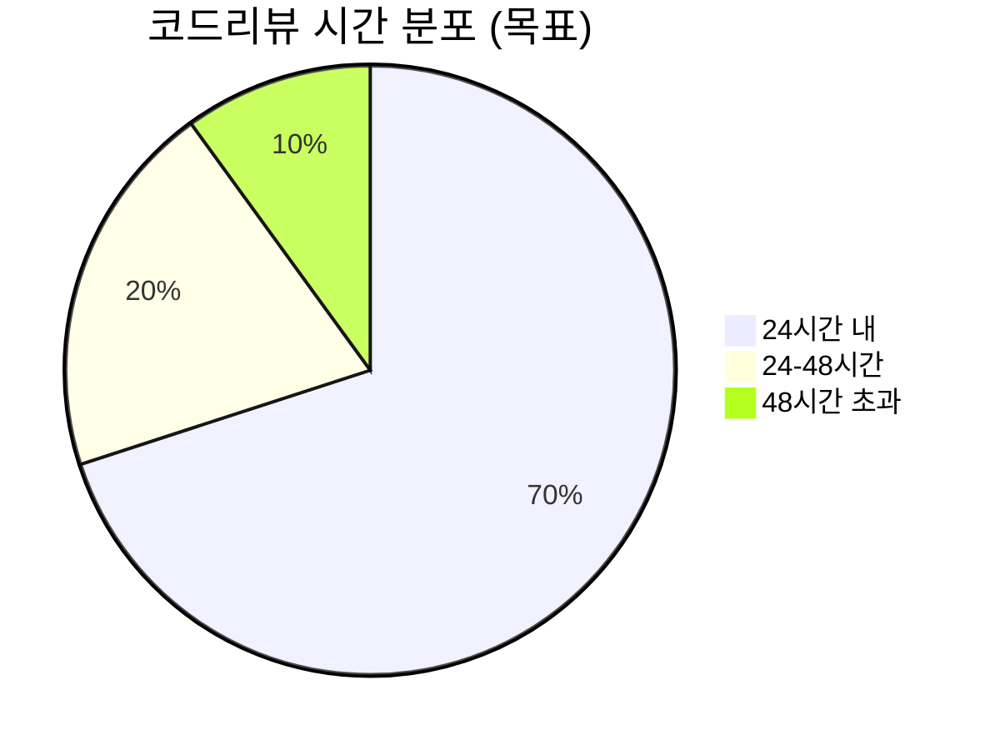

# 코드리뷰 문화

## 1. 한 줄 요약

**코드리뷰는 버그를 찾는 과정이 아니라, 팀의 집단 지성을 코드에 반영하고 지식을 공유하는 협업 도구이다.**

---

## 2. 쉽게 설명

### 모바일 개발자 관점 비유

코드리뷰를 **"요리 레시피 공유"**에 비유해볼까요?

혼자 요리하면 늘 같은 방식으로 만들게 됩니다. 하지만 레시피를 공유하면:
- 다른 사람의 노하우를 배울 수 있고
- 내가 몰랐던 재료 조합을 알게 되고
- "이건 왜 이렇게 했어?"라는 질문을 통해 스스로도 다시 생각하게 됩니다

코드리뷰도 마찬가지입니다. **버그 잡기가 목적이 아니라, 더 나은 코드를 함께 만들어가는 과정**입니다.

### 테크리드의 코드리뷰 역할

주니어 때는 리뷰를 **받는** 입장이 많았다면, 테크리드는:
- 리뷰 **문화**를 만들고
- 리뷰 **가이드라인**을 설계하고
- **건설적인 피드백** 방법을 가르치고
- 리뷰를 통한 **지식 공유 체계**를 구축합니다

### 핵심 개념

| 개념 | 설명 | 예시 |
|------|------|------|
| **리뷰 SLA** | 리뷰 응답 시간 약속 | "24시간 내 첫 코멘트" |
| **LGTM** | Looks Good To Me (승인) | 코드 품질 기준 충족 |
| **Nit** | 사소한 의견 (선택적) | "nit: 변수명 더 명확하면 좋겠네요" |
| **Blocking** | 반드시 수정 필요 | "이 부분은 메모리 릭이 발생합니다" |
| **CODEOWNERS** | 코드 영역별 필수 리뷰어 | "payment/ 폴더는 결제팀 승인 필요" |

---

## 3. 구조 다이어그램

### 코드리뷰 프로세스 흐름

```
┌─────────────────────────────────────────────────────────────────────┐
│                     코드리뷰 라이프사이클                            │
└─────────────────────────────────────────────────────────────────────┘

    ┌──────────────┐
    │  PR 작성    │
    │  ──────────  │
    │  - 작은 단위 │◀─────────────────────────────────────────┐
    │  - 명확한 설명│                                          │
    │  - 셀프리뷰  │                                          │
    └──────┬───────┘                                          │
           │                                                   │
           ▼                                                   │
    ┌──────────────┐                                          │
    │  리뷰어 지정 │                                          │
    │  ──────────  │                                          │
    │  - CODEOWNERS│                                          │
    │  - 도메인전문가                                          │
    │  - 랜덤 선택 │                                          │
    └──────┬───────┘                                          │
           │                                                   │
           ▼                                                   │
    ┌──────────────┐     ┌──────────────┐                     │
    │   리뷰 진행 │────▶│  피드백 반영 │─────────────────────┤
    │  ──────────  │     │  ──────────  │                     │
    │  - 24시간 SLA│     │  - 논의      │   재리뷰 필요시     │
    │  - 건설적 코멘트    │  - 수정      │                     │
    │  - 질문/제안 │     │  - 설명      │                     │
    └──────┬───────┘     └──────────────┘                     │
           │                                                   │
           ▼                                                   │
    ┌──────────────┐                                          │
    │    승인      │                                          │
    │  ──────────  │                                          │
    │  - LGTM x2  │                                          │
    │  - CI 통과   │                                          │
    │  - 머지      │                                          │
    └──────────────┘
```

### 피드백 유형 분류

```
┌─────────────────────────────────────────────────────────────────────┐
│                      코드리뷰 피드백 레벨                            │
├─────────────────────────────────────────────────────────────────────┤
│                                                                     │
│   BLOCKING (반드시 수정)                                            │
│   ─────────────────────────                                         │
│   - 버그, 크래시 가능성                                             │
│   - 보안 취약점                                                     │
│   - 심각한 성능 문제                                                │
│   - 아키텍처 원칙 위반                                              │
│                                                                     │
│   예시: "이 코드는 메인 스레드에서 네트워크 호출을 하고 있어요.     │
│         ANR이 발생할 수 있습니다."                                  │
│                                                                     │
├─────────────────────────────────────────────────────────────────────┤
│   SUGGESTION (권장 수정)                                            │
│   ─────────────────────────                                         │
│   - 더 나은 방법 제안                                               │
│   - 가독성 개선                                                     │
│   - 테스트 추가 요청                                                │
│   - 문서화 필요                                                     │
│                                                                     │
│   예시: "이 로직을 별도 함수로 추출하면 테스트하기 더 쉬울 것       │
│         같아요. 어떻게 생각하세요?"                                 │
│                                                                     │
├─────────────────────────────────────────────────────────────────────┤
│   NIT (선택적, 사소한 의견)                                         │
│   ─────────────────────────                                         │
│   - 네이밍 개선                                                     │
│   - 포맷팅                                                          │
│   - 주관적 선호                                                     │
│                                                                     │
│   예시: "nit: `data`보다 `userProfile`이 더 명확할 것 같아요"       │
│                                                                     │
├─────────────────────────────────────────────────────────────────────┤
│   QUESTION (질문/학습)                                              │
│   ─────────────────────────                                         │
│   - 이해를 위한 질문                                                │
│   - 의도 확인                                                       │
│   - 지식 공유 요청                                                  │
│                                                                     │
│   예시: "이 패턴은 처음 보는데, 어떤 장점이 있나요?"                │
│                                                                     │
├─────────────────────────────────────────────────────────────────────┤
│   PRAISE (칭찬)                                                     │
│   ─────────────────────────                                         │
│   - 좋은 코드 인정                                                  │
│   - 창의적 해결책 칭찬                                              │
│   - 학습 포인트 공유                                                │
│                                                                     │
│   예시: "이 부분 깔끔하게 처리했네요! 나중에 팀에 공유해주세요."    │
│                                                                     │
└─────────────────────────────────────────────────────────────────────┘
```

### CODEOWNERS 구조

```
┌─────────────────────────────────────────────────────────────────────┐
│                       CODEOWNERS 파일 예시                          │
├─────────────────────────────────────────────────────────────────────┤
│                                                                     │
│   # .github/CODEOWNERS                                             │
│                                                                     │
│   # 전체 코드베이스 기본 리뷰어                                     │
│   *                           @mobile-team                         │
│                                                                     │
│   # 아키텍처 관련 (테크리드 필수 리뷰)                              │
│   /core/                      @tech-lead                           │
│   /shared/                    @tech-lead                           │
│   *.gradle                    @tech-lead                           │
│                                                                     │
│   # 도메인별 전문가                                                 │
│   /feature/payment/           @payment-team @security-team         │
│   /feature/search/            @search-team                         │
│   /feature/cart/              @commerce-team                       │
│                                                                     │
│   # 플랫폼별 전문가                                                 │
│   *.swift                     @ios-chapter                         │
│   *.kt                        @android-chapter                     │
│                                                                     │
│   # 민감한 영역                                                     │
│   /security/                  @security-team @tech-lead            │
│   *.pem                       @security-team @tech-lead            │
│                                                                     │
└─────────────────────────────────────────────────────────────────────┘
```

### 리뷰 메트릭 대시보드



```
┌─────────────────────────────────────────────────────────────────────┐
│                    코드리뷰 건강도 지표                              │
├─────────────────────────────────────────────────────────────────────┤
│                                                                     │
│  리뷰 응답 시간 (목표: 24시간)                                      │
│  ═══════════════════════════════════════════════════ 평균: 18시간  │
│  ████████████████████████████████████░░░░░░░░░░░░░░░               │
│                                              ▲ 현재: 72%           │
│                                                                     │
│  PR 크기 (목표: 400줄 이하)                                        │
│  ═══════════════════════════════════════════════════ 평균: 320줄   │
│  ████████████████████████████████░░░░░░░░░░░░░░░░░░░               │
│                                              ▲ 현재: 64%           │
│                                                                     │
│  리뷰어당 일일 리뷰 수 (목표: 3-5개)                                │
│  ═══════════════════════════════════════════════════ 평균: 4.2개   │
│  ██████████████████████████████████████████░░░░░░░░░               │
│                                              ▲ 적정               │
│                                                                     │
│  코멘트 → 해결 시간 (목표: 8시간)                                  │
│  ═══════════════════════════════════════════════════ 평균: 6시간   │
│  ████████████████████████████████████████████████░░░               │
│                                              ▲ 현재: 75%           │
│                                                                     │
└─────────────────────────────────────────────────────────────────────┘
```

---

## 4. 실무 적용 예시

### 예시 1: 코드리뷰 가이드라인

```markdown
# [팀명] 코드리뷰 가이드라인

## 원칙
1. **코드를 비판하고, 사람을 비판하지 않는다**
   - (나쁜 예) "왜 이렇게 했어요?"
   - (좋은 예) "이 부분에서 다른 접근법도 고려해볼 수 있을 것 같아요"

2. **질문 형태로 피드백한다**
   - (나쁜 예) "이건 틀렸어요"
   - (좋은 예) "이렇게 하면 어떨까요? ~한 이유에서요"

3. **긍정적 피드백도 남긴다**
   - 좋은 코드, 창의적 해결책은 칭찬하기

## PR 작성 규칙

### 크기
- **최대 400줄** (리뷰 가능한 크기)
- 큰 변경은 여러 PR로 분리
- 리팩토링과 기능 추가 PR 분리

### 제목
[타입] 간결한 설명

타입: feat, fix, refactor, test, docs, chore

예시:
- [feat] 장바구니 상품 삭제 기능 추가
- [fix] 결제 화면 크래시 수정
- [refactor] Repository 패턴 적용

### 설명 템플릿
## 무엇을 했나요?
- 변경 사항 요약

## 왜 했나요?
- 배경, 이슈 링크

## 어떻게 테스트했나요?
- 테스트 방법, 스크린샷

## 리뷰어에게
- 집중해서 봐줬으면 하는 부분
- 고민되는 부분

## 리뷰 규칙

### 응답 시간
- 첫 코멘트: **24시간 이내**
- 리뷰 완료: **48시간 이내**
- 긴급 PR: Slack으로 알림, **4시간 이내**

### 필수 승인
- 일반 PR: **2명** LGTM
- 핵심 모듈: **테크리드 포함** 2명
- 핫픽스: **1명** (사후 리뷰)

### 피드백 레이블
리뷰 코멘트 시작에 레이블 사용:
- `[blocking]` - 반드시 수정
- `[suggestion]` - 권장 수정
- `[nit]` - 사소한 의견
- `[question]` - 질문
- `[praise]` - 칭찬

## 자동화
- Lint/Format: PR 생성 시 자동 체크
- 테스트: CI에서 자동 실행
- 커버리지: 80% 미만 시 경고
```

### 예시 2: 건설적 피드백 예시

**상황**: 주니어 개발자가 복잡한 조건문을 작성함

```kotlin
// 원본 코드
fun canPurchase(user: User, product: Product): Boolean {
    if (user.isLoggedIn) {
        if (user.hasPaymentMethod) {
            if (product.isAvailable) {
                if (user.balance >= product.price) {
                    return true
                }
            }
        }
    }
    return false
}
```

**좋지 않은 피드백**:
```
(나쁜 예) "이 코드 읽기 힘들어요. 다시 작성해주세요."
(나쁜 예) "왜 이렇게 작성했어요?"
(나쁜 예) "Early return 써야죠."
```

**좋은 피드백**:
```
[suggestion] Early Return 패턴을 적용하면 가독성이 개선될 것 같아요.

제안하는 형태:

fun canPurchase(user: User, product: Product): Boolean {
    if (!user.isLoggedIn) return false
    if (!user.hasPaymentMethod) return false
    if (!product.isAvailable) return false
    if (user.balance < product.price) return false

    return true
}

이렇게 하면:
1. 각 조건의 의미가 명확해져요
2. 새로운 조건 추가가 쉬워져요
3. 테스트 케이스 작성도 직관적이에요

참고: https://refactoring.guru/replace-nested-conditional-with-guard-clauses

어떻게 생각하세요?
```

### 예시 3: 코드리뷰 체크리스트

```markdown
# 코드리뷰 체크리스트

## 기능
- [ ] 요구사항을 충족하는가?
- [ ] 엣지 케이스를 처리했는가?
- [ ] 에러 핸들링이 적절한가?

## 설계
- [ ] SOLID 원칙을 따르는가?
- [ ] 적절한 추상화 수준인가?
- [ ] 기존 패턴과 일관성이 있는가?
- [ ] 테스트하기 쉬운 구조인가?

## 성능 (모바일 특화)
- [ ] 메인 스레드 블로킹이 없는가?
- [ ] 메모리 릭 가능성이 없는가?
- [ ] 불필요한 객체 생성이 없는가?
- [ ] 적절한 캐싱을 사용하는가?

## 보안
- [ ] 민감 정보가 로그에 남지 않는가?
- [ ] 인증/인가 처리가 적절한가?
- [ ] 입력 검증이 있는가?

## 테스트
- [ ] 단위 테스트가 있는가?
- [ ] 테스트 커버리지가 충분한가?
- [ ] 테스트가 의미 있는가? (trivial 하지 않은가)

## 가독성
- [ ] 변수/함수명이 명확한가?
- [ ] 복잡한 로직에 주석이 있는가?
- [ ] 코드 포맷이 일관성 있는가?

## 문서
- [ ] 공개 API에 문서가 있는가?
- [ ] 복잡한 비즈니스 로직에 설명이 있는가?
- [ ] README 업데이트가 필요한가?
```

### 예시 4: 리뷰 문화 개선 회고

```markdown
# 코드리뷰 문화 회고 (분기별)

## 잘한 점 (Keep)
- 리뷰 응답 시간이 평균 18시간으로 개선됨
- 칭찬 코멘트가 늘어남
- PR 크기가 작아짐 (평균 320줄)

## 문제점 (Problem)
- 특정 리뷰어에게 리뷰가 집중됨
- 복잡한 PR 리뷰가 지연됨
- 리뷰 품질 편차가 큼

## 시도할 것 (Try)
- 리뷰어 로테이션 도입
- 복잡한 PR은 작성자가 먼저 설명 세션 진행
- 주간 "좋은 리뷰" 공유 시간

## 액션 아이템
- [ ] @김철수 리뷰어 자동 배정 스크립트 작성
- [ ] @이영희 PR 설명 세션 가이드 작성
- [ ] @박지민 좋은 리뷰 예시 문서화
```

---

## 5. 장단점

### 코드리뷰의 장점

| 장점 | 설명 |
|------|------|
| **버그 조기 발견** | 배포 전 문제 발견으로 비용 절감 |
| **지식 공유** | 팀 전체의 코드베이스 이해도 향상 |
| **코드 품질 향상** | 일관된 스타일, 더 나은 설계 |
| **온보딩 도구** | 신입이 코드베이스 학습하는 창구 |
| **문서화 역할** | PR 히스토리가 변경 이유 기록 |

### 코드리뷰의 단점 및 완화 방안

| 단점 | 완화 방안 |
|------|----------|
| **시간 소요** | 자동화(Lint, Test), 작은 PR, SLA 설정 |
| **병목 현상** | CODEOWNERS 분산, 리뷰어 로테이션 |
| **갈등 유발** | 가이드라인, 피드백 교육, 심리적 안전 |
| **형식적 리뷰** | 체크리스트, 메트릭 모니터링 |
| **리뷰어 피로** | 리뷰 부담 분산, 자동화 확대 |

### 좋은 코드리뷰 문화의 지표

```
┌─────────────────────────────────────────────────────────────────────┐
│  건강한 코드리뷰 문화 지표                                           │
├─────────────────────────────────────────────────────────────────────┤
│                                                                     │
│  건강한 상태:                                                        │
│  - 리뷰 요청 후 24시간 내 첫 코멘트                                 │
│  - PR당 평균 2-3개의 의미 있는 코멘트                               │
│  - 칭찬 코멘트가 전체의 10% 이상                                    │
│  - 리뷰어가 팀 전체에 고르게 분산                                   │
│  - "LGTM만 찍기" 없이 실질적 리뷰                                   │
│  - 리뷰 후 논의가 건설적으로 진행                                   │
│                                                                     │
│  경고 신호:                                                          │
│  ─────────────                                                      │
│  - 리뷰 대기 시간이 계속 증가                                       │
│  - 특정 사람만 리뷰하는 상황                                        │
│  - 코멘트 없이 승인만 하는 경우 증가                                │
│  - 리뷰 코멘트로 인한 갈등 발생                                     │
│  - 리뷰 회피 (직접 머지, 리뷰어 미지정)                             │
│                                                                     │
└─────────────────────────────────────────────────────────────────────┘
```

---

## 6. 실제 회사 사례

### 구글 (Google)

구글은 **엄격한 코드리뷰 문화**로 유명합니다. 모든 코드 변경은 최소 1명의 리뷰어 승인이 필요하며, 핵심 코드는 여러 명의 승인이 필요합니다. 특히 **"Readability"** 제도가 있어, 특정 언어의 Readability를 획득한 사람만 해당 언어 코드에 최종 승인을 할 수 있습니다. 이 시스템은 코드 품질과 일관성을 높이는 데 기여합니다. 또한 코드리뷰 가이드라인을 공개하여 업계 표준이 되었습니다.

### 마이크로소프트 (Microsoft)

마이크로소프트는 **코드리뷰 자동화와 AI 활용**을 선도합니다. GitHub Copilot과 AI 기반 코드리뷰 도구를 적극 활용하며, PR 크기 분석, 잠재적 버그 탐지 등을 자동화했습니다. 또한 팀별로 코드리뷰 메트릭을 추적하고 지속적으로 개선합니다.

### 네이버 (Naver)

네이버는 **코드리뷰 SLA를 엄격하게 관리**합니다. 특히 검색, 쇼핑 등 대규모 서비스에서는 리뷰 응답 시간을 모니터링하고, 지연되는 경우 자동 알림이 발생합니다. 또한 **"리뷰 버디"** 제도를 운영하여, 신입 개발자가 베테랑과 짝을 이뤄 리뷰를 학습합니다.

### 카카오 (Kakao)

카카오는 **피드백 레이블 시스템**을 적극 활용합니다. [P0], [P1], [P2] 등 우선순위를 명시하여 어떤 피드백이 필수인지 선택인지 명확히 합니다. 또한 금요일 오후에는 코드리뷰를 자제하는 문화가 있어, 주말 전 급한 머지로 인한 문제를 예방합니다.

### 토스 (Toss)

토스는 **빠른 피드백 문화**를 강조합니다. 작은 PR을 권장하고, 리뷰 응답 시간을 최소화하는 것을 중요시합니다. 또한 **"Pre-mortem"** 개념을 도입하여, 코드리뷰 시 "이 코드가 프로덕션에서 문제를 일으킨다면 어떤 시나리오일까?"를 함께 고민합니다.

---

## 7. 팀 갈등 해결 방법

### 코드리뷰에서 발생하는 일반적 갈등

```
┌─────────────────────────────────────────────────────────────────┐
│                   코드리뷰 갈등 유형 및 대응                       │
├─────────────────────────────────────────────────────────────────┤
│                                                                 │
│  1. 스타일 논쟁                                                 │
│  ─────────────                                                  │
│  "탭 vs 스페이스", "if 뒤에 줄바꿈 할지"                         │
│  → 린터/포맷터로 자동화하여 논쟁 제거                           │
│                                                                 │
│  2. 설계 의견 차이                                              │
│  ─────────────                                                  │
│  "이 구조보다 저 패턴이 낫다"                                   │
│  → ADR로 팀 차원 결정, 일관성 유지                              │
│                                                                 │
│  3. 피드백 수용 거부                                            │
│  ─────────────                                                  │
│  "내 코드가 맞아", "왜 바꿔야 해?"                               │
│  → 1:1 대화, 피드백 교육, 심리적 안전                           │
│                                                                 │
│  4. 지나친 완벽주의                                             │
│  ─────────────                                                  │
│  "nit이 50개..." "완벽해질 때까지 승인 안 함"                   │
│  → 블로킹/nit 구분 명확화, 시간 제한                            │
│                                                                 │
│  5. 권력 관계                                                   │
│  ─────────────                                                  │
│  "시니어 말은 무조건 맞아", "주니어 의견 무시"                   │
│  → 평등한 피드백 문화, 모든 의견 존중                           │
│                                                                 │
└─────────────────────────────────────────────────────────────────┘
```

### 갈등 상황별 대화 예시

**상황 1: 리뷰어와 작성자의 의견이 다를 때**

```
리뷰어: "[suggestion] 이 부분은 Factory 패턴으로 하면 확장성이 좋을 것 같아요."

작성자: "현재 요구사항에서는 이 정도면 충분할 것 같은데요."

테크리드 중재:
"둘 다 좋은 포인트예요.
현재 스펙을 고려하면 작성자 의견처럼 지금은 단순하게 가고,
나중에 확장 필요 시 Factory로 리팩토링하는 건 어떨까요?
TODO 코멘트로 남겨두면 좋겠어요."
```

**상황 2: 피드백을 받아들이지 않을 때**

```
1:1 미팅에서:

테크리드: "리뷰 코멘트 관련해서 이야기하고 싶은 게 있어요."

개발자: "그 피드백은 동의하지 않아요."

테크리드: "구체적으로 어떤 부분이 동의가 안 되나요?"

개발자: "제 방식이 더 효율적이라고 생각해요."

테크리드: "그 생각을 이해해요. 데이터로 비교해볼 수 있을까요?
          두 방식의 벤치마크를 해보고, 그 결과로 결정하면 어떨까요?"
```

### 심리적 안전 구축

```markdown
## 코드리뷰에서 심리적 안전 만들기

### 리뷰어로서
1. "이 코드는..." 대신 "이 접근법은..."으로 시작
2. 질문으로 대화 열기: "이렇게 한 이유가 있을까요?"
3. 대안 제시할 때 이유 설명하기
4. 긍정적 피드백 먼저, 개선점 나중에

### 작성자로서
1. 방어적이지 않게 피드백 받기
2. 의도 설명 시 공격적이지 않게
3. 모르면 솔직히 모른다고 인정
4. 좋은 피드백에 감사 표현

### 팀 차원에서
1. "Blame-free" 문화 강조
2. 실수를 학습 기회로
3. 정기적인 "좋은 리뷰" 공유
4. 코드리뷰 교육 세션
```

---

## 8. 경영진/비개발자와의 소통 팁

### 코드리뷰를 비즈니스 언어로 설명하기

| 기술 용어 | 비즈니스 번역 |
|-----------|---------------|
| 코드리뷰 | "출시 전 품질 검증 프로세스" |
| PR 크기 제한 | "작은 단위로 자주 검증하여 리스크 분산" |
| 리뷰 SLA | "개발 병목 방지를 위한 응답 시간 약속" |
| CODEOWNERS | "핵심 영역은 전문가가 반드시 검토" |
| 블로킹 이슈 | "출시 전 반드시 수정해야 할 심각한 문제" |

### 코드리뷰 ROI 설명하기

```markdown
# 코드리뷰 투자 대비 효과 (경영진용)

## 투자
- 개발 시간의 약 10-15%가 코드리뷰에 사용

## 효과

### 버그 예방
- 코드리뷰로 발견되는 버그: 전체의 60-70%
- 프로덕션 버그 수정 비용 vs 리뷰 단계 수정 비용: 10배 차이
- 예: 프로덕션 버그 1건 수정 = 8시간
      리뷰 단계 발견 시 = 30분

### CS 비용 절감
- 버그 10건 예방 × 건당 CS 대응 2시간 = 월 20시간 절감

### 온보딩 효율화
- 신입 개발자 코드베이스 이해 시간: 4주 → 2주
- 리뷰 기록이 코드 히스토리 역할

### 팀 지식 공유
- "버스 팩터" 개선: 한 명만 아는 코드 감소
- 팀 전체 역량 상향 평준화

## 결론
- 10-15% 시간 투자로 30-40% 효율 개선 효과
```

---

## 9. 템플릿 모음

### PR 템플릿

```markdown
## 개요
[변경 사항을 한 줄로 요약]

## 변경 내용
- 변경 1
- 변경 2
- 변경 3

## 변경 이유
[왜 이 변경이 필요한지, 관련 이슈 링크]

Closes #123

## 테스트
- [ ] 단위 테스트 추가/수정
- [ ] 수동 테스트 완료

### 테스트 방법
1.
2.
3.

### 스크린샷/영상 (UI 변경 시)
| Before | After |
|--------|-------|
|        |       |

## 리뷰어에게
[집중해서 봐줬으면 하는 부분, 고민되는 점]

## 체크리스트
- [ ] 코드 컨벤션 준수
- [ ] 테스트 통과
- [ ] 문서 업데이트 (필요시)
```

### 코드리뷰 코멘트 템플릿

```markdown
## 피드백 레이블 사용 가이드

### [blocking] 반드시 수정
이슈: [설명]
이유: [왜 문제인지]
제안: [해결 방법]

예시:
[blocking] 이 코드는 메인 스레드에서 네트워크 호출을 합니다.
이유: ANR이 발생할 수 있어요.
제안: Dispatchers.IO로 감싸거나 Retrofit suspend 함수 사용

### [suggestion] 권장 수정
현재: [현재 코드]
제안: [개선된 코드]
이유: [왜 더 나은지]

예시:
[suggestion] 이 조건문을 Early Return으로 변경하면 어떨까요?
```kotlin
// 현재
if (a) { if (b) { doSomething() } }

// 제안
if (!a) return
if (!b) return
doSomething()
```
이유: 가독성이 개선되고 중첩이 줄어들어요.

### [nit] 사소한 의견
[nit] `data` → `userProfile` 네이밍이 더 명확할 것 같아요.
(선택적이니 무시해도 괜찮아요)

### [question] 질문
[question] 이 패턴을 선택한 특별한 이유가 있나요?
(궁금해서 물어보는 거예요, 블로킹 아님)

### [praise] 칭찬
[praise] 이 부분 깔끔하게 처리했네요!
특히 에러 핸들링이 꼼꼼해서 좋아요.
```

### 코드리뷰 문화 점검 템플릿

```markdown
# 코드리뷰 문화 월간 점검

## 정량 지표
| 지표 | 이번 달 | 지난 달 | 목표 |
|------|--------|--------|------|
| 평균 리뷰 응답 시간 | | | 24시간 |
| 평균 PR 크기 | | | 400줄 |
| 리뷰어당 일일 리뷰 수 | | | 3-5개 |
| LGTM-only 비율 | | | <20% |

## 정성 지표 (1-5점)
- [ ] 피드백이 건설적인가?
- [ ] 리뷰 부담이 분산되었는가?
- [ ] 새 팀원이 리뷰에 참여하고 있는가?
- [ ] 리뷰를 통해 지식이 공유되고 있는가?

## 이번 달 좋았던 점


## 개선할 점


## 다음 달 액션
1.
2.
```

---

## 10. 체크리스트

### 코드리뷰 문화 구축 체크리스트

- [ ] 코드리뷰 가이드라인이 문서화되었는가?
- [ ] PR 템플릿이 설정되었는가?
- [ ] CODEOWNERS가 설정되었는가?
- [ ] 리뷰 SLA가 정의되었는가?
- [ ] 피드백 레이블 규칙이 있는가?
- [ ] 린터/포맷터가 자동화되었는가?

### 리뷰어 체크리스트

- [ ] 기능이 요구사항을 충족하는가?
- [ ] 코드가 읽기 쉬운가?
- [ ] 테스트가 충분한가?
- [ ] 성능 문제는 없는가?
- [ ] 보안 취약점은 없는가?
- [ ] 문서화가 필요한가?

### PR 작성자 체크리스트

- [ ] 셀프 리뷰를 했는가?
- [ ] PR 크기가 적절한가 (400줄 이하)?
- [ ] 제목과 설명이 명확한가?
- [ ] 테스트를 추가했는가?
- [ ] CI가 통과하는가?
- [ ] 리뷰어에게 필요한 컨텍스트를 제공했는가?

---

## 11. 내 생각

> *이 섹션은 학습 후 본인의 생각을 정리하는 공간입니다.*

### 학습 후 느낀 점


### 우리 팀 코드리뷰의 장점


### 우리 팀 코드리뷰의 개선점


### 내가 받은 가장 좋았던 피드백


### 내가 줄 수 있는 더 나은 피드백


---

## 12. 추가 질문

### 기본 이해 확인

1. 코드리뷰의 주된 목적은 버그 발견인가, 지식 공유인가?

> **답변**: **둘 다이지만, 지식 공유가 더 중요**합니다. 연구에 따르면 코드리뷰에서 발견되는 버그는 전체 버그의 15-30%에 불과합니다. 정적 분석 도구와 테스트가 버그 발견에 더 효과적입니다. 반면 코드리뷰의 진정한 가치는: (1) **팀 전체의 코드베이스 이해도 향상**: 다른 사람 코드를 보면서 시스템을 학습합니다. (2) **암묵지의 명시화**: "왜 이렇게 했는지"에 대한 논의가 기록됩니다. (3) **코드 품질 상향 평준화**: 좋은 패턴이 팀 전체로 전파됩니다. (4) **온보딩 도구**: 신입이 PR 히스토리를 통해 맥락을 파악합니다. 따라서 "이 리뷰가 버그를 못 잡았다"고 실패로 보지 마세요. 지식 공유가 되었다면 성공한 리뷰입니다.

2. "nit" 코멘트는 언제 사용하고, 얼마나 사용해야 적절한가?

> **답변**: **"nit"(사소한 의견)은 블로킹이 아닌 선택적 피드백**에 사용합니다. 예: 네이밍 개선 제안, 스타일 선호, 약간 더 나은 방법 제안. **적절한 사용량**: 한 PR당 nit 코멘트는 **3-5개 이하**가 적절합니다. 너무 많으면: (1) 작성자가 압도당해 중요한 피드백을 놓칩니다. (2) "nitpicking"으로 인식되어 관계가 손상됩니다. (3) 리뷰 시간이 불필요하게 늘어납니다. **팁**: nit이 많다면, 그중 정말 중요한 1-2개만 남기고 나머지는 삭제하세요. 또는 "이번엔 이것만, 다음 PR에서 다른 것"으로 분산하세요. 그리고 nit보다 blocking/suggestion 구분이 더 중요합니다. 핵심 피드백을 먼저 쓰고, nit은 나중에 추가하세요.

3. 좋은 PR 크기는 어느 정도이며, 큰 변경은 어떻게 처리해야 하는가?

> **답변**: **200-400줄이 이상적**입니다. 연구에 따르면 400줄 이상의 PR은 리뷰 품질이 급격히 떨어집니다. 리뷰어가 집중력을 유지하기 어렵기 때문입니다. **큰 변경 처리 방법**: (1) **세로 분할**: 기능을 독립적인 단계로 나눕니다. 예: "데이터 레이어 추가 → 비즈니스 로직 → UI" (2) **피처 플래그**: 미완성 기능을 플래그로 숨기고 작은 PR로 점진적 추가. (3) **리팩토링 분리**: 리팩토링과 기능 추가를 별도 PR로. 같이 있으면 리뷰가 어렵습니다. (4) **설계 리뷰 먼저**: 큰 변경은 코드 전에 설계(RFC) 리뷰를 받으세요. 단, 불가피하게 큰 PR이 있다면, "먼저 설명 세션"을 제안하세요. 30분 화상 미팅으로 전체 맥락을 설명하면 리뷰가 훨씬 쉬워집니다.

### 심화 질문

4. 리뷰어와 의견 충돌이 발생했을 때, 테크리드로서 어떻게 중재해야 하는가?

> **답변**: 중재의 핵심은 **양측을 다 듣고, 기술적 논쟁을 감정적 싸움으로 확대되지 않게 하는 것**입니다. 구체적 단계: (1) **양측 입장 이해**: 각자 5분씩 자신의 논거를 설명하게 합니다. 이때 상대방은 끼어들지 않습니다. (2) **공통점 찾기**: "둘 다 성능이 중요하다고 생각하는 것 맞죠?"처럼 공통 목표를 확인합니다. (3) **객관화**: 벤치마크, 문서, 업계 사례 등 데이터로 논의를 객관화합니다. (4) **결정 기준 명확화**: "우리 팀에서 가장 중요한 것은 유지보수성"처럼 결정 기준을 상기시킵니다. (5) **필요시 테크리드가 결정**: 합의가 안 되면 테크리드가 결정하되, 이유를 명확히 설명합니다. "이번에는 A 방식으로 가겠습니다. 이유는... 하지만 B님 의견도 일리가 있어서 다음에 재검토하겠습니다." 핵심은 **사람이 아닌 코드에 대한 논의**로 유지하는 것입니다.

5. 시니어 개발자의 코드도 리뷰해야 하는가? 어떻게 접근해야 하는가?

> **답변**: **반드시 리뷰해야 합니다.** 시니어도 실수하고, 시니어의 코드에서 배울 점이 많습니다. **시니어 코드 리뷰 시 접근법**: (1) **배움의 자세로**: "이 패턴이 흥미롭네요. 이렇게 한 이유가 있을까요?"처럼 질문으로 시작합니다. 이것은 리뷰이면서 학습입니다. (2) **실제 문제 발견 시 당당하게**: "여기서 메모리 릭이 발생할 것 같은데요"처럼 기술적 문제는 레벨에 관계없이 지적합니다. (3) **다른 관점 제시**: "저는 이 부분을 이렇게 이해했는데, 혹시 다른 의도가 있나요?"로 자신의 관점을 공유합니다. (4) **칭찬도 잊지 않기**: 시니어도 인정받고 싶습니다. 좋은 코드에 칭찬을 남기세요. **팀 차원에서**: 모든 코드는 리뷰를 받는다는 원칙을 세우세요. 시니어도 예외가 아닙니다. 이것이 건강한 코드리뷰 문화입니다.

6. 코드리뷰에서 심리적 안전감을 어떻게 확보할 수 있는가?

> **답변**: 심리적 안전은 **"틀려도 괜찮다", "질문해도 괜찮다"**는 느낌입니다. 구축 방법: (1) **언어 선택**: "이건 틀렸어요" → "이 부분에서 다른 접근도 있을 것 같아요"로 바꿉니다. 코드를 비판하지, 사람을 비판하지 마세요. (2) **질문 환영**: "이게 왜 이런지 모르겠어요"라고 말해도 무시당하지 않는 환경을 만듭니다. 오히려 "좋은 질문이에요"라고 반응합니다. (3) **실수 공유**: 테크리드부터 "제가 지난주에 이런 실수를 했는데..."라고 실수를 공유하면, 다른 사람도 편해집니다. (4) **칭찬 문화**: 리뷰에서 좋은 점도 언급합니다. 비판만 있으면 방어적이 됩니다. (5) **1:1 후속**: 코드리뷰에서 갈등이 있었다면, 1:1 미팅에서 개인적으로 풀어줍니다. (6) **비난 없는 회고**: 버그가 발생해도 "누구 잘못"이 아니라 "시스템을 어떻게 개선할까"를 논의합니다.

### 실습 과제

7. 현재 팀의 코드리뷰 가이드라인을 작성하거나 개선해보자.

> **답변**: 가이드라인 작성 시 포함해야 할 내용: (1) **원칙**: 코드리뷰의 목적과 태도 (예: "코드를 비판하고, 사람을 비판하지 않는다"). (2) **PR 작성 규칙**: 크기 제한, 제목 형식, 설명 템플릿. (3) **리뷰 규칙**: 응답 시간(SLA), 필수 승인 수, 피드백 레이블. (4) **자동화**: 린터, 테스트, CI 설정. **작성 팁**: 처음부터 완벽할 필요 없습니다. 한 페이지로 시작하고, 팀 피드백을 받아 점진적으로 개선하세요. 또한 팀 전체가 참여해서 만들면 "우리의 가이드라인"이 되어 준수율이 높아집니다. 기존 가이드라인이 있다면, "최근 1개월간 코드리뷰에서 발생한 문제"를 기반으로 개선점을 찾으세요.

8. 최근 내가 남긴 리뷰 코멘트 10개를 분석하고 개선점을 찾아보자.

> **답변**: 분석 방법: (1) **10개 코멘트 수집**: 최근 PR들에서 내가 남긴 코멘트를 복사합니다. (2) **분류하기**: 각 코멘트가 blocking/suggestion/nit/question/praise 중 무엇인지 분류합니다. (3) **패턴 찾기**: blocking이 너무 많은가? 칭찬이 하나도 없는가? 질문 형태인가 명령 형태인가? (4) **톤 점검**: 각 코멘트를 받는 사람 입장에서 읽어봅니다. 방어적으로 느껴지는가? (5) **개선점 도출**: 예를 들어, "칭찬이 하나도 없다" → 다음부터 PR마다 최소 1개 칭찬 남기기. 이 연습을 한 달에 한 번 하면 리뷰 품질이 크게 향상됩니다.

9. 팀의 코드리뷰 메트릭(응답 시간, PR 크기 등)을 측정해보자.

> **답변**: 측정 방법: (1) **도구 선택**: GitHub Insights, LinearB, Sleuth, 또는 직접 스크립트 작성. (2) **측정 항목**: 평균 리뷰 응답 시간 (첫 코멘트까지), 평균 PR 크기 (줄 수), 리뷰어당 일일 리뷰 수, PR 생성부터 머지까지 시간. (3) **기간**: 최소 1개월 데이터를 수집합니다. (4) **분석**: 목표(예: 24시간 응답)와 비교하고, 이상치(예: 1주일 걸린 PR)를 확인합니다. (5) **액션**: 문제가 발견되면 원인을 파악합니다. "리뷰가 느린 이유가 뭘까?" → 특정 리뷰어에게 집중? PR이 너무 큼? 주의: 메트릭을 "감시"가 아닌 "개선 도구"로 사용하세요. "리뷰 빨리 안 했다"고 비난하는 게 아니라, "어떻게 하면 더 빨리 할 수 있을까"를 논의합니다.

### 토론 주제

10. "모든 코드는 리뷰받아야 한다" vs "신뢰 기반으로 일부는 생략 가능" 어떤 입장인가?

> **답변**: **"모든 코드는 리뷰받아야 한다"에 기본적으로 동의**하되, 실용적 예외를 둡니다. **모든 코드 리뷰의 장점**: 일관성(누구도 예외 없음), 지식 공유(어떤 코드든 최소 2명이 알음), 안전망(시니어도 실수함). **실용적 예외**: 핫픽스(긴급 상황 시 1명 승인 + 사후 리뷰), 자동 생성 코드(포맷팅, 의존성 업데이트), 문서만 수정. **"신뢰 기반 생략"의 위험**: "시니어는 리뷰 안 받아도 돼"가 되면 시니어의 코드는 아무도 모르게 됩니다. 버스 팩터가 낮아지고, 신입은 시니어 코드에서 배울 기회를 잃습니다. **내 의견**: 리뷰의 **깊이**는 조정할 수 있지만, 리뷰 **자체**는 생략하지 마세요. 사소한 변경은 빠르게 LGTM해도 됩니다. 하지만 누군가는 봐야 합니다.

11. AI 기반 코드리뷰 도구가 인간 리뷰를 대체할 수 있을까?

> **답변**: **부분적으로 대체 가능하지만, 완전 대체는 어렵습니다.** **AI가 잘하는 것**: 스타일 체크, 일반적인 버그 패턴 탐지, 보안 취약점 스캔, 코드 복잡도 분석, 중복 코드 발견. **AI가 못하는 것**: 비즈니스 맥락 이해("이 코드가 우리 도메인에 맞는가?"), 아키텍처 적합성("이 패턴이 우리 시스템에 맞는가?"), 팀 컨벤션 미묘한 차이, 지식 공유(사람 간 학습), 멘토링과 성장 피드백. **실용적 접근**: AI를 "첫 번째 리뷰어"로 활용합니다. AI가 기본적인 것(스타일, 일반 버그)을 잡고, 인간 리뷰어는 비즈니스 로직, 설계, 멘토링에 집중합니다. **결론**: AI는 코드리뷰의 효율을 높이는 도구이지, 인간 리뷰어를 완전히 대체할 수는 없습니다. 특히 팀 문화와 지식 공유 측면에서 인간 리뷰는 필수입니다.

12. 비동기 코드리뷰 vs 실시간 페어 프로그래밍, 각각 언제 효과적인가?

> **답변**: **둘 다 장단점이 있으며, 상황에 따라 선택**합니다. **비동기 코드리뷰가 효과적인 경우**: 일상적인 변경, 리뷰어와 작성자 시간대가 다름, 문서화된 피드백이 필요함, 여러 리뷰어의 의견이 필요함. **페어 프로그래밍이 효과적인 경우**: 복잡한 문제 해결, 신입 온보딩, 설계 논의, 빠른 피드백 루프 필요, 실시간 협업이 효율적인 작업. **하이브리드 접근**: 복잡한 PR은 먼저 30분 "PR 워크스루" 세션을 하고, 이후 비동기로 세부 피드백을 남깁니다. 이렇게 하면 맥락 공유는 실시간으로, 세부 검토는 비동기로 할 수 있습니다. **원격 환경에서**: 비동기 리뷰가 기본이 되지만, 중요한 설계나 복잡한 변경은 화상 세션을 추가합니다.

---

## 참고 자료

- [Google Engineering Practices: Code Review](https://google.github.io/eng-practices/review/)
- [How to Do Code Reviews Like a Human](https://mtlynch.io/human-code-reviews-1/)
- [Conventional Comments](https://conventionalcomments.org/)
- [The Art of Giving and Receiving Code Reviews Gracefully](https://www.alexandra-hill.com/2018/06/25/the-art-of-giving-and-receiving-code-reviews/)
- [What Google Learned From Its Quest to Build the Perfect Team](https://www.nytimes.com/2016/02/28/magazine/what-google-learned-from-its-quest-to-build-the-perfect-team.html)
- [Code Review Best Practices - Palantir](https://blog.palantir.com/code-review-best-practices-19e02780015f)
